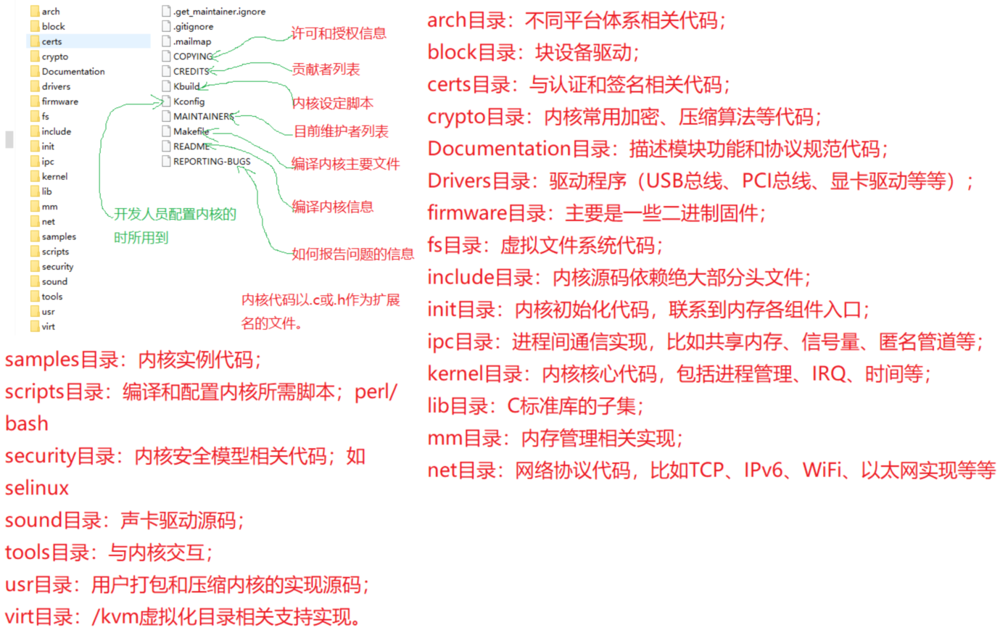

## 嵌入式开发技术

- #### **嵌入式基础**

> 嵌入式处理器：
>
> - 微控制器（MCU，单片机）
> - 微处理器（CPU，需要外接其他芯片来完成系统功能）
> - DSP：数字信号处理器
> - GPU：图形处理器
> - Soc：片上系统（包含一个或多个高性能处理器核心）
>
> **嵌入式系统**：
>
> 1. **单片机（MCU）**：采用RTOS系统或裸机程序执行
>
> 2. **嵌入式Linux**
>
>    | 特性       | 单片机                           | 嵌入式Linux                      |
>    | ---------- | -------------------------------- | -------------------------------- |
>    | 处理器     | 单核，资源受限                   | 多核可选，资源相对丰富           |
>    | 操作系统   | 无或简单的RTOS                   | 完整的Linux操作系统              |
>    | 内存/存储  | 几KB到几MB                       | 几MB到几GB                       |
>    | 处理能力   | 低                               | 高                               |
>    | 实时性     | 高                               | 相对较低 (可通过实时扩展提高)    |
>    | 功耗       | 低                               | 相对较高                         |
>    | 应用场景   | 简单控制，传感器节点，低功耗设备 | 复杂应用，网络设备，图形界面应用 |
>    | 开发复杂度 | 低                               | 高                               |
>    | 成本       | 低                               | 高                               |
>    | 编程语言   | 主要C语言                        | C、C++、Python等多种语言         |
>
> **指令集**：
>
> 1. **x86/x64:** 应用于高性能计算，服务器，PC
> 2. **ARM:** 移动设备、嵌入式系统，服务器，可穿戴设备
> 3. **RISC-V**：物联网，嵌入式系统
> 4. **PowerPC**：嵌入式系统，
> 5. **MIPS:** 应用于嵌入式系统的指令集架构。
>
> 基于ARM指令的CPU架构
>
> - **Cortex系列：** Arm 公司研发的Cortex系列处理器架构
>
>   - **Cortex-M**：针对微控制器应用，强调低功耗、成本效益和实时性能（传感器，物联网）
>
>   - **Cortex-R**：针对实时应用，强调高性能和确定性（汽车，工业控制）
>
>   - **Cortex-A**：针对应用处理器，强调高性能和多功能性（手机，平板，电脑）
>
>     C/C++语言编译过程：
>
> - 源码（`.c .h .cpp .cc .cxx .inl .tpp`)
>
> - 编译/汇编/链接器（`.s .o .exe .a`）：GCC，Clang/LLVM，MSVC
>

#### **基于Linux的系统**

> 操作系统概念
>
> 1. 临界区：代码执行中同一时间只允许一个进程进入执行的代码区域
> 2. 共享/独享资源
> 3. 任务切换与调度
> 4. 可重入性：代码或函数允许多个进程调用（需要维护资源安全）
> 5. 时钟节拍
>
> [Linux内核](https://www.kernel.org/doc/html/latest/translations/zh_CN/index.html)及系统结构
>
> - 内核层（控制和管理硬件与软件资源）
> - Shell层（用户交互页面）
> - 应用层
>
> **Linux模块机制**：允许动态地向运行的内核添加或删除代码，而无需重新编译或重启系统
>
> ~~~c
> #include <linux/module.h>      // 需要的模块头文件
> #include <linux/kernel.h>      // printk() 函数需要的头文件
> #include <linux/init.h>        // 用于宏 INIT 和 EXIT
> 
> // 模块加载时的函数
> static int __init hello_init(void)
> {
>     printk(KERN_INFO "HelloModule: Module loaded.\n");
>     return 0; // 成功加载模块
> }
> 
> // 模块卸载时的函数
> static void __exit hello_exit(void)
> {
>     printk(KERN_INFO "HelloModule: Module unloaded.\n");
> }
> 
> // 注册模块的加载和卸载函数
> module_init(hello_init);    // 模块初始化（加载）函数
> module_exit(hello_exit);    // 模块卸载函数
> 
> // 模块信息
> MODULE_LICENSE("GPL");       // GPL 开源协议
> MODULE_AUTHOR("Your Name");  // 作者
> MODULE_DESCRIPTION("A simple Hello World kernel module."); // 描述
> 
> ~~~
>
> **[Linux内核代码](https://github.com/torvalds/linux)**
>
> -  
>
> **Linux内核功能**
>
> - **进程与调度（SCHED）**
>
>   进程是正在执行的程序及其相关资源的总称，包括可执行代码、打开的文件、内核数据、处理器状态、内存地址空间和线程等。进程是资源分配和调度的基本单位，线程是进程中的执行单元，各线程共享代码和全局数据，但拥有独立的堆栈和局部变量。Linux 使用虚拟内存管理技术，为每个进程提虚拟地址空间，用户只能访问虚拟地址。
>
>   **进程地址空间功能区域及其用途**
>
>   1. 代码段：存储程序的可执行代码，包括函数和指令（通常为只读区域，可被多个进程运行）
>   2. 数据段：存储全局变量和静态变量
>   3. 堆：动态内存分配（如通过 `malloc`、`calloc` 或 `new` 分配的内存）
>   4. 栈：存储函数调用信息（如返回地址、参数）、局部变量和临时数据
>   5. 内核空间：存储操作系统内核代码和数据
>   6. 动态链接库映射区域
>   7. 内存映射区域：存储通过内存映射文件或设备的内容（实现进程间通信和大型文件访问）
>   8. 虚拟地址保留区域
>
>   **任务结构（task_struct)**：在内核中执行的进程（线程）
>
>   1. pid
>
>   2. state：
>
>      `TASK_RUNNING`：正在运行或可运行。
>
>      `TASK_INTERRUPTIBLE`：可中断的等待状态（进程正在等待某个事件，处理信号后可能会转为就绪态）
>
>      `TASK_UNINTERRUPTIBLE`：不可中断的等待状态（需要指定信号唤醒）
>
>      `TASK_STOPPED`：任务已停止  `TASK_DEAD`：任务已终止。
>
>      `TASK_ZOMBIE`：僵死（进程已终止，未进行资源回收）
>
>      `TASK_DEAD`：退出
>
>      `TASK_TRACED`：挂起（跟踪）状态（程被调试器（如 `gdb`）暂停，等待调试器进一步操作）
>
>   3. signal：通知进程某些事件的发生，信号分为三种。阻塞不处理（blocked）；待处理（pending）；信号函数处理（sighand）
>
>      | 信号编号 | 信号名称  | 默认动作       | 说明                                 |
>      | -------- | --------- | -------------- | ------------------------------------ |
>      | 1        | SIGHUP    | 终止           | 挂起终端。通常用于重新加载配置文件。 |
>      | 2        | SIGINT    | 终止           | 由终端发出中断信号 (Ctrl+C)。        |
>      | 3        | SIGQUIT   | 核心转储，终止 | 由终端发出退出信号 (Ctrl+)。         |
>      | 4        | SIGILL    | 核心转储，终止 | 非法指令。                           |
>      | 5        | SIGTRAP   | 核心转储，终止 | 跟踪/断点陷阱。                      |
>      | 6        | SIGABRT   | 核心转储，终止 | 由 `abort()` 函数发出终止信号。      |
>      | 7        | SIGBUS    | 核心转储，终止 | 总线错误 (非对齐访问)。              |
>      | 8        | SIGFPE    | 核心转储，终止 | 浮点异常。                           |
>      | 9        | SIGKILL   | 终止           | 杀死信号，无法被捕获、忽略或阻塞。   |
>      | 10       | SIGUSR1   | 终止           | 用户定义的信号 1。                   |
>      | 11       | SIGSEGV   | 核心转储，终止 | 段错误 (无效内存引用)。              |
>      | 12       | SIGUSR2   | 终止           | 用户定义的信号 2。                   |
>      | 13       | SIGPIPE   | 终止           | 写入无读者管道。                     |
>      | 14       | SIGALRM   | 终止           | 定时器到期 (由 `alarm()` 函数设置)。 |
>      | 15       | SIGTERM   | 终止           | 终止信号。                           |
>      | 16       | SIGSTKFLT | 终止           | 栈故障。                             |
>      | 17       | SIGCHLD   | 忽略           | 子进程停止或终止。                   |
>      | 18       | SIGCONT   | 继续           | 继续执行已停止的进程。               |
>      | 19       | SIGSTOP   | 停止           | 停止信号，无法被捕获、忽略或阻塞。   |
>      | 20       | SIGTSTP   | 停止           | 由终端发出停止信号 (Ctrl+Z)。        |
>      | 21       | SIGTTIN   | 停止           | 后台进程尝试从终端读取。             |
>      | 22       | SIGTTOU   | 停止           | 后台进程尝试写入终端。               |
>      | 23       | SIGURG    | 忽略           | 套接字上有紧急数据。                 |
>      | 24       | SIGXCPU   | 核心转储，终止 | 超过 CPU 时间限制。                  |
>      | 25       | SIGXFSZ   | 核心转储，终止 | 超过文件大小限制。                   |
>      | 26       | SIGVTALRM | 终止           | 虚拟定时器到期。                     |
>      | 27       | SIGPROF   | 终止           | 分析定时器到期。                     |
>      | 28       | SIGWINCH  | 忽略           | 窗口大小改变。                       |
>      | 29       | SIGIO     | 终止           | 异步 I/O 可用。                      |
>      | 30       | SIGPWR    | 终止           | 电源故障。                           |
>      | 31       | SIGSYS    | 核心转储，终止 | 无效的系统调用。                     |
>      | 34       | SIGRTMIN  | 终止           | 实时信号范围的开始。                 |
>      | 64       | SIGRTMAX  | 终止           | 实时信号范围的结束。                 |
>
>   **进程创建，执行，销毁**
>
>   ~~~c
>   #include <stdio.h>
>   #include <stdlib.h>
>   #include <unistd.h>
>   #include <sys/types.h>
>   #include <sys/wait.h>
>   
>   int main() {
>       pid_t pid; // 用于存储进程 ID
>      // 创建子进程，父进程和子进程执行分别执行下面代码，父进程返回子进程pid，子进程返回0
>       pid = fork();
>       if (pid < 0) {
>           // fork 失败
>           perror("Fork failed");
>           exit(EXIT_FAILURE);
>       } else if (pid == 0) {
>           // 子进程
>           printf("Child process: PID=%d, Parent PID=%d\n", getpid(), getppid());
>           // 子进程执行一个任务，比如调用 `execlp` 运行一个外部命令
>           printf("Child process running...\n");
>           execlp("/bin/ls", "ls", "-l", NULL);
>           // 如果 execlp 执行失败
>           perror("execlp failed");
>           exit(EXIT_FAILURE);
>       } else {
>           // 父进程
>           printf("Parent process: PID=%d, Child PID=%d\n", getpid(), pid);
>           int status;
>           // 等待子进程结束
>           if (waitpid(pid, &status, 0) == -1) {
>               perror("waitpid failed");
>           } else {
>               // 子进程正常退出
>               if (WIFEXITED(status)) {
>                   printf("Child process exited with code %d\n", WEXITSTATUS(status));
>               } else if (WIFSIGNALED(status)) {
>                   printf("Child process killed by signal %d\n", WTERMSIG(status));
>               } else {
>                   printf("Child process did not exit normally\n");
>               }
>           }
>           printf("Parent process finished\n");
>       }
>   
>       return 0;
>   }
>   ~~~
>
>   **调度策略**：CFS (Completely Fair Scheduler)、SCHED_FIFO 和 SCHED_RR
>
>   CFS算法实现：维护虚拟运行时间 (vruntime)：不是实际的物理时间，而是根据进程的优先级（nice 值）进行加权的运行时间。优先级越低的进程，vruntime 增长得越快；优先级越高的进程，vruntime 增长得越慢。当进程运行时，其 vruntime 会不断累加。使用红黑树来组织所有可运行的进程，红黑树的键值是进程的 vruntime。vruntime 越小的进程，在红黑树中越靠左，并选择vruntime最小的进程执行，当一个进程运行结束后（例如，时间片用完或主动放弃 CPU），CFS 会更新其 vruntime。
>
> - **[内存管理](https://github.com/JaveryChaing/computer-system-structure/blob/master/%E6%93%8D%E4%BD%9C%E7%B3%BB%E7%BB%9F/4.%E5%AD%98%E5%82%A8%E7%AE%A1%E7%90%86/%E5%AD%98%E5%82%A8%E7%AE%A1%E7%90%86.md)**：MMU：硬件单元，负责将虚拟地址转换为物理地址（页表）
>
> - **虚拟文件系统（VFS）**：操作系统内核中的一个软件层，负责将用户程序对文件的操作请求转换成对具体文件系统的操作，从而屏蔽不同文件系统之间的差异，为用户提供统一的文件访问接口
>
>   - VFS（虚拟文件系统）：
>
>     1. SuperBlock：已挂载的文件系统（描述了文件系统的整体信息）
>
>     2. inode：文件夹及文件的数据结构，包含文件的元数据（文件大小，权限，修改时间，链接数）
>
>        - `ls -i` 查看inode号
>
>        - `ls -l` 查看文件属性
>
>        - 文件类型（第一字符）
>
>          `-`：普通文件
>
>          `d`：目录
>
>          `l`：符号链接（软链接）
>
>          `c`：字符设备文件
>
>          `b`：块设备文件
>
>          `s`：套接字文件
>
>          `p`：命名管道（FIFO）
>
>        - 文件权限（分三组，每组三个字符，表示文件所有者权限，所属组权限及其它用户权限）
>
>          `r`：读权限（read）
>
>          `w`：写权限（write）
>
>          `x`：执行权限（execute）
>
>          `-`：没有相应权限
>
>        - 硬链接数
>
>     3. dentry：文件名和对应的索引节点关联起来
>
>     4. file object：代表一个打开的文件，它是进程和文件之间的桥梁
>
>   - 常规系统文件
>
>     1. ext3/ext4：单文件支持 16 TiB，支持日志功能
>     2. XFS：用于大型服务器和存储系统（适合大容量数据存储）
>     3. NTFS/APFS：不开源
>
>   - 基于Flash文件系统
>
>     1. F2FS
>     2. UBIFD：专为嵌入式设备和NAND 闪存设计
>     3. JFFS2：支持嵌入式 Linux 系统
>     4. EXFAT
>
>   - 基于RAM文件系统
>
>     1. tmpfs：内存文件系统
>     2. ramfs
>
>   - 网络文件系统：NFS
>
> - **进程间通信（IPC）**
>
>   管道：进程向管道写入数据，另一个进程从管道读取数据。管道内部有一个缓冲区，用于临时存储数据（单向通信，效率低）
>
>   信号：向目标进程发送事件信号，接收信号的进程可以选择忽略、捕获或执行默认操作。（异步通信，不能传输大量数据）
>
>   信号量：用于进程间的同步和互斥（控制对共享资源的访问）
>
>   消息队列：将数据复制到内核链表中（需要进程间约定消息队列的key值）
>
>   共享内存：允许多个进程访问同一块物理内存区域（需要进行同步控制）
>
>   Unix 域套接字：

#### **Linux设备驱动程序结构**

> 驱动程序功能：
>
> 1. 硬件初始化：设备启动时初始化（设置寄存器、配置中断）
> 2. 数据传输：负责在内存和硬件之间传输数据
> 3. 处理中断事件：硬件产生中断时，执行驱动程序的中断处理程序
> 4. 实现内核标准的接口
>
> 设备文件与普通文件
>
> - 普通文件：文本文件与二进制文件通过系统API进行访问
>
> - 设备文件：代表硬件设备，充当硬件设备的抽象接口，允许用户空间程序与内核中的设备驱动程序进行通信。不直接存储数据。存储在`/dev/null` （字符设备文件），`/dev/sda`（块设备文件）
>
>   1. 字符设备：数据逐个字节地读写（不支持随机访问）
>   2. 块设备：以固定大小的块为单位进行访问，
>   3. 网络设备
>
> - **设备号：用来唯一标识一个设备**
>
>   1. 主设备号（Major Number）：标识设备的类型和驱动程序（内核根据主设备号选择驱动）
>
>   2. 次设备号（Minor Number）：用于标识使用相同驱动程序的多个设备中的具体一个
>
>   3. 设备号分配（/proc/devices查看已分配的主设备号，ls -l 查看文件主设备号和次设备号）
>
>      ~~~bash
>      # 创建特殊文件
>      mknod [选项] <节点名> <类型> [<主设备号> <次设备号>]
>      # 查看主设备号对应驱动
>      cat /proc/devices
>      # 查看设备文件及相关驱动
>      udevadm info
>      # 管道文件（用于进程间通信）
>      mkfifo pipe
>      # 设备拓扑结构，设备管理，每个设备在 /sys/devices 目录下都有相应的目录，包含了该设备的各种属性和控制接口
>      ls /sys/
>      # sys常见子目录
>      /sys/block： 块设备信息，例如硬盘、SSD 等。
>      /sys/bus： 系统中各种总线的信息，例如 PCI、USB、I2C 等。
>      /sys/class： 按照设备类型分类的设备信息，例如 net（网络设备）、input（输入设备）、thermal（温度传感器）等。
>      /sys/devices： 系统中所有设备的层级结构，按照设备在总线上的拓扑结构组织。这是 /sys 目录最重要的子目录。
>      /sys/firmware： 固件相关信息。
>      /sys/fs： 文件系统相关信息。
>      /sys/kernel： 内核参数和子系统信息。
>      /sys/module： 已加载的内核模块信息。
>      /sys/power： 系统电源管理信息。
>
>      # 字符设备驱动
>      1 (mem): 内存设备。允许直接访问物理内存。通常用于调试或特殊的硬件访问。 驱动: mem
>      2 (ptyp): 伪终端。用于提供虚拟终端。 驱动: pty
>      3 (ttyp): 终端。用于连接用户终端。 驱动: tty
>      4 (ttyS): 串口。用于连接串行设备，例如调制解调器。 驱动: serial8250 (或其他串口驱动)
>      5 (cua): 调用输出设备，通常绑定到串口。 驱动: cua
>      7 (loop): 循环设备。允许将文件作为块设备挂载。 驱动: loop
>      10 (misc): 杂项设备。用于不适合其他类别的各种设备。 驱动: misc
>      13 (input): 输入设备。用于鼠标、键盘、游戏手柄等。 驱动: input
>      14 (sound): 传统声卡设备。 驱动: soundcore (较新的系统可能使用ALSA)
>      18 (pts): 伪终端从设备。与 /dev/ptmx 结合使用。 驱动: pts
>      29 (fb): 帧缓冲设备。用于访问图形显示硬件。 驱动: fbdev
>      89 (alauda): 阿里云的设备驱动，具体功能取决于其服务。 驱动: alauda
>      180-189 (usb): USB设备。 驱动: usbhid, usbstorage 等各种USB驱动
>      253 (random): 随机数生成器。 驱动: random
>      254 (urandom): 非阻塞随机数生成器。 驱动: random
>      # 块设备驱动
>      1 (ramdisk): 内存中的虚拟磁盘。 驱动: ramdisk
>      7 (loop): 循环设备。允许将文件作为块设备挂载。 驱动: loop
>      8-16 (sd): SCSI磁盘。 驱动: sd_mod
>      31 (hd): IDE硬盘驱动器。现在很少使用，已被sd驱动替代。 驱动: hd
>      259 (vd): 虚拟磁盘
>
>      ~~~
>
>   4. **设备树**：描述硬件平台的数据结构（将硬件信息从内核代码中分离）
>
>      1. dts文件：硬件的结构和配置，通过编译器dtc转为dtb
>
>         ~~~dtd
>         / {
>             compatible = "my-board";
>
>             i2c0: i2c@10000 {
>                 compatible = "some-i2c-controller";
>                 #address-cells = ;
>                 #size-cells = ;
>                 rtc: rtc@50 {
>                     compatible = "some-rtc";
>                     reg = <0x50>;
>                 };
>             };
>             uart0: uart@20000 {
>                 compatible = "ns16550a";
>                 reg = <0x20000 0x100>;
>                 interrupts = ;
>             };
>         };
>         ~~~
>
>      2. Bootloader加载dtb文件（dtb）加载到内存中的一个固定地址，并将该地址传递给内核）
>
>      3. 内核遍历树节点通过`compatible`属性匹配驱动
>
>      4. 调用以驱动的probe()函数完成设备初始化工作
>
> 设备模型（内核管理硬件设备和驱动程序的框架）
>
> - bus（总线）：cpu与设备之间通道（通信协议和电气标准，用于在不同的设备之间传输数据和控制信号），负责管理连接在其上的设备和驱动程序，并负责将设备和驱动程序进行匹配。它提供了一组通用的接口供驱动程序实现，总线类型包括 PCI、USB、I2C、SPI、Platform Bus ，总线信息位于 `/sys/bus` 目录下
> - class（类）：相似功能的设备（网络，输入，块设备）,为用户空间程序提供更高级别的接口调用，类信息位于 `/sys/class` 目录下
> - device（设备）：设备代表了系统中的一个硬件单元，设备是驱动程序操作的对象
> - driver（驱动）：操作硬件设备的软件代码（驱动程序通过总线提供的接口与设备进行通信）
>
> **总线驱动**
>
> - 设备及驱动加载过程
>
>   1. `module_init()` 内核接口，将驱动注册到总线上，主要完成分配内存，注册设备驱动，初始化数据结构
>
>      设备驱动注册：
>
>      - driver_register(struct device_driver *drv)
>
>      - i2c_add_driver()`、`usb_register()`、`spi_register_driver()
>   
>   2. 设备发现（PCI、USB、SPI）控制器驱动检测到硬件的存在，并生成一个 `device` 结构体来表示该设备，并device_register()注册设备
>   
>   3. 调用注册驱动 math_device()方法与设备匹配，匹配成功后在调用驱动的probe()完成设备初始化
>
> - **bus_type 结构体**：描述总线类型（保证不同总线驱动在接口上的一致性）
>
>   ~~~c
>   struct bus_type {
>       const char *name;                             /* 总线名称 */
>       const struct device_attribute *dev_attrs;     /* 总线的设备属性 */
>       const struct device_type *dev_type;           /* 总线的设备类型 */
>       struct device_driver *driver;                 /* 与总线相关的驱动 */
>       const struct bus_match *match;                /* 匹配设备与驱动 */
>        /* 设备与驱动的匹配函数 */
>       int (*match)(struct device *dev, struct device_driver *drv); 
>       /* 驱动与设备匹配成功后的初始化操作 */
>       int (*probe)(struct device *dev);             
>       int (*remove)(struct device *dev);            /* 移除设备时的操作 */
>       void (*shutdown)(struct device *dev);         /* 关闭设备时的操作 */
>       /* 触发 uevent */
>       int (*uevent)(struct device *dev, struct kobj_uevent_env *env); 
>       const struct dev_pm_ops *pm;                  /* 电源管理操作 */
>       struct device *devices;                       /* 设备链表 */
>       struct driver *drivers;                       /* 驱动程序链表 */
>       struct list_head bus_list;                    /* 总线链表 */
>       const struct device_ops *device_ops;          /* 设备操作集 */
>       struct module *owner;                         /* 模块指针 */
>       void *priv;                                   /* 私有数据 */
>   };
>
>   ~~~
>
> - **device结构体**
>
>   ~~~c
>   struct device {
>       /* 父设备指针，表示设备树中的父设备 */
>       struct device *parent;                     
>       /* 私有数据，通常用于设备管理 */
>       struct device_private *p;                   
>       /* 设备类型，用于指定设备的操作行为 */
>       const struct device_type *type;              
>       /* 总线 ID，用于标识设备的总线地址 */
>       const char *bus_id;                        
>       /* 设备所属的总线类型 */
>       struct bus_type *bus;                     
>       /* 设备驱动程序指针，指向已绑定的驱动 */
>       struct device_driver *driver;              
>       /* 链表指针，用于设备链表中的下一设备 */
>       struct device *next;                        
>       /* 用于设备的 kobject 对象，支持 sysfs 属性 */
>       struct kobject kobj;                       
>       /* 设备的 fwnode（设备树或 ACPI 相关信息） */
>       struct fwnode_handle *fwnode;               
>       /* 设备树节点，设备树中设备的表示 */
>       struct device_node *of_node;                
>       /* IOMMU（输入输出内存管理单元）组，用于地址空间隔离 */
>       struct iommu_group *iommu_group;           
>       /* 设备的唯一标识符 */
>       unsigned int id;                           
>       /* 设备号，由主设备号和次设备号组成 */
>       unsigned int devt;                         
>       /* 设备是否已初始化 */
>       bool initialized;                          
>       /* 设备是否已注册到系统中 */
>       bool registered;                           
>       /* 设备是否被挂起 */
>       bool suspended;                            
>       /* 设备是否正在进行探测过程 */
>       bool in_probe;                             
>       /* 设备的锁，用于同步对设备的操作 */
>       struct mutex lock;                        
>       /* 设备链表，用于管理设备的链式关系 */
>       struct list_head device_links;             
>       /* 电源管理标志，用于管理设备的电源状态 */
>       unsigned long pm_flags;                   
>       /* 电源管理操作集，指向 dev_pm_ops 结构体 */
>       const struct dev_pm_ops *pm;               
>       /* 驱动程序数据指针，允许驱动存储私有数据 */
>       void *driver_data;                         
>       /* 平台相关的设备数据，通常由驱动传递给设备 */
>       void *platform_data;                       
>       /* 设备资源（例如内存、I/O）管理 */
>       struct device *devres;                     
>       /* 与设备资源相关的管理 */
>       struct devres *resource;                   
>       /* 设备的 sysfs 属性列表 */
>       struct device_attribute *dev_attr;         
>       /* 设备的 kobject 类型 */
>       struct kobj_type *kobj_type;              
>       /* 总线类型指针，指向设备所在的总线 */
>       struct bus_type *bus;                     
>       /* DMA 地址掩码，用于设置 DMA 地址的范围 */
>       unsigned long dma_mask;                   
>       /* 关联的字符设备结构 */
>       struct cdev *cdev;                        
>       /* 设备的文件操作集 */
>       const struct file_operations *fops;        
>       /* PnP (Plug and Play) 设备列表 */
>       struct list_head pnp_list;                
>       /* 设备标志，表示设备的状态和配置 */
>       unsigned long dev_flags;                  
>       /* 父设备指针 */
>       struct device *parent;                     
>       /* 设备的字符设备结构 */
>       struct cdev *cdev;                        
>       /* 设备的文件操作集 */
>       const struct file_operations *fops;        
>   };
>
>   ~~~
>
> - **device_driver 结构体**
>
>   ~~~c
>   struct device_driver {
>       /* 驱动程序名称，通常为驱动的名称 */
>       const char *name;                        
>       /* 驱动程序所管理的设备，通常为空直到设备与驱动匹配 */
>       struct device *dev;                      
>       /* 设备树匹配表，用于设备树匹配设备和驱动 */
>       const struct of_device_id *of_match_table; 
>       /* ACPI 匹配表，用于 ACPI 设备的匹配 */
>       const struct acpi_device_id *acpi_match_table; 
>       /* 驱动程序与设备匹配后调用的初始化函数 */
>       int (*probe)(struct device *dev);          
>       /* 驱动程序移除设备时调用的清理函数 */
>       int (*remove)(struct device *dev);         
>       /* 驱动程序的电源管理操作集 */
>       const struct dev_pm_ops *pm;               
>       /* 设备挂起时调用的操作函数 */
>       int (*suspend)(struct device *dev);        
>       /* 设备恢复时调用的操作函数 */
>       int (*resume)(struct device *dev);         
>       /* 指向与该驱动程序相关联的 driver 结构体，用于管理驱动程序 */
>       struct driver *driver;                    
>       /* 驱动程序链表，用于管理已注册的驱动程序 */
>       struct list_head driver_list;             
>       /* 驱动程序的私有数据，可以存储任何与驱动程序相关的数据 */
>       void *driver_data;                        
>   };
>   
>   ~~~
>
> - **file_operations 结构体**
>
>   ~~~c
>   struct file_operations {
>       // 打开文件或设备时调用
>       int (*open)(struct inode *inode, struct file *filp);
>       // 关闭文件或设备时调用
>       int (*release)(struct inode *inode, struct file *filp);
>       // 读操作，用于从设备或文件中读取数据
>       ssize_t (*read)(struct file *filp, char __user *buf, size_t count, loff_t *pos);
>       // 写操作，用于向设备或文件中写入数据
>       ssize_t (*write)(struct file *filp, const char __user *buf, size_t count, loff_t *pos);
>       // 内存映射，用于将文件或设备映射到用户空间
>       int (*mmap)(struct file *filp, struct vm_area_struct *vma);
>       // 通过 `ioctl` 或 `unlocked_ioctl` 处理设备的特殊控制指令
>       long (*unlocked_ioctl)(struct file *filp, unsigned int cmd, unsigned long arg);
>       // 多路复用设备的操作，如 select/poll 系统调用
>       __poll_t (*poll)(struct file *filp, struct poll_table_struct *wait);
>       // 文件或设备的 `seek` 操作
>       loff_t (*llseek)(struct file *filp, loff_t offset, int whence);
>       // 分配私有数据或其他初始化
>       int (*flush)(struct file *filp, fl_owner_t id);
>       // 直接内存访问（DMA）或异步 I/O 操作
>       ssize_t (*read_iter)(struct kiocb *iocb, struct iov_iter *iter);
>       ssize_t (*write_iter)(struct kiocb *iocb, struct iov_iter *iter);
>       // 文件关闭时，内核或驱动清理方法
>       void (*release_private)(struct inode *inode);
>   };
>   
>   ~~~
>
>   | 成员变量     | 描述                                                         |
>   | ------------ | ------------------------------------------------------------ |
>   | owner        | 指向拥有该 file_operations 结构体的模块。这有助于内核在卸载模块时正确地释放资源。 |
>   | llseek       | 用于实现文件位置的设置。                                     |
>   | read         | 用于从设备读取数据。                                         |
>   | write        | 用于向设备写入数据。                                         |
>   | **ioctl**    | **用于执行设备特定的控制操作。**                             |
>   | open         | 打开设备时调用，用于初始化设备或分配资源。                   |
>   | release      | 关闭设备时调用，用于释放资源。                               |
>   | poll         | 实现设备的异步I/O操作。                                      |
>   | mmap         | 将设备内存映射到用户空间。                                   |
>   | fasync       | 处理异步通知。                                               |
>   | lock         | 文件锁定操作。                                               |
>   | sendpage     | 高效地将页面发送到设备。                                     |
>   | splice       | 用于splice操作，高效地将数据从一个文件描述符传输到另一个。   |
>   | truncate     | 截断文件。                                                   |
>   | permission   | 检查文件权限。                                               |
>   | private_data | 用于存储设备私有数据。                                       |
>
>   ~~~c
>   // ioctl：设备输入输出控制，通过ioctl，用户程序可以对设备进行一些特殊的控制操作
>   // fd：文件描述符号，打开的设备文件
>   // cmd：控制的命令，标识执行的操作
>   // ... : 可变参数
>   int ioctl(int fd, unsigned long cmd, ...);
>   // 检测用户空间输入的是否有效
>   unsigned long copy_from_user(void *to, const void __user *from, unsigned long n);
>   ~~~
>
> **设备中断处理函数** 
>
> - top half：中断立即执行（快速执行），具有较高的优先级
>
>   ~~~c
>   // irq: 中断号
>   // handler: 中断处理函数指针
>   // flags: 中断标志，如IRQF_SHARED表示中断可以共享
>   // name: 中断描述
>   // dev: 设备指针
>   // 中断处理函数注册
>   int request_irq(unsigned int irq, irq_handler_t handler, unsigned long flags, const char *name, void *dev);
>   ~~~
>
> - bottom half：负责完成中断相关的较复杂和耗时的操作。它运行在内核进程上下文中，优先级低于顶半部
>
>   

> #### 概念
>
> - RTOS：实时操作系统，能够在特定的时间范围内保证响应和执行操作，[VxWorks，HC/OS，eCos，Nucleus，QNX，OSBK](实时系统概述.md))
>- Soc：芯片级系统，将一个完整的系统集成在一块芯片上，它通常包含 CPU（处理器核心）、内存（如 RAM、ROM、Flash）、外设接口（如 USB、I2C、SPI、UART）、通信模块（如 Wi-Fi、蓝牙）和其他专用功能模块
> - MCU：微控器，集成微处理器（CPU）、内存（RAM 和 ROM）、I/O 控制器（GPIO、UART、SPI、I2C 等）和定时器的单芯片微型计算机。MCU 通常用来执行简单的控制任务
>- MPU：MPU 是一种只包含中央处理器（CPU）的处理单元，不包括 RAM、ROM 或外设接口。MPU 需要配合外部存储器和外设工作，因此它更适合复杂的应用
> - HAL库：（Hardware Abstraction Layer）库是硬件抽象层库，用于嵌入式系统开发中，HAL 库的目的是为硬件平台提供一层抽象，开发人员通过 HAL 接口与硬件交互。开发者无需直接操作寄存器，降低了开发难度
>- BootLoader：引导加载程序，用于初始化硬件，加载操作系统内核，故障恢复，安全启动
> - BPS：每秒钟传输的比特数（每秒传输位数），衡量数据通信速率的单位。影响 BPS 的因素，线缆质量，噪声干扰，硬件能力，协议开销
>- 通信方式
>   1. 通信模式：单工，半双工，全双工
>  2. 传输方式：同步（发送和接收双方通过共享的时钟信号来协调数据的发送和接收），异步（数据的发送和接收是通过特定的标志（如起始位和停止位）来区分），串行（所有的数据比特在一个信号通道上依次发送），并行（数据以多个比特同时传输）

#### Linux编译及文件系统制作

> 

#### U-Boot烧录

> 烧入

#### 电气接口及通信方式

> UART：异步串行通信，接收方需要设置相同的波特率
>
> - TXD：数据发送
> - RXD：数据接收
> - GND：地线引脚。为UART通信提供参考地电位（所有信号线完成电路闭合，减少干扰）
> - RTS：请求发送引脚。发送方通过RTS信号通知接收方它准备好发送数据
> - CTS：清除发送引脚。接收方通过CTS信号通知发送方它准备好接收数据
> - DTR：数据终端就绪引脚。发送方通过DTR信号通知接收方它已经准备好进行通信（用于设备初始化和状态指示）
> - RI：振铃指示引脚。用于表示有来电信号
> - DCD：数据载波检测引脚。用于指示调制解调器检测到有效的载波信号（在调制解调器应用中使用，表示数据载波信号已经检测到）

#### 示波器
