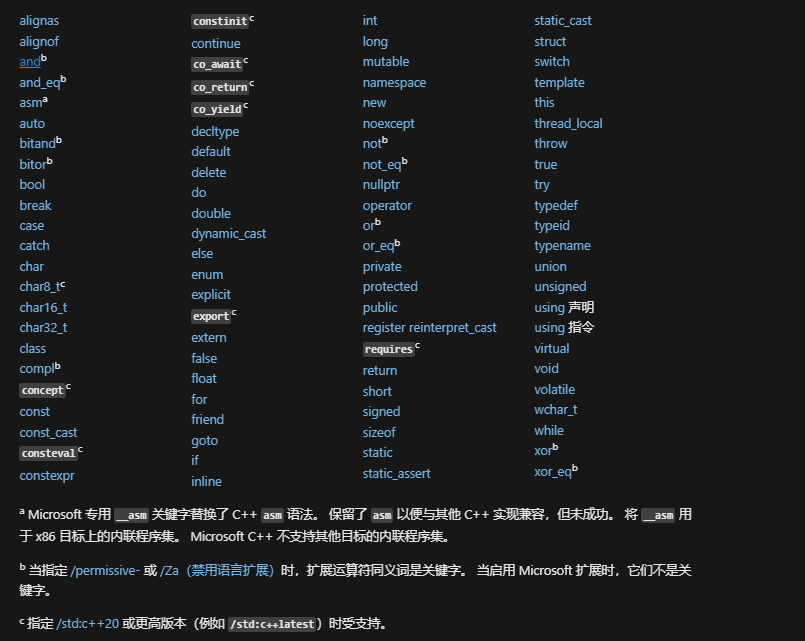

## [C++基本语法](https://learn.microsoft.com/zh-cn/cpp/cpp/user-defined-literals-cpp?view=msvc-170)

#### **标准C++关键字**

> 

#### **基本数据类型**

> 1. 数值
>
>    ~~~C++
>    //整数类型
>    int i = 157;       
>    int j = 0198;       
>    int k = 0365;       
>    int m = 36'000'000
>    // 八进制整型文本，以 0 作为规范的开头，后跟 0 到 7 之间的一系列数字
>    int i =0377
>    // 十六进制整型文本，以 0x 或 0X 作为规范
>    int j = 0X3FFF;
>    // 无符号类型,使用 u 或 U 后缀
>    unsigned val_1 = 328u;                 
>    long val_2 = 0x7FFFFFL;  
>    // 浮点数据类型，默认为double类型，使用后缀f/l,改变为float或long double 类型
>    ~~~
>
> 2. 布尔值（true/false)
>
> 3. 指针
>
>    ~~~c++
>    // C++ 引入了 nullptr 文本来指定初始化为零的指针。 在可移植代码中，应使用 nullptr，而不是整型类型零或宏（如 NULL）
>    // 二进制文本(C++14)
>    auto x = 0B001101  // int 类型
>    
>    // 原始指针变量声明仅分配足够的内存来存储地址，当指针二次执行其他值地址时，不会从新开辟空间，且原值存储空间不会被释放。后续可以使用智能指针消除这种问题
>    ~~~
>
> 4. 字符文本
>
>    ~~~C++
>    // C++ 字符串使用char[]及std::string标准库表示
>    auto c_char = 'A';
>    // u8/L/u 表示（单字节或多字节）、UTF-8、宽字符（UCS-2 或 UTF-16）、UTF-16 和 UTF-32 编码
>    //字符数据类型
>    char c_char_1 = u8'A'; // 以UTF-8位编码的字符文本
>    wchar_t w_char = u8"hello \word"  // 宽字符文本（包含多个字符）
>    // 用户定义的文本 C++11规范
>    ~~~
>
> 基本数据类型大小
>
> | 类型                | 大小     | 评论                                                         |
> | :------------------ | :------- | :----------------------------------------------------------- |
> | **`int`**           | 4 个字节 | 整数值的默认选择。                                           |
> | **`double`**        | 8 字节   | 浮点值的默认选择。                                           |
> | **`bool`**          | 1 个字节 | 表示可为 true 或 false 的值。                                |
> | **`char`**          | 1 个字节 | 用于早期 C 样式字符串或 std:: 字符串对象中无需转换为 UNICODE 的 ASCII 字符。 |
> | **`wchar_t`**       | 2 个字节 | 表示可能以 UNICODE 格式进行编码的“宽”字符值（Windows 上为 UTF-16，其他操作系统上可能不同）。 **`wchar_t`** 是在 类型字符串中使用的字符类型 `std::wstring`。 |
> | **`unsigned char`** | 1 个字节 | C++ 没有内置字节类型。 使用 **`unsigned char`** 来表示字节值。 |
> | **`unsigned int`**  | 4 个字节 | 位标志的默认选项。                                           |
> | **`long long`**     | 8 字节   | 表示更大的整数值范围。                                       |
>
> 特殊字符转移
>
>    | 值           | 转义序列 |
>    | :----------- | :------- |
>    | 换行符       | \n       |
>    | 反斜杠       | \\       |
>    | 水平制表符   | \t       |
>    | 问号         | ? 或 \?  |
>    | 垂直制表符   | \v       |
>    | 单引号       | \'       |
>    | 退格符       | \b       |
>    | 双引号       | \"       |
>    | 回车符       | \r       |
>    | null 字符    | \0       |
>    | 换页符       | \f       |
>    | 八进制       | \ooo     |
>    | 警报（响铃） | \a       |
>    | 十六进制     | \xhhh    |

#### **C++类型系统**

> - 标量类型：算术，指针，nullptr_t（指针空值类型，nullptr的类型）
>
> - 复合类型：数组，函数，类（结构），联合，枚举，引用，非静态成员指针
>
> - void类型：用于方法，函数返回，不能声明void类型变量，允许void指针变量
>
> - 变量：标量类型，复合类型的名称，用于访问数据，**变量类型声明后不允许更改。类型转换：将变量的值复制到不同类型的变量中（可能造成数据丢失或不正确）**
>
>   - **类型装换与类型安全**
>     1. 隐式类型装换
>        - 整型提升、整型装换
>        - 浮点装换
>        - 算术装换
>        - 指针装换（指向基类）
>        - 指向void *，nullprt 指针
>     2. 强制装换（存在数据丢失或不正确）
>        - **`static_cast`**：编译时检查的强制转换（或用于基类向下转型）
>        - `dynamic_cast`：对比static_cast，更安全（或用于基类向下转型）
>        - **`const_cast`**：将非 **`const`** 变量转换为 **`const`**
>        - **`reinterpret_cast`**，用于无关类型（如指针类型和 **`int`**）之间的强制转换。
>
> - 变量限制符
>
>   1. const：保证在编译时不会无意修改值，const int 与int 不是同一数据类型
>
>      ~~~C++
>      //指针型const （const修饰靠近变量）
>      int * const p = a; // 变量p存储地址不允许修改
>      const int*p = a;  // 变量a存储地址不允许修改
>      ~~~
>
>   2. constexpr：修饰常量表达式（在编译时能确定值），与const一致
>
>   3. static：程序启动时分配对象或变量，并在程序结束时释放对象或变量。
>
>      - 文件范围内修饰变量时为文件内可见
>      - 在函数内声明变量时，该变量不会随着return而回收
>
>   4. using与typedef：类型别名（为已声明并定义的实体声明一个新名称）
>
>      ~~~C++
>      // 定义long类型别名 counter
>      using counter = long;
>      using fmt = std::ios_base::fmtflags;
>      // 定义返回void指针，参数int函数类型
>      using func = void(*)(int)
>      void actual_function(int arg);
>      func fpt_pt = &actual_function;
>      //应用于成员变量（类似java中super，使用子类中使用父类方法）
>      class D:B{
>        public:
>         using B::f;
>         using B::g;
>         f();
>         g();
>      }
>
>      // 应用于模板
>      template <typename T> struct MyAlloc{
>          // 给泛型T声明别名value_type
>          typedef T value_type;
>      }
>      // 声明long类型别名UL 等同 using UL = long;
>      typedef long UL;
>
>      ~~~
>
>   5. extern：声明变量具有外部连接
>
>   6. thread_local：声明变量仅可以在其创建的线程上访问，线程销毁时销毁
>
>      - DLL中动态初始化线程局部变量可能无法在调用线程上初始化
>
>   7. auto：指示编译器判断变量的初始化类型或 lambda 表达式参数来推导其类型
>
>      ~~~C++
>      auto a {42};
>      auto b = 0;
>      auto d(1.4f);
>      for(auto &i:iterable) do_action(i);
>      int &countRef = count;
>      // auto 推断引用变量会解除引用 
>      auto myauto = countRef; // 复制countRef引用数据
>      // 指针不会解除
>      auto myauot_p = &countRef;
>      ~~~
>
>   8. volatile：线程同步变量，改动后对其他线程可见
>
>   9. mutable ：可变数据成员（修饰类的非静态，非常量成员）
>
>   10. **`typename`**：泛元，用于指定模板参数
>
> - 作用域
>
>   1. 全局作用域
>      - 头文件(.h)与源文件(.cpp)，
>        - 头文件中变量只允许声明不允许定义，不允许重复声明
>        - 程序全局使用使用extern修饰
>        - 声明变量为文件内可见（引用头文件可见）
>          - const
>          - constexpr
>          - typedef
>          - 命名空间中static对象
>
>   2. 局部（命名空间，lambda，函数，类范围，语句范围）
>      - 局部变量中重新声明变量名，可隐藏外部变量
>
> - 头文件：（声明变量，类，函数，命名空间）
>
>   > ~~~C++
>   > // my_class.h
>   > //用于确保它们不会多次插入到单个 .cpp 文件中
>   > #ifndef MY_CLASS_H // include guard
>   > #define MY_CLASS_H
>   > 
>   > namespace N
>   > {
>   >     class my_class
>   >     {
>   >     public:
>   >         void do_something();
>   >     };
>   > }
>   > #endif /* MY_CLASS_H */
>   > ~~~
>
> - 源文件：
>
>   > main函数：无法重载，无法声明inline，static，无法提取地址，无法再次调用
>   >
>   > ~~~C++
>   > // 包含 argv 后面的参数计数的整数。 argc 参数始终大于或等于 1
>   > //argv 传入程序参数
>   > int main(int argc, char* argv[])
>   > //程序钩子函数 <cstdlib.h>
>   > 
>   > // 直接退出程序，清空使用内存，消除内核中数据结构
>   > void _Exit(int status) noexcept;
>   > //同上，_Exit()包装函数，增加I/O缓存写回文件操作
>   > void exit()
>   > 
>   > // 立即终止当前进程，产生异常导致程序终止（不会销毁任意对象）
>   > void abort() noexcept;
>   > 
>   > //程序正常退出时，执行注册函数（异常情况下不会执行）
>   > int atexit(c-atexit-handler * func) noexcept;
>   > int atexit(atexit-handler * func) noexcept;
>   > ~~~
>   >
>   > | 命令行输入       | argv[1]   | argv[2] | argv[3] |
>   > | :--------------- | :-------- | :------ | :------ |
>   > | `"abc" d e`      | `abc`     | `d`     | `e`     |
>   > | `a\\b d"e f"g h` | `a\\b`    | `de fg` | `h`     |
>   > | `a\\\"b c d`     | `a\"b`    | `c`     | `d`     |
>   > | `a\\\\"b c" d e` | `a\\b c`  | `d`     | `e`     |
>   > | `a"b"" c d`      | `ab" c d` |         |         |
>

#### **运算符与表达式**

> - size_t  alignof(type)：对齐方式，返回类型大小
>
>   ~~~C++
>   // 与aligned_malloc使用开辟指针空间
>   S* p = (S*)aligned_malloc(n * sizeof(S), alignof(S));
>   ~~~
>
> - **运行时类型消息RTTI**
>
>   1. dynamic_cast：多态类型转换
>   2. typeid：标识对象类型
>      - typeid操作数为NULL指针时，引发bad_typeid异常
>   3. type_info：保留typeid运算符返回的类信息
>
> - 运算符优先级
>
>   | 运算符说明                                                   | 运算符                                                       | 替代方法     |
>   | :----------------------------------------------------------- | :----------------------------------------------------------- | :----------- |
>   | 第 1 组优先级，无关联性                                      |                                                              |              |
>   | [范围解析](https://learn.microsoft.com/zh-cn/cpp/cpp/scope-resolution-operator?view=msvc-170) | [`::`](https://learn.microsoft.com/zh-cn/cpp/cpp/scope-resolution-operator?view=msvc-170) |              |
>   | 第 2 组优先级，从左到右关联                                  |                                                              |              |
>   | [成员选择（对象或指针）](https://learn.microsoft.com/zh-cn/cpp/cpp/member-access-operators-dot-and?view=msvc-170) | 或 `->`                                                      |              |
>   | [数组下标](https://learn.microsoft.com/zh-cn/cpp/cpp/subscript-operator?view=msvc-170) | [`[\]`](https://learn.microsoft.com/zh-cn/cpp/cpp/subscript-operator?view=msvc-170) |              |
>   | [函数调用](https://learn.microsoft.com/zh-cn/cpp/cpp/function-call-operator-parens?view=msvc-170) | [`()`](https://learn.microsoft.com/zh-cn/cpp/cpp/function-call-operator-parens?view=msvc-170) |              |
>   | [后缀递增](https://learn.microsoft.com/zh-cn/cpp/cpp/postfix-increment-and-decrement-operators-increment-and-decrement?view=msvc-170) | [`++`](https://learn.microsoft.com/zh-cn/cpp/cpp/postfix-increment-and-decrement-operators-increment-and-decrement?view=msvc-170) |              |
>   | [后缀递减](https://learn.microsoft.com/zh-cn/cpp/cpp/postfix-increment-and-decrement-operators-increment-and-decrement?view=msvc-170) | [`--`](https://learn.microsoft.com/zh-cn/cpp/cpp/postfix-increment-and-decrement-operators-increment-and-decrement?view=msvc-170) |              |
>   | [类型名称](https://learn.microsoft.com/zh-cn/cpp/cpp/typeid-operator?view=msvc-170) | [`typeid`](https://learn.microsoft.com/zh-cn/cpp/cpp/typeid-operator?view=msvc-170) |              |
>   | [常量类型转换](https://learn.microsoft.com/zh-cn/cpp/cpp/const-cast-operator?view=msvc-170) | [`const_cast`](https://learn.microsoft.com/zh-cn/cpp/cpp/const-cast-operator?view=msvc-170) |              |
>   | [动态类型转换](https://learn.microsoft.com/zh-cn/cpp/cpp/dynamic-cast-operator?view=msvc-170) | [`dynamic_cast`](https://learn.microsoft.com/zh-cn/cpp/cpp/dynamic-cast-operator?view=msvc-170) |              |
>   | [重新解释的类型转换](https://learn.microsoft.com/zh-cn/cpp/cpp/reinterpret-cast-operator?view=msvc-170) | [`reinterpret_cast`](https://learn.microsoft.com/zh-cn/cpp/cpp/reinterpret-cast-operator?view=msvc-170) |              |
>   | [静态类型转换](https://learn.microsoft.com/zh-cn/cpp/cpp/static-cast-operator?view=msvc-170) | [`static_cast`](https://learn.microsoft.com/zh-cn/cpp/cpp/static-cast-operator?view=msvc-170) |              |
>   | 第 3 组优先级，从右到左关联                                  |                                                              |              |
>   | [对象或类型的大小](https://learn.microsoft.com/zh-cn/cpp/cpp/sizeof-operator?view=msvc-170) | [`sizeof`](https://learn.microsoft.com/zh-cn/cpp/cpp/sizeof-operator?view=msvc-170) |              |
>   | [前缀递增](https://learn.microsoft.com/zh-cn/cpp/cpp/prefix-increment-and-decrement-operators-increment-and-decrement?view=msvc-170) | [`++`](https://learn.microsoft.com/zh-cn/cpp/cpp/prefix-increment-and-decrement-operators-increment-and-decrement?view=msvc-170) |              |
>   | [前缀递减](https://learn.microsoft.com/zh-cn/cpp/cpp/prefix-increment-and-decrement-operators-increment-and-decrement?view=msvc-170) | [`--`](https://learn.microsoft.com/zh-cn/cpp/cpp/prefix-increment-and-decrement-operators-increment-and-decrement?view=msvc-170) |              |
>   | [二进制反码](https://learn.microsoft.com/zh-cn/cpp/cpp/one-s-complement-operator-tilde?view=msvc-170) | [`~`](https://learn.microsoft.com/zh-cn/cpp/cpp/one-s-complement-operator-tilde?view=msvc-170) | **`compl`**  |
>   | [逻辑“非”](https://learn.microsoft.com/zh-cn/cpp/cpp/logical-negation-operator-exclpt?view=msvc-170) | [`!`](https://learn.microsoft.com/zh-cn/cpp/cpp/logical-negation-operator-exclpt?view=msvc-170) | **`not`**    |
>   | [一元求反](https://learn.microsoft.com/zh-cn/cpp/cpp/unary-plus-and-negation-operators-plus-and?view=msvc-170) | [`-`](https://learn.microsoft.com/zh-cn/cpp/cpp/unary-plus-and-negation-operators-plus-and?view=msvc-170) |              |
>   | [一元加](https://learn.microsoft.com/zh-cn/cpp/cpp/unary-plus-and-negation-operators-plus-and?view=msvc-170) | [`+`](https://learn.microsoft.com/zh-cn/cpp/cpp/unary-plus-and-negation-operators-plus-and?view=msvc-170) |              |
>   | [Address-of](https://learn.microsoft.com/zh-cn/cpp/cpp/address-of-operator-amp?view=msvc-170) | [`&`](https://learn.microsoft.com/zh-cn/cpp/cpp/address-of-operator-amp?view=msvc-170) |              |
>   | [间接寻址](https://learn.microsoft.com/zh-cn/cpp/cpp/indirection-operator-star?view=msvc-170) | [`*`](https://learn.microsoft.com/zh-cn/cpp/cpp/indirection-operator-star?view=msvc-170) |              |
>   | [创建对象](https://learn.microsoft.com/zh-cn/cpp/cpp/new-operator-cpp?view=msvc-170) | [`new`](https://learn.microsoft.com/zh-cn/cpp/cpp/new-operator-cpp?view=msvc-170) |              |
>   | [销毁对象](https://learn.microsoft.com/zh-cn/cpp/cpp/delete-operator-cpp?view=msvc-170) | [`delete`](https://learn.microsoft.com/zh-cn/cpp/cpp/delete-operator-cpp?view=msvc-170) |              |
>   | [强制转换](https://learn.microsoft.com/zh-cn/cpp/cpp/cast-operator-parens?view=msvc-170) | [`()`](https://learn.microsoft.com/zh-cn/cpp/cpp/cast-operator-parens?view=msvc-170) |              |
>   | 第 4 组优先级，从左到右关联                                  |                                                              |              |
>   | [指向成员的指针（对象或指针）](https://learn.microsoft.com/zh-cn/cpp/cpp/pointer-to-member-operators-dot-star-and-star?view=msvc-170) | 或 `->*`                                                     |              |
>   | 第 5 组优先级，从左到右关联                                  |                                                              |              |
>   | [乘法](https://learn.microsoft.com/zh-cn/cpp/cpp/multiplicative-operators-and-the-modulus-operator?view=msvc-170) | [`*`](https://learn.microsoft.com/zh-cn/cpp/cpp/multiplicative-operators-and-the-modulus-operator?view=msvc-170) |              |
>   | [部门](https://learn.microsoft.com/zh-cn/cpp/cpp/multiplicative-operators-and-the-modulus-operator?view=msvc-170) | [`/`](https://learn.microsoft.com/zh-cn/cpp/cpp/multiplicative-operators-and-the-modulus-operator?view=msvc-170) |              |
>   | [取模](https://learn.microsoft.com/zh-cn/cpp/cpp/multiplicative-operators-and-the-modulus-operator?view=msvc-170) | [`%`](https://learn.microsoft.com/zh-cn/cpp/cpp/multiplicative-operators-and-the-modulus-operator?view=msvc-170) |              |
>   | 第 6 组优先级，从左到右关联                                  |                                                              |              |
>   | [加法](https://learn.microsoft.com/zh-cn/cpp/cpp/additive-operators-plus-and?view=msvc-170) | [`+`](https://learn.microsoft.com/zh-cn/cpp/cpp/additive-operators-plus-and?view=msvc-170) |              |
>   | [减法](https://learn.microsoft.com/zh-cn/cpp/cpp/additive-operators-plus-and?view=msvc-170) | [`-`](https://learn.microsoft.com/zh-cn/cpp/cpp/additive-operators-plus-and?view=msvc-170) |              |
>   | 第 7 组优先级，从左到右关联                                  |                                                              |              |
>   | [左移](https://learn.microsoft.com/zh-cn/cpp/cpp/left-shift-and-right-shift-operators-input-and-output?view=msvc-170) | [`<<`](https://learn.microsoft.com/zh-cn/cpp/cpp/left-shift-and-right-shift-operators-input-and-output?view=msvc-170) |              |
>   | [右移](https://learn.microsoft.com/zh-cn/cpp/cpp/left-shift-and-right-shift-operators-input-and-output?view=msvc-170) | [`>>`](https://learn.microsoft.com/zh-cn/cpp/cpp/left-shift-and-right-shift-operators-input-and-output?view=msvc-170) |              |
>   | 第 8 组优先级，从左到右关联                                  |                                                              |              |
>   | [小于](https://learn.microsoft.com/zh-cn/cpp/cpp/relational-operators-equal-and-equal?view=msvc-170) | [`<`](https://learn.microsoft.com/zh-cn/cpp/cpp/relational-operators-equal-and-equal?view=msvc-170) |              |
>   | 大于                                                         | [`>`](https://learn.microsoft.com/zh-cn/cpp/cpp/relational-operators-equal-and-equal?view=msvc-170) |              |
>   | 小于或等于                                                   | [`<=`](https://learn.microsoft.com/zh-cn/cpp/cpp/relational-operators-equal-and-equal?view=msvc-170) |              |
>   | 大于或等于                                                   | [`>=`](https://learn.microsoft.com/zh-cn/cpp/cpp/relational-operators-equal-and-equal?view=msvc-170) |              |
>   | 第 9 组优先级，从左到右关联                                  |                                                              |              |
>   | [等式](https://learn.microsoft.com/zh-cn/cpp/cpp/equality-operators-equal-equal-and-exclpt-equal?view=msvc-170) | [`==`](https://learn.microsoft.com/zh-cn/cpp/cpp/equality-operators-equal-equal-and-exclpt-equal?view=msvc-170) |              |
>   | [不相等](https://learn.microsoft.com/zh-cn/cpp/cpp/equality-operators-equal-equal-and-exclpt-equal?view=msvc-170) | [`!=`](https://learn.microsoft.com/zh-cn/cpp/cpp/equality-operators-equal-equal-and-exclpt-equal?view=msvc-170) | **`not_eq`** |
>   | 第 10 组优先级，从左到右关联                                 |                                                              |              |
>   | [位与](https://learn.microsoft.com/zh-cn/cpp/cpp/bitwise-and-operator-amp?view=msvc-170) | [`&`](https://learn.microsoft.com/zh-cn/cpp/cpp/bitwise-and-operator-amp?view=msvc-170) | **`bitand`** |
>   | 第 11 组优先级，从左到右关联                                 |                                                              |              |
>   | [位异或](https://learn.microsoft.com/zh-cn/cpp/cpp/bitwise-exclusive-or-operator-hat?view=msvc-170) | [`^`](https://learn.microsoft.com/zh-cn/cpp/cpp/bitwise-exclusive-or-operator-hat?view=msvc-170) | **`xor`**    |
>   | 第 12 组优先级，从左到右关联                                 |                                                              |              |
>   | [位或](https://learn.microsoft.com/zh-cn/cpp/cpp/bitwise-inclusive-or-operator-pipe?view=msvc-170) | [`|`](https://learn.microsoft.com/zh-cn/cpp/cpp/bitwise-inclusive-or-operator-pipe?view=msvc-170) | **`bitor`**  |
>   | 第 13 组优先级，从左到右关联                                 |                                                              |              |
>   | [逻辑与](https://learn.microsoft.com/zh-cn/cpp/cpp/logical-and-operator-amp-amp?view=msvc-170) | [`&&`](https://learn.microsoft.com/zh-cn/cpp/cpp/logical-and-operator-amp-amp?view=msvc-170) | **`and`**    |
>   | 第 14 组优先级，从左到右关联                                 |                                                              |              |
>   | [逻辑或](https://learn.microsoft.com/zh-cn/cpp/cpp/logical-or-operator-pipe-pipe?view=msvc-170) | [`||`](https://learn.microsoft.com/zh-cn/cpp/cpp/logical-or-operator-pipe-pipe?view=msvc-170) | **`or`**     |
>   | 第 15 组优先级，从右到左关联                                 |                                                              |              |
>   | [条件逻辑](https://learn.microsoft.com/zh-cn/cpp/cpp/conditional-operator-q?view=msvc-170) | [`? :`](https://learn.microsoft.com/zh-cn/cpp/cpp/conditional-operator-q?view=msvc-170) |              |
>   | [转让](https://learn.microsoft.com/zh-cn/cpp/cpp/assignment-operators?view=msvc-170) | [`=`](https://learn.microsoft.com/zh-cn/cpp/cpp/assignment-operators?view=msvc-170) |              |
>   | [乘法赋值](https://learn.microsoft.com/zh-cn/cpp/cpp/assignment-operators?view=msvc-170) | [`*=`](https://learn.microsoft.com/zh-cn/cpp/cpp/assignment-operators?view=msvc-170) |              |
>   | [除法赋值](https://learn.microsoft.com/zh-cn/cpp/cpp/assignment-operators?view=msvc-170) | [`/=`](https://learn.microsoft.com/zh-cn/cpp/cpp/assignment-operators?view=msvc-170) |              |
>   | [取模赋值](https://learn.microsoft.com/zh-cn/cpp/cpp/assignment-operators?view=msvc-170) | [`%=`](https://learn.microsoft.com/zh-cn/cpp/cpp/assignment-operators?view=msvc-170) |              |
>   | [加法赋值](https://learn.microsoft.com/zh-cn/cpp/cpp/assignment-operators?view=msvc-170) | [`+=`](https://learn.microsoft.com/zh-cn/cpp/cpp/assignment-operators?view=msvc-170) |              |
>   | [减法赋值](https://learn.microsoft.com/zh-cn/cpp/cpp/assignment-operators?view=msvc-170) | [`-=`](https://learn.microsoft.com/zh-cn/cpp/cpp/assignment-operators?view=msvc-170) |              |
>   | [左移赋值](https://learn.microsoft.com/zh-cn/cpp/cpp/assignment-operators?view=msvc-170) | [`<<=`](https://learn.microsoft.com/zh-cn/cpp/cpp/assignment-operators?view=msvc-170) |              |
>   | [右移赋值](https://learn.microsoft.com/zh-cn/cpp/cpp/assignment-operators?view=msvc-170) | [`>>=`](https://learn.microsoft.com/zh-cn/cpp/cpp/assignment-operators?view=msvc-170) |              |
>   | [按位“与”赋值](https://learn.microsoft.com/zh-cn/cpp/cpp/assignment-operators?view=msvc-170) | [`&=`](https://learn.microsoft.com/zh-cn/cpp/cpp/assignment-operators?view=msvc-170) | **`and_eq`** |
>   | [按位“与或”赋值](https://learn.microsoft.com/zh-cn/cpp/cpp/assignment-operators?view=msvc-170) | [`|=`](https://learn.microsoft.com/zh-cn/cpp/cpp/assignment-operators?view=msvc-170) | **`or_eq`**  |
>   | [按位“异或”赋值](https://learn.microsoft.com/zh-cn/cpp/cpp/assignment-operators?view=msvc-170) | [`^=`](https://learn.microsoft.com/zh-cn/cpp/cpp/assignment-operators?view=msvc-170) | **`xor_eq`** |
>   | [引发表达式](https://learn.microsoft.com/zh-cn/cpp/cpp/try-throw-and-catch-statements-cpp?view=msvc-170) | [`throw`](https://learn.microsoft.com/zh-cn/cpp/cpp/try-throw-and-catch-statements-cpp?view=msvc-170) |              |
>   | 第 16 组优先级，从左到右关联                                 |                                                              |              |
>   | [逗号](https://learn.microsoft.com/zh-cn/cpp/cpp/comma-operator?view=msvc-170) | [,](https://learn.microsoft.com/zh-cn/cpp/cpp/comma-operator?view=msvc-170) |              |

#### **复合数据类型**

> - 枚举
>
>   ~~~C++
>   //枚举声明，允许枚举值重复，枚举值可以隐式转为int，但int需要强转enum类型
>   enum Suit { Diamonds = 1, Hearts, Clubs = 1, Spades };
>   ~~~
>
> - union：所有成员共享一个内存位置（**union变量所占用的内存长度等于最长的成员的内存长度**）
>
>   ~~~C++
>   // 单独声明 
>   union union_name{
>        char mark;
>        long num;
>        float score;
>   }
>   // 与struct使用
>   struct TempData{
>       int mark;
>       union{
>            TempData temp;
>            WindData temp;
>       }
>   }
>   ~~~
>
> - 函数运算符重载
>
>   | 运算符       | 名称                   | 类型   |
>   | :----------- | :--------------------- | :----- |
>   | **,**        | 逗号                   | 二元   |
>   | **!**        | 逻辑非                 | 一元   |
>   | !=           | 不相等                 | 二元   |
>   | **%**        | 取模                   | 二元   |
>   | **%=**       | 取模赋值               | 二元   |
>   | **&**        | 位与                   | 二元   |
>   | **&**        | address-of             | 一元   |
>   | **&&**       | 逻辑与                 | 二元   |
>   | &=           | 按位“与”赋值           | 二元   |
>   | **( )**      | 函数调用               | —元    |
>   | **( )**      | 转换运算符             | 一元   |
>   | **`\*`**     | 乘法                   | 二元   |
>   | **`\*`**     | 指针取消引用           | 一元   |
>   | **`\*=`**    | 乘法赋值               | 二元   |
>   | **+**        | 加法                   | 二元   |
>   | **+**        | 一元加                 | 一元   |
>   | **++**       | 递增 1                 | 一元   |
>   | **+=**       | 加法赋值               | 二元   |
>   | **-**        | 减法                   | 二元   |
>   | **-**        | 一元求反               | 一元   |
>   | **--**       | 递减 1                 | 一元   |
>   | **-=**       | 减法赋值               | 二元   |
>   | **->**       | 成员选择               | 二元   |
>   | **`->\*`**   | 指向成员的指针选定内容 | 二元   |
>   | **/**        | 部门                   | 二元   |
>   | **/=**       | 除法赋值               | 二元   |
>   | **<**        | 小于                   | 二元   |
>   | **<<**       | 左移                   | 二元   |
>   | <<=          | 左移赋值               | 二元   |
>   | <=           | 小于或等于             | 二元   |
>   | **=**        | 分配                   | 二元   |
>   | **==**       | 等式                   | 二元   |
>   | **>**        | 大于                   | 二元   |
>   | >=           | 大于或等于             | 二元   |
>   | **>>**       | 右移                   | 二元   |
>   | >>=          | 右移赋值               | 二元   |
>   | **[ ]**      | 数组下标               | —元    |
>   | **^**        | 异或                   | 二元   |
>   | **^=**       | 异或赋值               | 二元   |
>   | **\|**       | 位或                   | 二元   |
>   | **\|=**      | 按位“与或”赋值         | 二进制 |
>   | **\|\|**     | 逻辑或                 | 二进制 |
>   | **~**        | 二进制反码             | 一元   |
>   | **`delete`** | 删除                   | —      |
>   | **`new`**    | 新建                   | —      |
>
> **类与结构**
>
> - friend：友元，定义在类中但不属于类的成员（获得了特殊访问权限的普通外部函数，不受类访问控制）
>
>   > friend void ChangePrivate( Point & );
>
> - **左值与右值**
>
>   > lvalue：左值包含变量名，函数，及变量表达式（--x，++x)，可通过`&`取址的表达式
>   >
>   > rvalue：右值包含常量，复合类型常量，变量表达式（x++，x+1）等，通常不可取址，没绑定变量则为临时变量。
>   >
>   > 
>   >
>   > **右值引用与移动：`&&`**：减少对象拷贝（通常用在函数返回值，参数上）
>   >
>   > *函数返回值是临时对象，函数执行完之前将返回对象**深拷贝**到调用方法栈空间中，作为右值赋值给其他变量*
>   >
>   > ~~~C++
>   > // 声明右值变量a 
>   > int && a = 10;
>   > string str = "str";
>   > // str 此时为右值，str_1 为右值引用（左值）
>   > string && str_1 = move(str);
>   > // && 类型可以默认转为&类型
>   > 
>   > ~~~
>
> - **指针与引用**
>
>   > ~~~C++
>   > // int类型指针变量 prt
>   > // & 右值表达式中为取址
>   > int *prt = &10;
>   > // & 左值表达式中为引用类型变量ref（只能引用非空指针和变量）
>   > int &ref = *prt;
>   > // * 右值表达式取值操作（prt为指针变量)
>   > int p = *prt
>   > // 声明空指针 
>   > int *p1 = nullptr;
>   > 
>   > // 定义变量名a
>   > int a = 10;
>   > // 变量a取址赋值给指针a_p
>   > int *a_p = &a;
>   > // 变量a引用赋值给 a_ref
>   > int &a_ref = a;
>   > // a_ref引用取值赋值给指针a_p_1  （a_p_1 与 a_p 地址相同）
>   > int *a_p_1 = &a_ref;
>   > // a_p指针取值赋值给引用 a_ref_1
>   > int &a_ref_1 = *a_p;
>   > ~~~
>
> - **对象生存期和资源管理**（RALL：资源获取即初始化)
>
>   > 防止对象泄漏方法
>   >
>   > 1. **在堆栈上创建**（声明为非指针局部变量，在函数体内创建）
>   >
>   > 2. **使用智能指针** <memory>
>   >
>   >    > **unique_ptr：独占指针**（任何时刻数据只能绑定一个变量）
>   >    >
>   >    > ~~~C++
>   >    > // 声明类型  不要对智能指针本身使用 new 或 malloc 表达式
>   >    > unique_prt<Song> var_name(new Song())
>   >    > auto var_name = make_unique<Song>();
>   >    > 
>   >    > //可移动，不可复制，将var_name变量所有权移动给song，var_name变量为nullprt
>   >    > auto song = std::move(var_name)
>   >    > ~~~
>   >    >
>   >    > | 名称                                                         | 说明                                                    |
>   >    > | :----------------------------------------------------------- | :------------------------------------------------------ |
>   >    > | [`get`](https://learn.microsoft.com/zh-cn/cpp/standard-library/unique-ptr-class?view=msvc-170#get) | 返回 `stored_ptr`。                                     |
>   >    > | [`get_deleter`](https://learn.microsoft.com/zh-cn/cpp/standard-library/unique-ptr-class?view=msvc-170#get_deleter) | 返回对 `stored_deleter` 的引用。                        |
>   >    > | [`release`](https://learn.microsoft.com/zh-cn/cpp/standard-library/unique-ptr-class?view=msvc-170#release) | 将 `pointer()` 存储在 `stored_ptr` 中并返回其先前内容。 |
>   >    > | [`reset`](https://learn.microsoft.com/zh-cn/cpp/standard-library/unique-ptr-class?view=msvc-170#reset) | 释放当前拥有的资源并接受新资源。                        |
>   >    > | [`swap`](https://learn.microsoft.com/zh-cn/cpp/standard-library/unique-ptr-class?view=msvc-170#swap) | 使用提供的 `deleter` 交换资源和 `unique_ptr`。          |
>   >    >
>   >    > 
>   >    >
>   >    > **shared_prt：分享指针**（资源可由多个 `shared_ptr` 对象拥有，最后一个 `shared_ptr` 对象被销毁后，资源将释放）**线程安全**
>   >    >
>   >    > | **成员函数**                                                 |                                                              |
>   >    > | ------------------------------------------------------------ | ------------------------------------------------------------ |
>   >    > | [`get`](https://learn.microsoft.com/zh-cn/cpp/standard-library/shared-ptr-class?view=msvc-170#get) | 获取拥有的资源的地址。                                       |
>   >    > | [`owner_before`](https://learn.microsoft.com/zh-cn/cpp/standard-library/shared-ptr-class?view=msvc-170#owner_before) | 如果此 `shared_ptr` 排在提供的指针之前（或小于该指针），则返回 true。 |
>   >    > | [`reset`](https://learn.microsoft.com/zh-cn/cpp/standard-library/shared-ptr-class?view=msvc-170#reset) | 替换拥有的资源。                                             |
>   >    > | [`swap`](https://learn.microsoft.com/zh-cn/cpp/standard-library/shared-ptr-class?view=msvc-170#swap) | 交换两个 `shared_ptr` 对象。                                 |
>   >    > | [`unique`](https://learn.microsoft.com/zh-cn/cpp/standard-library/shared-ptr-class?view=msvc-170#unique) | 测试拥有的资源是否是唯一的。                                 |
>   >    > | [`use_count`](https://learn.microsoft.com/zh-cn/cpp/standard-library/shared-ptr-class?view=msvc-170#use_count) | 计算资源所有者的数目。                                       |
>   >    >
>   >    >  
>   >    >
>   >    > **weak_ptf：弱指针与shared_prt使用**，声明weak_ptf的指针不会影响shared_prt资源的引用计数，**当shared_prt回收时，weak_ptf指向资源为空**
>   >
>   > 
>   >
>   > 析构函数：对象超出范围或通过调用 **`delete`** 显式销毁对象时，会自动调用析构函数，不会对成员变量进行回收，需要手动定义析构函数删除
>   >
>   > - 不接收参数，无返回值
>   >
>   > - 不能声明为const，volatile，static
>   >
>   > - 允许虚拟（**`virtual`**）
>   >
>   > - 与构造函数相反执行（先构造的对象最后回收）
>   >
>   >   
>   >
>   > 多继承：子类继承多个基类按照基类继承顺序执行构造函数，析构函数正好相反
>
> - **函数与Lambda表达式**
>
>   > 函数声明
>   >
>   > 1. **`constexpr`**：函数的返回值是常量值，可以在编译时进行计算
>   > 2. extern，static
>   > 3. inline：函数执行时不进行入栈，出栈执行，提高函数执行效率
>   >    - 内联函数必须函数体与声明结合
>   >    - 在lass中定义的方法与方法体自动成为内联函数
>   >
>   > **lambda表达式**（函数语法）
>   >
>   > -  
>   >
>   >   1. 捕获列表（捕获上下文变量，lambda中可使用的变量）
>   >      - `[]`不捕获任何变量，即使用时调用
>   >      - `[var]`：按值传递，捕获变量var，变量var可更具上下文变动在函数体中使用
>   >      - `[=]`：值传递方式捕获所有局部变量（包含this）
>   >      - `[&var]`：同上，使用引用传递
>   >      - `[&]`：同上，所有局部变量使用引用传递
>   >      - `[this]`：按值传递方式捕获当前类对象
>   >   2. 参数列表
>   >   3. 可变规则（默认是const，可以通过mutable取消常量限制）
>   >   4. 返回类型
>   >
>   > - constexpr Lambda表达式
>   >
>   >   ~~~C++
>   >   int y = 42;
>   >   // answer为函数
>   >   auto answer = [y]()constexpr{
>   >       int x = 10;
>   >       return y + x;
>   >   }
>   >   // 或者
>   >   auto answer = {
>   >       return 32+ n;
>   >   }
>   >   constexpr  int response = answer(10); 
>   >   ~~~
>
> - **数组、容器**
>
>   > ~~~C++
>   > // 堆栈声明（在编译时确定数组类型及大小） 
>   > constexpr size_t size = 1000;
>   > double numbers[size] {0};
>   > // 堆声明，在运行时确定数组大小及类型，其指针为数组头元素地址
>   > double * numbers = new double[size]{0};
>   > ~~~
>   >
>   > **序列容器**
>   >
>   > 1. string
>   > 2. `vector`:自动增长，允许随机访问、连续存储，特定值的元素
>   > 3. array：固定长度，无法动态扩展  std::array<double,10>values;
>   > 4. deque：双向队列， 它享有 `vector` 随机访问和长度灵活的优点，但是不具备连续性
>   > 5. list：双向链表（不能随机访问）
>   > 6. forward_list：单向链表
>   >
>   > **关联容器**
>   >
>   > 1. map：map<string,int>m
>   > 2. set：元素的值是唯一，并用作数据自动排序所依据的键值（key与value是相等的）
>   > 3. multimap：可以存储多个相同的键值对（快速查找，允许重复值)
>   > 4. multiset：特定顺序存储元素(快速查找，允许重复值) 
>   >
>   > 无序容器
>   >
>   > 1. unordered_map
>   > 2. unordered_multimap
>   > 3. unordered_set
>   > 4. unordered_multiset

#### **C++中的异常处理**

> - 与Java异常处理一致，无finally确保释放资源（通常用智能指针代替）
>
>   ~~~C++
>   // 可以抛出任意类型异常，
>   void throw_run_error() {
>       throw "abcd";
>   }
>   // 不能抛出任何异常（如果函数执行异常，中断程序，无法catch) 等同noexcept
>   void throw_run_error() throw();
>   
>   // 抛出指定类型异常（异常可以是任意类型）
>   // catch通过类型匹配（包含基类匹配），如果没有匹配成功，则程序退出
>   void throw_run_error() throw(char,int);
>   ~~~
>
> - std::exception：异常父类，异常标准库 [`<stdexcept>`](https://learn.microsoft.com/zh-cn/cpp/standard-library/stdexcept?view=msvc-170) 
>
>   | 异常                   | 描述                                                         |
>   | :--------------------- | :----------------------------------------------------------- |
>   | **std::exception**     | 该异常是所有标准 C++ 异常的父类。                            |
>   | std::bad_alloc         | 该异常可以通过 **new** 抛出。                                |
>   | std::bad_cast          | 该异常可以通过 **dynamic_cast** 抛出。                       |
>   | std::bad_typeid        | 该异常可以通过 **typeid** 抛出。                             |
>   | std::bad_exception     | 这在处理 C++ 程序中无法预期的异常时非常有用。                |
>   | **std::logic_error**   | 编译异常（通常语法错误抛出）                                 |
>   | std::domain_error      | 当使用了一个无效的数学域时，会抛出该异常。                   |
>   | std::invalid_argument  | 当使用了无效的参数时，会抛出该异常。                         |
>   | std::length_error      | 当创建了太长的 std::string 时，会抛出该异常。                |
>   | std::out_of_range      | 该异常可以通过方法抛出，例如 std::vector 和 std::bitset<>::operator。 |
>   | **std::runtime_error** | 理论上不可以通过读取代码来检测到的异常。                     |
>   | std::overflow_error    | 当发生数学上溢时，会抛出该异常。                             |
>   | std::range_error       | 当尝试存储超出范围的值时，会抛出该异常。                     |
>   | std::underflow_error   | 当发生数学下溢时，会抛出该异常。                             |
>
> - noexcept：指定某个函数是否可能会引发异常（无法确定异常情况下，代替 throw() 声明函数异常）
>
>   > noexcept：函数不会引发异常，**等效于noexcept(true)**，**当函数发生异常时将调用void terminate()终止程序**（类似于断言，断言一般判断值是否满足条件，noexcept则监听函数是否异常）
>   >
>   > noexcept(false)：函数可以引发任何类型的异常，代替throw(type)声明函数可能发生的异常
>   >
>   > - noexcept(express)：express：可以为noexcept(express)
>
> - **断言**：当运行到表达式为假时，打印异常消息，调用abort函数停止程序运行
>
>   > assert(int expression) ：expression 为0时发生异常退出程序（运行时检测）
>   >
>   > static_assert(bool_constexpt，message)：编译时检测
>   
> - Terminate函数 (当存在异常未被捕获时，则通过调用abort()使其终止，不释放对象)
>
> - **异常资源回收：**
>
>   > ~~~C++
>   > // 异常信息与对象同一生命周期 (RAII)
>   > template <typename T,int sz = 1> 
>   > class Pwrap{
>   >     T *prt;
>   >   public:
>   >     class RangeError{};  
>   >     PWrap(){
>   >         prt = new T[sz];
>   >     }
>   >     ~Pwrap(){
>   >         delete [] prt;
>   >     }
>   >     // 取值时发生异常
>   >     T& operator throw(RangeError){
>   >         if(i>=0 && i < sz) return prt[i];
>   >         // 抛出成员对象
>   >         throw RangeError();
>   >     }
>   > }
>   > ~~~
>   >
>   > 

#### **模板（泛型）**

>  ~~~C++
>  // 泛型函数
>  template <typename T>
>  T minimum(const T& lhs, const T& rhs)
>  {
>      return lhs < rhs ? lhs : rhs;
>  }
>  template <class T> void f(T){};
>  
>  
>  // 泛型类 泛元T，U，V typename等同class
>  template <typename T, typename U, typename V> 
>  class Foo{};
>  
>  template <typename ... Arguments> 
>  class vtclass;
>  
>  // 非类型模板推导（使用auto进行类型推导）
>  template<auto x> constexpr auto constant = x;
>  
>  // 模板参数（嵌套模板）MyClass包含泛元T和Arr
>  // Arr 包含泛元 U，V
>  template<typename T, template<typename U, typename V> class Arr>
>  class MyClass {
>      T data;
>      Arr<std::string, int> a;
>  };
>  
>  // 默认模板直变量，vector包含泛元A，B，B默认为int类型
>  template <class A, typename B = int > 
>      class vector;
>  
>  //typename 定义父类泛元，
>  template <class T> 
>     class Subtype : Base<type T::V>{}
>  
>  //模板友元
>  template <typename T> 
>  class Arr{
>      T* arr;
>      // 声明友元模板函数
>      template<class T>
>          friend Array<T>* combine(Array<T>&a,Array<T>& b);
>  }
>  //定义友元模板
>  template <class T>
>      Array<T>* combine (Array<T>&a,Array<T>& b){}
>  
>  //常见泛型
>  template <typename T,size_t N>
>  class MyArray{
>      T arr[N];
>  }
>  ~~~

#### **C++预处理**

> 预处理指令 
>
>  
>
> - define：定义宏，编译器可用标记字符串替换源文件中标识符的每个匹配项
>
> - error：指令在编译时发出用户指定的错误消息，然后终止编译
>
>   > \#error C++ compiler required.
>
> - `#if，#elif #else #endif`
>
> - include
>
> - line：指令指示预处理器将编译器的行号和文件名报告值设置为给定行号和文件名
>
> - undef：与define相反

#### [**C++模块**  （C++20）]((https://learn.microsoft.com/zh-cn/cpp/cpp/import-export-module?view=msvc-170))

>  ~~~C++
>  // 链接模块
>  export module Example;
>  // 使用模块
>  import Example;
>  ~~~

  

  

