## [C++标准库](https://learn.microsoft.com/zh-cn/cpp/standard-library/cpp-standard-library-header-files?view=msvc-170)

> |       类别       |                          标准头文件                          |
> | :--------------: | :----------------------------------------------------------: |
> |       算法       |             `<algorithm>, <cstdlib>, <numeric>`              |
> |     原子操作     |                          `<atomic>`                          |
> |    C库包装器     | `<cassert>、<ccomplex>、<cctype>、<cerrno>、<cfenv>、<cfloat>、<cinttypes>、<ciso646>b、<climits>、<clocale>、<cmath>、<csetjmp>、<csignal>、<cstdalign> 、<cstdarg>、<cstdbool> 、<cstddef>、<cstdint>、<cstdio>、<cstdlib>、<cstring>、<ctgmath> 、<ctime>、<cuchar>、<cwchar>、<cwctype>` |
> |     序列容器     |     `<array>、<deque>、<forward_list>、<list>、<vector>`     |
> |     关联容器     |                        `<map>, <set>`                        |
> |   无序关联容器   |              `<unordered_map>、<unordered_set>`              |
> |    容器适配器    |                      `<queue>, <stack>`                      |
> |  错误和异常处理  |    `<cassert>、<exception>、<stdexcept>、<system_error>`     |
> |      工具类      | `<any>、<bit>、<bitset>、<cstdlib>、<execution>、<functional>、<memory>、<memory_resource>、<optional>、<ratio>、<scoped_allocator>、<tuple>、<type_traits>、<typeindex>、<utility>、<variant>` |
> |  I/O与格式设置   | `<cinttypes>、<cstdio>、<filesystem>、<fstream>、<iomanip>、<ios>、<iosfwd>、<iostream>、<istream>、<ostream>、<sstream>、<streambuf>、<strstream>、<syncstream>` |
> |      迭代器      |                         `<iterator>`                         |
> |     数学工具     | `<bit>、<cfenv>、<cmath>、<complex>、<cstdlib>、<limits>、<numeric>、<random>、<ratio>、<valarray>` |
> |     内存管理     | `<allocators>、<memory>、<memory_resource>、<new>、<scoped_allocator>` |
> |      多线程      | `<atomic>、<condition_variable>、<future>、<mutex>、<shared_mutex>14、<thread>` |
> |    正则表达式    |                          `<regex>`                           |
> | 字符串与字符数据 | `<charconv>、<cctype>、<cstdlib>、<cstring>、<cuchar>、<cwchar>、<cwctype>、<regex>、<string>、<string_view>` |
> |       时间       |                     `<chrono>、<ctime>`                      |
> |      本地化      | `<clocale>、<codecvt>、<cvt/wbuffer>、<cvt/wstring>、<locale>` |
> |     语言支持     | `<cfloat>、<climits>、<codecvt> 、<compare>、<contract>、<coroutine>、<csetjmp>、<csignal>、<cstdarg>、<cstddef>、<cstdint>、<cstdlib>、<exception>、<initializer_list>、<limits>、<new>、<typeinfo>、<version>` |
>

#### **C++11语言特性**

> - 使用nullprt代替0或NULL指针
>
> - auto自动类型推导
>
> - 一致性初始化（使用大括号初始化容器，类，结构体）
>
> - Range-Based for 循环（迭代器循环语法）
>
> - 右值引用（rvalue reference）与 move
>
> - 定义字符串常量 
>
> - noexcept：异常处理 noexcept(true)
>
> - constrxper
>

#### **algorithm：C++标准容器模板函数**(对各种数据结构进行操作)

> adjacent_find：查找容器中条件相等的元素 
>
> ~~~C++
> // twice 二元函数，返回bool值
> auto result =  adjacent_find(L.begin( ), L.end( ), twice )
> if(result == L.end()) // 未满足条件
> ~~~
>
> **辅助函数**
>
> 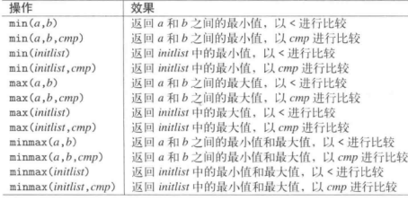 

#### **Chrono** 时间处理函数

> GMT：格林尼治时间地球自转时间（UTC=GMT +/-0.9)
>
> UTC：世界时间 标准格式为YYYY-MM-DD Thh:mm:ssZ（2023-05-26T16:00:00Z)
>
> ***GMT与UTC与时区无关，跨时区应用使用UTC作为标准时间***
>
> UNIX：时间戳，以1970-01-01T00:00:00为起点经过的秒数
>
> ~~~C++
> 
> // C语言中 tm 结构
> struct tm{
>     // 0~59
>     int tm_sec;
> 	// 0~59
>     int tm_min;
>     // 0~23
>     int tm_hour;
> 	// 1~31
>     int tm_mday;
> 	// 0~11
>     int tm_mon;
> 	//当期年份= tm_year+1900
>     int tm_year;
>     //0~6（0为周天）
>     int tm_wday;
>     // 0~365，从0开始 一年第多少天
>     int tm_yday;
>     // 夏令营时间 0 表示生效
>     int tm_isdst;
>     // 时区
>     char &tm_zone;
> }
>   // time_t 获取当期时间
>   time_t now = time(nullptr);
>   tm* ltm = localtime(&now);
>   time_point<system_clock> now = system_clock::now();
>   // 获取时间戳
>   long long timestamp = system_now.time_since_epoch().count()
>   // 等价于 duration<int64> sec(3);
>   seconds sec(3);
>   // 3000 毫秒，使用double类型包装
>   duration<double, std::milli> ms3k(3000);
> ~~~
>
> **TODO**

#### **cstdlib：程序钩子函数**

> 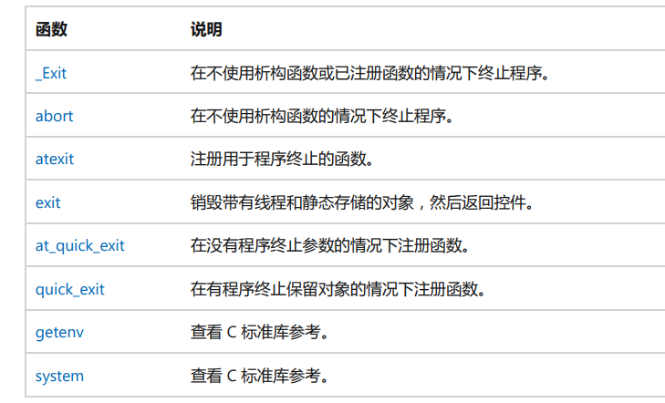 
>
> #### **字符转数字**
>
> 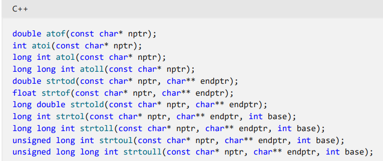 
>
> #### **数学运算**
>
> 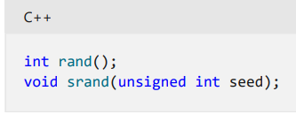 
>
> 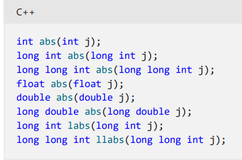 
>
> 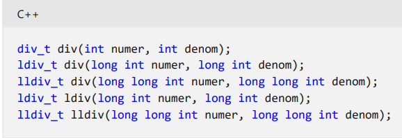 

**array：**

> 模板类成员：
>
> 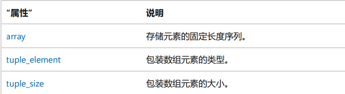 
>
> 模板运算符重载（需要泛元满足下面运算符）
>
> 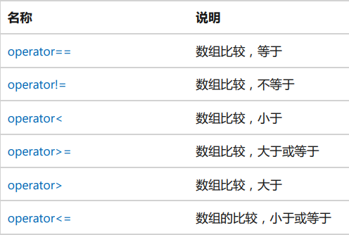  
>
> 模版函数
>
> 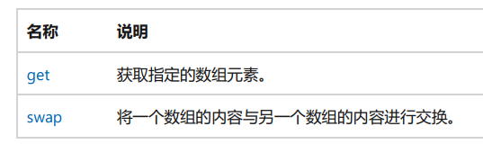 
>
> ~~~C++
>  array<int,4> c0;
>  // c0获取元素
>  cout << " " << get<1>(c0);
>  cout << " " << get<3>(c0) << endl;
> // 交换c0，c1中元素
>  swap(c0,c1);
> ~~~
>
> **array类**
>
> 成员
>
> 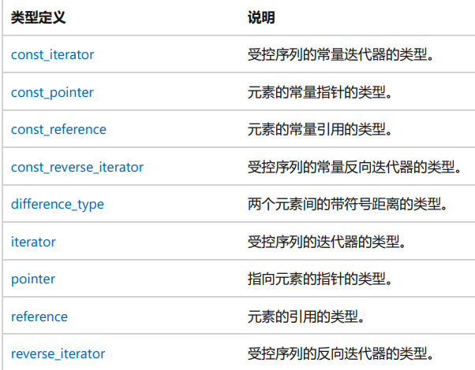 
>
> 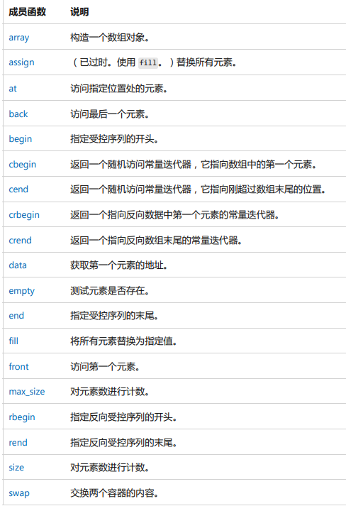 

#### **atomic**：创建支持原子操作的类型的类和类模板(不支持浮点)

> ~~~C++
> // 所属atomic::atomic命名空间
> // 构造方法
> atomic(const atomic &);
> atomic();
> atomic(Ty Value)noexcept;
> ~~~

#### **通用工具**

> pair：以key/value组成的struct数据模板结构，定义在<utility>中，用于构造map容器，及函数多返回值
>
> tuple：多元数据结构，可以存放任意数据类型，定义在<tuple>中,使用std空间，返回多个元组，
>
> - tuple_size(tupletype)::value : 获取元素个数
> - tuple_element<idx，tupletype>::type：获取第idx个元素类型
> - tuple_cat()：拼接多个tuple
>
> **Type Trait：模板类型判断**
>
> - 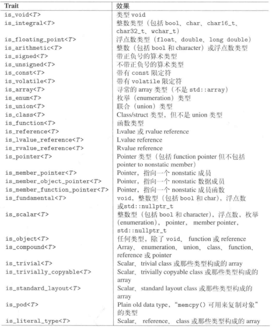 
> - 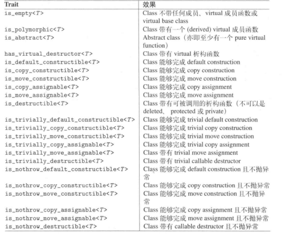  
> - 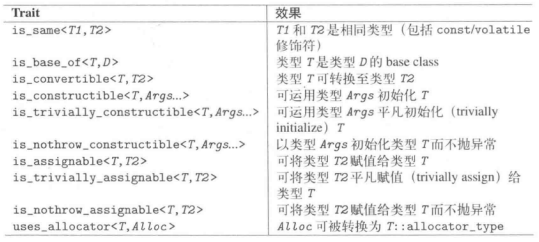 
> - 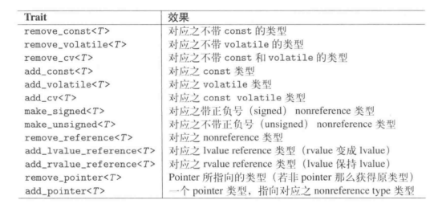 
> - 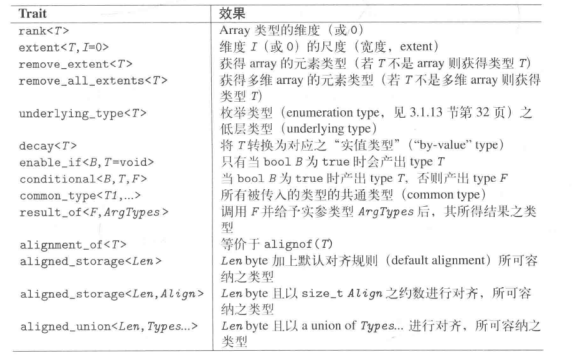 
>
> Reference Wrapper ：<functional>模板引用转换
>
> - ref(T value) = T & value
> - cref(T & value) = T value
>
>  

 

