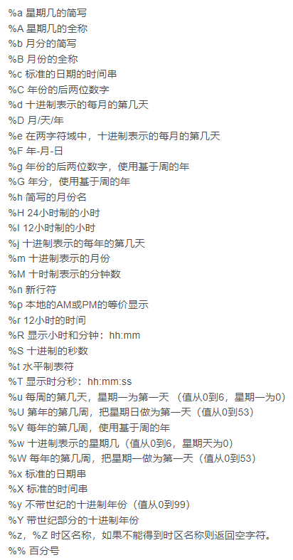

## [C++标准库](https://learn.microsoft.com/zh-cn/cpp/standard-library/cpp-standard-library-header-files?view=msvc-170)

#### **标准头文件**

> |       类别       |                          标准头文件                          |
> | :--------------: | :----------------------------------------------------------: |
> |       算法       |             `<algorithm>, <cstdlib>, <numeric>`              |
> |     原子操作     |                          `<atomic>`                          |
> |    C库包装器     | `<cassert>、<ccomplex>、<cctype>、<cerrno>、<cfenv>、<cfloat>、<cinttypes>、<ciso646>b、<climits>、<clocale>、<cmath>、<csetjmp>、<csignal>、<cstdalign> 、<cstdarg>、<cstdbool> 、<cstddef>、<cstdint>、<cstdio>、<cstdlib>、<cstring>、<ctgmath> 、<ctime>、<cuchar>、<cwchar>、<cwctype>` |
> |     序列容器     |     `<array>、<deque>、<forward_list>、<list>、<vector>`     |
> |     关联容器     |                        `<map>, <set>`                        |
> |   无序关联容器   |              `<unordered_map>、<unordered_set>`              |
> |    容器适配器    |                      `<queue>, <stack>`                      |
> |  错误和异常处理  |    `<cassert>、<exception>、<stdexcept>、<system_error>`     |
> |      工具类      | `<any>、<bit>、<bitset>、<cstdlib>、<execution>、<functional>、<memory>、<memory_resource>、<optional>、<ratio>、<scoped_allocator>、<tuple>、<type_traits>、<typeindex>、<utility>、<variant>` |
> |  I/O与格式设置   | `<cinttypes>、<cstdio>、<filesystem>、<fstream>、<iomanip>、<ios>、<iosfwd>、<iostream>、<istream>、<ostream>、<sstream>、<streambuf>、<strstream>、<syncstream>` |
> |      迭代器      |                         `<iterator>`                         |
> |     数学工具     | `<bit>、<cfenv>、<cmath>、<complex>、<cstdlib>、<limits>、<numeric>、<random>、<ratio>、<valarray>` |
> |     内存管理     | `<allocators>、<memory>、<memory_resource>、<new>、<scoped_allocator>` |
> |      多线程      | `<atomic>、<condition_variable>、<future>、<mutex>、<shared_mutex>14、<thread>` |
> |    正则表达式    |                          `<regex>`                           |
> | 字符串与字符数据 | `<charconv>、<cctype>、<cstdlib>、<cstring>、<cuchar>、<cwchar>、<cwctype>、<regex>、<string>、<string_view>` |
> |       时间       |                     `<chrono>、<ctime>`                      |
> |      本地化      | `<clocale>、<codecvt>、<cvt/wbuffer>、<cvt/wstring>、<locale>` |
> |     语言支持     | `<cfloat>、<climits>、<codecvt> 、<compare>、<contract>、<coroutine>、<csetjmp>、<csignal>、<cstdarg>、<cstddef>、<cstdint>、<cstdlib>、<exception>、<initializer_list>、<limits>、<new>、<typeinfo>、<version>` |

#### **C++11语言特性**

> - 使用nullprt代替0或NULL指针
>
> - auto自动类型推导
>
> - 一致性初始化（使用大括号初始化容器，类，结构体）
>
> - Range-Based for 循环（迭代器循环语法）
>
> - 右值引用（rvalue reference）与 move
>
> - 定义字符串常量 
>
> - noexcept：异常处理 noexcept(true)
>
> - constrxper
>

#### **atomic**：创建支持原子操作的类型的类和类模板(不支持浮点)

> ~~~C++
> // 所属atomic::atomic命名空间
> // 构造方法
> atomic(const atomic &);
> atomic();
> atomic(Ty Value)noexcept;
> ~~~

#### **Chrono** 时间处理函数

> GMT：格林尼治时间地球自转时间（UTC=GMT +/-0.9)
>
> UTC：世界时间 标准格式为YYYY-MM-DD Thh:mm:ssZ（2023-05-26T16:00:00Z)
>
> ***GMT与UTC与时区无关，跨时区应用使用UTC作为标准时间***
>
> UNIX：时间戳，以1970-01-01T00:00:00为起点经过的秒数
>
> 时间相关类型
>
> - **C和POSIX提供的Date/Time函数**
>
>   ~~~C++
>   // 获取当期时间戳（实际上时间戳为UTC，与时区无关）
>   time_t tm = time(nullprt);
>   // 时间戳转为tm，同timep,未加上时区
>   tm* gmtime(const time_t * timep);
>   // 加上本地时区
>   tm* ltm = localtime(&tm);
>   // ts 转 time_t
>   time_t mktime(struct tm* time_ptr);
>   // tm 转字符 Mon Oct 24 11:41:17 2022，返回本地时间
>   char asctime(const struct tm time_ptr);
>   // tm格式化转str；
>   size_t strftime(char *str ,size_t count,const char * format,const struct tm* tm);
>   char strTime[100];
>   // tm格式化成字符串 2022-10-07 20:46:01
>   strftime(startTime,sizeof(startTime),"%Y-%m-%d %H:%M:%S",tm);
>   
>   // time_t 获取当期时间
>   time_t now = time(nullptr);
>   tm* ltm = localtime(&now);
>   time_point<system_clock> now = system_clock::now();
>   // 获取时间戳
>   long long timestamp = system_now.time_since_epoch().count()
>   // 等价于 duration<int64> sec(3);
>   seconds sec(3);
>   // 3000 毫秒，使用double类型包装
>   duration<double, std::milli> ms3k(3000);
>   ~~~
>
> - size_t：通常用在32位系统上时间戳处理（unsigned int)
>
> - tm：时间结构
>
>   ~~~C++
>   // C语言中 tm 结构
>   struct tm{
>    // 0~59
>    int tm_sec;
>   	// 0~59
>    int tm_min;
>    // 0~23
>    int tm_hour;
>   	// 1~31
>    int tm_mday;
>   	// 0~11
>    int tm_mon;
>   	//当期年份= tm_year+1900
>    int tm_year;
>    //0~6（0为周天）
>    int tm_wday;
>    // 0~365，从0开始 一年第多少天
>    int tm_yday;
>    // 夏令营时间 0 表示生效
>    int tm_isdst;
>    // 时区
>    char &tm_zone;
>   }
>   ~~~
>
> - Chrono：定义表示和操作持续时间及时刻的类和函数
>
>   ~~~C++
>   // duration类：时间间隔，默认以秒为单位
>   // 构造方法 Rep：次数，Period：倍率 std::ratio<1, 10>：表示1/10 的倍率 
>   // duration 支持重载算术运算符操作，计算时不必转换单位
>   template <class Rep, class Period> class duration;
>   template <class Rep, class Period = ratio<1>> class duration;
>   template <class Rep, class Period1, class Period2> class duration <duration<Rep, Period1>, Period2>;
>                      
>   duration::period 获取单位类型
>   // 指定时间间隔类型20秒间隔，实际上为包装的 duration类型
>   std::chrono::seconds  sec(20);
>   std::chrono::hours aDay(24);
>   // 时间单位转换
>   hours m1 = duration_cast<seconds>(sec);
>   // C++14后可以用 constexpr表示一个常量时间间隔
>   constexpr auto twoDays = 48h;
>   constexpr auto my_duration_unit = 108ms;
>   ~~~
>  
>    

#### **cstdlib：程序钩子函数**

>  
>
> **字符转数字**
>
>  
>
> **数学运算**
>
>  
>
>  
>
>  

#### **通用工具**

> pair：以key/value组成的struct数据模板结构，定义在<utility>中，用于构造map容器，及函数多返回值
>
> tuple：多元数据结构，可以存放任意数据类型，定义在<tuple>中,使用std空间，返回多个元组，
>
> - tuple_size(tupletype)::value : 获取元素个数
> - tuple_element<idx，tupletype>::type：获取第idx个元素类型
> - tuple_cat()：拼接多个tuple
>
> **Type Trait：模板类型判断**
>
> -  
> -   
> -  
> -  
> -  
>
> Reference Wrapper ：<functional>模板引用转换
>
> - ref(T value) = T & value
> - cref(T & value) = T value

#### **STL标准模板库**

> 容器（Container）：**容器里存储的是元素的拷贝、副本，而不是引用**,必须实现复制构造，移动构造
>
> - 序列容器（顺序集合，使用数组，链表实现）
>
>   1. 底层C数组：array，vector（动态数组），deque(双端队列)：查询快，增减慢  
>
>   2. 链表：list，forward_list（单向链表）：查询慢，增减快，**不支持随机迭代器**
>
> - 关联容器（已排序集合，使用红黑树实现，默认less顺序排序）
>
>   1. set：元素更具value排序，不重复
>   2. multiset：元素排序，允许重复
>   3. map
>   4. multiamp：允许相同的key
>
>   | 名称        | 说明       |
>   | ----------- | ---------- |
>   | key_type    | 关键值类型 |
>   | mapped_type | 映射值类型 |
>   | key_compare | 比较标准   |
>
> - 无序容器（无序集合，使用散列表实现）
>
>   | 名称                                  | 说明         |
>   | ------------------------------------- | ------------ |
>   | hasher                                | 哈希函数类型 |
>   | key_euqal                             | 等值判断     |
>   | local_iterator 、const_local_iterator | 桶迭代器     |
>
> - 容器适配器（上述容器中满足指定的操作）
>
>   1. Stack：栈（LIFO)
>   2. Queue：队列
>   3. Priority Queue：优先队列
>
> - 拟容器
>
>   1. string
>   2. array<T,N>
>   3. bitset<N>
>   4. vector<bool>
>   5. pair<T,U>
>   6. tuple<T...>
>   7. valarry<T>
>
> **容器通用方法**
>
> |                          名称                          | 说明（C是个容器，默认情况下使用C::allocator_type{} 分配空间） |
> | :----------------------------------------------------: | ------------------------------------------------------------ |
> |                  **容器初始化及赋值**                  |                                                              |
> |               C c{}，C c{ele}，C c{b,e}                | 初始化容器c  ，拷贝[b,e)区间容器                             |
> |              C c(n)，C c(n,x)，C c(n,x,a)              | 初始化容器c，容量为n，使用value_type{}分配空间，不使用关联容器 |
> |                C c{c2}，C c {move(c2)}                 | 拷贝，移动容器元素                                           |
> |                         c.~C()                         | 析构函数，销毁c的元素，释放资源                              |
> |                  c2 = c，c2 = move(c)                  | 拷贝赋值                                                     |
> |                     c = {element}                      | 重写赋值                                                     |
> |     c.assign(n,x)，c.assign(b,e)，c.assign({ele})      | 将指定位置容器赋值给c，不支持关联容器                        |
> |                      **元素访问**                      |                                                              |
> |                       c.front()                        | 不支持关联容器                                               |
> |                        c.back()                        | 不支持关联容器和forward_list                                 |
> |                     c[i]，c.at(i)                      | 不支持链表和关联容器                                         |
> |                     c[k]，c.at(k)                      | 适用于map，unordered_map                                     |
> |         **适用于vector，deque，list元素新增**          |                                                              |
> | c.push_back(v)，c.pop_back() e_emplace_back(args) | 末尾添加或删除元素                                           |
> |                    c.insert(p,n,x)                     | 将x插入到p之前，n：x的拷贝数量                               |
> |                   c.emplace(p,args)                    | 适用args创建元素，插入到p之前，不使用关联容器                |
> |                       c.erase(p)                       | 将p处元素删除                                                |
>
> **容器通用方法**
>
> | 名称                                                         | 说明                                                         |
> | :----------------------------------------------------------- | :----------------------------------------------------------- |
> | [`assign`](https://learn.microsoft.com/zh-cn/cpp/standard-library/list-class?view=msvc-170#assign) | 将元素从列表中擦除并将一组新的元素复制到目标列表。           |
> | [`back`](https://learn.microsoft.com/zh-cn/cpp/standard-library/list-class?view=msvc-170#back) | 返回对列表中最后一个元素的引用。                             |
> | [`begin`](https://learn.microsoft.com/zh-cn/cpp/standard-library/list-class?view=msvc-170#begin) | 返回发现列表中第一个元素的位置的迭代器。                     |
> | [`cbegin`](https://learn.microsoft.com/zh-cn/cpp/standard-library/list-class?view=msvc-170#cbegin) | 返回发现列表中第一个元素的位置的常量迭代器。                 |
> | [`cend`](https://learn.microsoft.com/zh-cn/cpp/standard-library/list-class?view=msvc-170#cend) | 返回发现一个列表中最后一个元素之后的位置的敞亮表达式。       |
> | [`clear`](https://learn.microsoft.com/zh-cn/cpp/standard-library/list-class?view=msvc-170#clear) | 消除列表中的全部元素。                                       |
> | [`crbegin`](https://learn.microsoft.com/zh-cn/cpp/standard-library/list-class?view=msvc-170#crbegin) | 返回发现反向列表中第一个元素的位置的常量迭代器。             |
> | [`crend`](https://learn.microsoft.com/zh-cn/cpp/standard-library/list-class?view=msvc-170#crend) | 返回用于发现反向列表中最后一个元素之后的位置的常量迭代器。   |
> | [`emplace`](https://learn.microsoft.com/zh-cn/cpp/standard-library/list-class?view=msvc-170#emplace) | 将构造的元素插入到列表中的指定位置。                         |
> | [`emplace_back`](https://learn.microsoft.com/zh-cn/cpp/standard-library/list-class?view=msvc-170#emplace_back) | 在列表的结尾处添加一个就地构造的元素。                       |
> | [`emplace_front`](https://learn.microsoft.com/zh-cn/cpp/standard-library/list-class?view=msvc-170#emplace_front) | 在列表的起始位置添加一个就地构造的元素。                     |
> | [`empty`](https://learn.microsoft.com/zh-cn/cpp/standard-library/list-class?view=msvc-170#empty) | 测试列表是否为空。                                           |
> | [`end`](https://learn.microsoft.com/zh-cn/cpp/standard-library/list-class?view=msvc-170#end) | 返回用于发现列表中最后一个元素之后的位置的迭代器。           |
> | [`erase`](https://learn.microsoft.com/zh-cn/cpp/standard-library/list-class?view=msvc-170#erase) | 从列表中的指定位置移除一个或一系列元素。                     |
> | [`front`](https://learn.microsoft.com/zh-cn/cpp/standard-library/list-class?view=msvc-170#front) | 返回对列表中第一个元素的引用。                               |
> | [`get_allocator`](https://learn.microsoft.com/zh-cn/cpp/standard-library/list-class?view=msvc-170#get_allocator) | 返回用于构造列表的 `allocator` 对象的一个副本。              |
> | [`insert`](https://learn.microsoft.com/zh-cn/cpp/standard-library/list-class?view=msvc-170#insert) | 将一个、几个或一系列元素插入列表中的指定位置。               |
> | [`max_size`](https://learn.microsoft.com/zh-cn/cpp/standard-library/list-class?view=msvc-170#max_size) | 返回列表的最大长度。                                         |
> | [`merge`](https://learn.microsoft.com/zh-cn/cpp/standard-library/list-class?view=msvc-170#merge) | 将元素从参数列表移除，将它们插入目标列表，将新的组合元素集以升序或其他指定顺序排序。 |
> | [`pop_back`](https://learn.microsoft.com/zh-cn/cpp/standard-library/list-class?view=msvc-170#pop_back) | 删除列表末尾的元素。                                         |
> | [`pop_front`](https://learn.microsoft.com/zh-cn/cpp/standard-library/list-class?view=msvc-170#pop_front) | 删除列表起始处的一个元素。                                   |
> | [`push_back`](https://learn.microsoft.com/zh-cn/cpp/standard-library/list-class?view=msvc-170#push_back) | 在列表的末尾添加元素。                                       |
> | [`push_front`](https://learn.microsoft.com/zh-cn/cpp/standard-library/list-class?view=msvc-170#push_front) | 在列表的开头添加元素。                                       |
> | [`rbegin`](https://learn.microsoft.com/zh-cn/cpp/standard-library/list-class?view=msvc-170#rbegin) | 返回发现反向列表中第一个元素的位置的迭代器。                 |
> | [`remove`](https://learn.microsoft.com/zh-cn/cpp/standard-library/list-class?view=msvc-170#remove) | 清除列表中与指定值匹配的元素。                               |
> | [`remove_if`](https://learn.microsoft.com/zh-cn/cpp/standard-library/list-class?view=msvc-170#remove_if) | 将满足指定谓词的元素从列表中消除。                           |
> | [`rend`](https://learn.microsoft.com/zh-cn/cpp/standard-library/list-class?view=msvc-170#rend) | 返回发现反向列表中最后一个元素之后的位置的迭代器。           |
> | [`resize`](https://learn.microsoft.com/zh-cn/cpp/standard-library/list-class?view=msvc-170#resize) | 为列表指定新的大小。                                         |
> | [`reverse`](https://learn.microsoft.com/zh-cn/cpp/standard-library/list-class?view=msvc-170#reverse) | 反转列表中元素的顺序。                                       |
> | [`size`](https://learn.microsoft.com/zh-cn/cpp/standard-library/list-class?view=msvc-170#size) | 返回列表中元素的数目。                                       |
> | [`sort`](https://learn.microsoft.com/zh-cn/cpp/standard-library/list-class?view=msvc-170#sort) | 按升序或其他顺序关系排列列表中的元素。                       |
> | [`splice`](https://learn.microsoft.com/zh-cn/cpp/standard-library/list-class?view=msvc-170#splice) | 将元素从自变量列表中删除或将它们插入目标列表。               |
> | [`swap`](https://learn.microsoft.com/zh-cn/cpp/standard-library/list-class?view=msvc-170#swap) | 交换两个列表的元素。                                         |
> | [`unique`](https://learn.microsoft.com/zh-cn/cpp/standard-library/list-class?view=msvc-170#unique) | 从列表中删除满足某些其他二元谓词的相邻重复元素或相邻元素。   |

#### **STL迭代器**

> - Output迭代器：向前写入（只能写入/更改元素）
>
>   > ~~~c++
>   > // 当val写入当前迭代器位置
>   > *iter = val;
>   > // 向前步进，返回新位置（前一个元素）
>   > ++iter;
>   > //向前步进，返回当前位置（旧位置）
>   > iter++;
>   > // 复制元素
>   > type(iter)
>   > // Insert 迭代器
>   > push_back(val);
>   > push_front(val);
>   > insert(pos,value);
>   > ~~~
>
> - Input迭代器：向前读取一次（只能读取/判断元素）
>
>   > ~~~C++
>   > *iter;
>   > iter->member;
>   > ++iter;
>   > iter++;
>   > iter!=iter2;
>   > iter == iter2;
>   > type(iter);
>   > ~~~
>
> - Forward
>
> - Bidirectional：支持迭代器`+，-`操作，支持读取和写入
>
> - Random-access：随机读取
>
>   > ~~~C++
>   > iter[n];
>   > ~~~
>
> - stream
>
>   > ~~~C++
>   > // Ostream：输出流迭代器 ,元素需要重载 << 操作符，用于拷贝容器或配合cout输出元素值
>   > //配合copy，将元素赋值到out_it中（写）
>   > ostream_iterator<int> out_it(cout);
>   > ostream_iterator<int> out_it(cout,",");
>   > // 拷贝元素
>   > ostream_iterator<int> out_it_1(out_id);
>   > 
>   > // istream_iterator：输入迭代器（读取）
>   > istream_iterator<int> intReader(cin);
>   > ~~~
>
> - Move()：移动元素内存空间
>
>   > ~~~C++
>   > make_move_iterator(s.begin(),make_move_iterator(s.end()));
>   > ~~~
>
> 迭代器辅助函数
>
> 1. advance(iterator,n)：当前位置前进或后退（只读）
> 2. next()，prev()：前进或后退位置
> 3. distance()：返回两个迭代器之间间隔
> 4. iter_swap()：交换元素值

**STL算法**

> - **非变动算法**（不改变元素次序和值，通过input或forward迭代器实现）
>
>   1. count()，count_if()
>   2. min_element()，max_element()
>   3. search()、search_n()
>   4. find()，find_if()，find_first_of()，find_end()
>   5. adjacent_find()：查找连续两个条件同元素
>   6. equal()
>   7. is_permutaion()：判断两个容器是否包含相等元素
>   8. is_sorted()，is_partitioned()
>   9. is_heap()，is_heap_until()
>   10. all_of()，any_of()，none_of()
>   
> - **变更算法**
>
>   1. for_each()：引用传参
>   2. transform()：元素转换
>   3. copy_if()、copy()，copy_backward()
>   4. move()，move_backward()
>   5. merge()
>   6. swap_ranges()
>   7. fill()，fill_n()
>   8. generate()，generate()_n
>   9. iota()
>   10. replace()，replace_if()，replace_copy()，replace_copy_if()
>
> - **移除算法**
>
>   1. remove()，remove_if()，remove_copy()，remove_copy_if()
>   2. unique()，unique_copy()
>
> - **排序算法**（通过元素赋值和转换改变元素顺序）
>
>   1. reverse()，reverse_copy()
>   2. rotate()，rotate_copy()：首位连接移动
>   3. next_permutation()，prev_permutation()：获取容器中已排序元素值
>   4. shuffle()，random_shuffle()：洗牌（打乱元素顺序）
>   5. sort()，partial_sort()
>   6. nth_element()：第n个元素位置开始排序
>   7. make_heap()，push_heap()，pop_heap()，sort_heap()
>

**内存与资源**

> **资源管理指针**
>
> - unique_prt：独占指针 
>
>   > | 名称                                       | 说明（cp为包含的指针）                         |
>   > | ------------------------------------------ | ---------------------------------------------- |
>   > | unique_prt up {}                           | 默认构造函数，cp = nullprt                     |
>   > | unique_prt up {cp}，unique_prt up {cp,del} | cp = p ，使用del释放器                         |
>   > | unique_pet up {up2}，up = up2              | 移动构造函数，up.cp = up2.cp ,up2.cp = nullprt |
>   > | up.~upique_prt()                           | cp!=nullprt，则调用cp的析构函数                |
>   > | up = nullprt，up.reset(nullprt)            | 释放up对象，cp空间被回收                       |
>   > | bool b (up)                                | 判断 cp是否为空                                |
>   > | cp = *up，up.get()，up[n]                  | 取原指针（up[n]原指针必须是数组）              |
>   > | p = up.release()                           | p = up.cp，up.cp = nullprt                     |
>   > | up.reset(p)，up.reset()                    | 释放之前cp指针，up.cp = p                      |
>   > | up.swap(up2)，swap(up,up2)                 | 交换cp指向                                     |
>   > | up->m                                      | 等同 up.cp->m                                  |
>
> - shard_prt：共享指针，垃圾回收器
>
>   > | 名称                    | 说明(cp包含指针，uc使用计数)               |
>   > | ----------------------- | ------------------------------------------ |
>   > | shared_prt sp{p,del,a}  | cp = p ; uc = 1,del资源释放器，a资源分配器 |
>   > | shared_prt sp {sp2}     | 赋值构造，uc ++                            |
>   > | sp.~shard_prt()         | --uc；释放sp对象，uc =0 释放cp对象         |
>   > | sp.reset()，sp.reset(p) | --uc；sp.cp = p                            |
>   > | sp.use_cont()           | 返回uc数，若cp == nullprt，则uc = 0        |
>
> - weak_prt

**IOStream**

> **Stream对象**
>
> - 全局Steam对象
>   1. input stream：读取数据流
>   2. output stream：写入数据流
> - 标准IO通道
>   1. cin
>   2. cout
>   3. cerr
>   4. clog
> - Stream操作符
>   1. `>>`：
>   2. `<<`：
> - 操控器
>   1. endl：刷新output缓冲区，并换行
>   2. ends：输出`\0`,用作字符串的结束标志
>   3. flush：刷新output缓冲区
>   4. ws：读入并忽略空白字符

 

