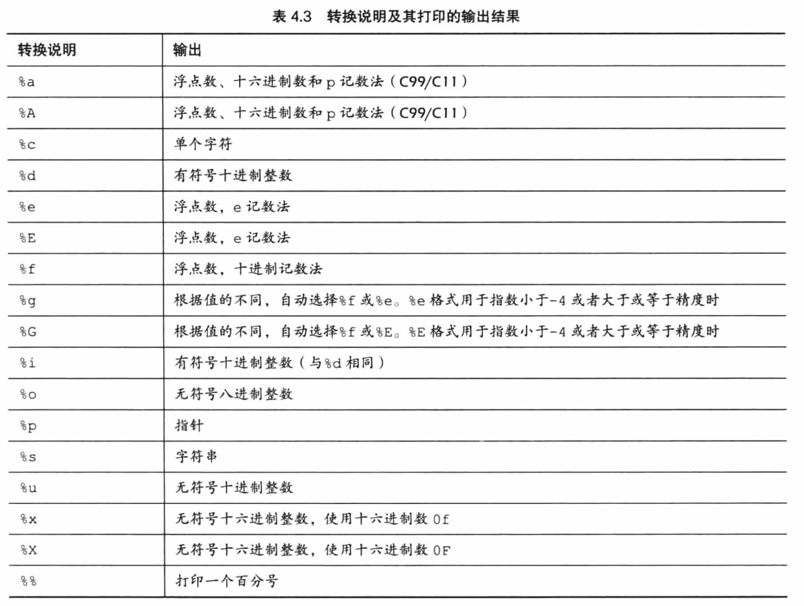

## C语言语法

> 位（bit）：最小的存储单元存储0或1
>
> 字节(byte)：8位为一字节，一字节可以表示$2^8$不同的数据
>
> 字(word)：计算机处理指令或数据的位长（32位/64位处理机）32位计算机：1字=32位=4字节，64位计算机：1字=64位=8字节
>
>  

#### **字符串和格式化输入输出**

> C语言中使用char[] 代替字符串数据，并使用标识符 \0 判断字符串结尾
>
>  
>
> 