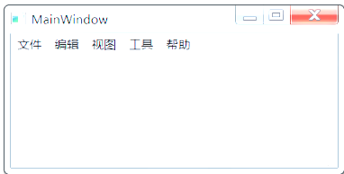
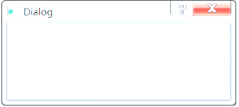

## QT

#### QApplication

> QApplication类管理图形用户界面应用程序的控制流和主要设置。它包含主事件循环，在其中来自窗口系统和其它资源的所有事件被处理和调度。也用于处理应用程序的初始化和结束，并且提供对话管理。使用Qt的图形界面的程序，都必须有只有一个QApplication对象
>
> - 执行事件处理
> - 定义应用程序的外观
> - 解析程序外部参数及命令

#### QWidget

> QWidget 是所有用户界面元素的基类，窗口和控件都是直接或间接继承自 QWidget，QMainWindow、QWidget、QDialog 三个类就是用来创建窗口的，可以直接使用也可以继承后再使用

#### QMainWindow

> QMainWindow 窗口可以包含菜单栏、工具栏、状态栏、标题栏等，是最常见的窗口形式，可以作为 GUI 程序的主窗口
>
>  

#### QDialog 

> 对话框窗口的基类。对话框主要用来执行短期任务，或与用户进行互动，它可以是模态的也可以是非模态的。QDialog 没有菜单栏、工具栏、状态栏等
>
>  
