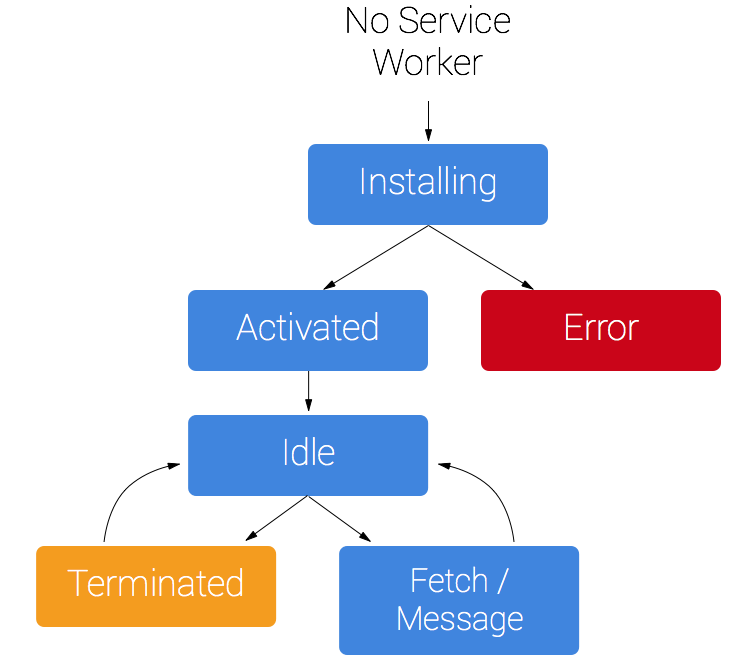
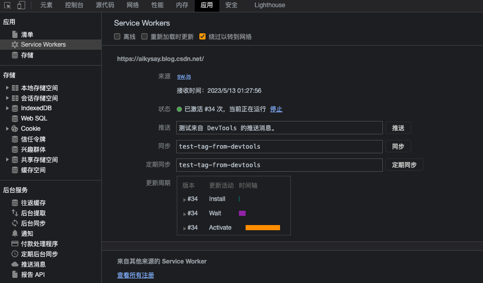
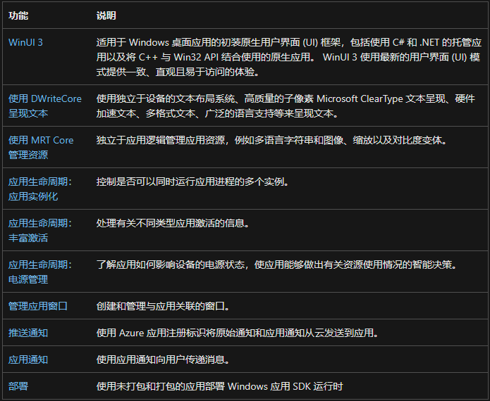

## Windows桌面应用

​		[WindwosBuilds](https://learn.microsoft.com/zh-cn/windows/apps/get-started/?tabs=rnw%2Ccpp-win32)

> - SPA：单页Web应用程序
>
>   1. 浏览器为客户端，使用AJAX(Asynchronous JavaScript/WebAssembly + XML/HTML)技术栈组成的前端应用。浏览器底层API决定了 SPA 能达到的用户体验和上层架构设计（浏览器内核与NativeAPI 兼容性）
>   2. 高度耦合的应用页面（前端编译，部署过程都耦合在一起相互依赖）。浏览器同源策略，一个webapp被限制共享一个域名，在跨应用使用场景下带来性能及安全问题。
>   3. 高度使用框架（VUE，React，Angular）封装浏览器API，使其最终业务的运行环境不再是浏览器，而是这套组件化方案。社区的组件化方案不会像 Web 标准一样去迭代，也不一定向下兼容，这在版本升级或框架迁移时会产生非常大的成本。
>
> - PWA：渐进式Web应用程序（无需安装即可使用的应用，类似于小程序）
>
>   1. ServiceWorker（C/S模型之间新增一层缓存代理，开启后安装在浏览器中，初始化时缓存应用所有静态资源，使用时缓存请求。实现离线使用、定期的后台同步以及推送通知功能）使用Workbox工具实现ServiceWorker
>
>       
>       
>

- #### Windows应用开发语言与集成环境

  - C/C++（性能最好）
  - C#(.NET)（支持跨平台开发）
  - Rust
  - WindowsSDK（WinUI3）
  - .NET MAUI(跨平台)
  - Web应用（PWA）
  - ReactNative

- #### Windows应用SDK

  >  Windows 应用 SDK 提供一组统一的 API 和工具，可供从 Windows 11 到 Windows 10 版本 1809 上的任何桌面应用以一致的方式使用。
  >
  > 包含内容
  >
  > -  
  > -  WindowsUI库
  > - Windows运行时API
  >
  > [Windows应用SDK](https://learn.microsoft.com/zh-cn/windows/apps/api-reference/)
