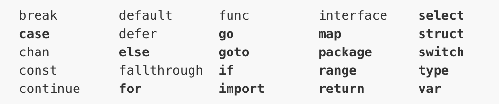
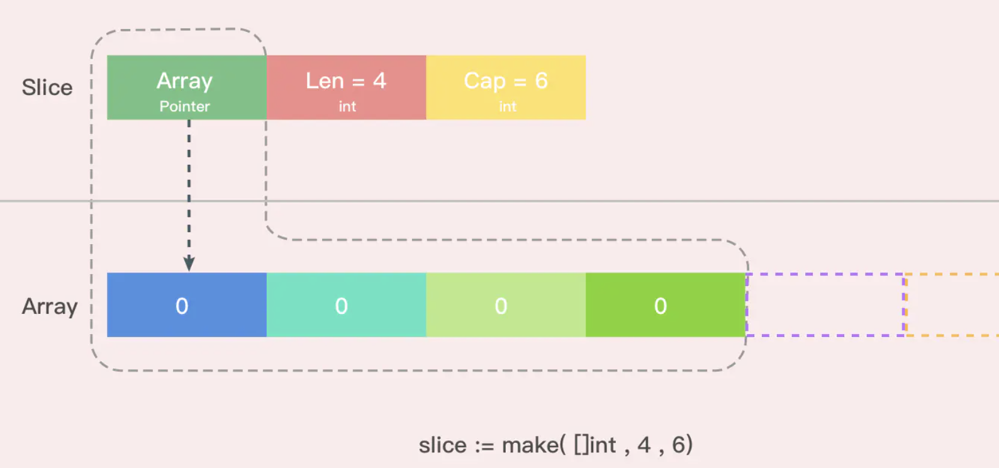
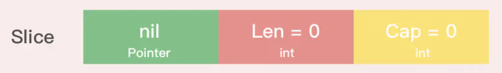

## GoLang基础

> 前景：Google开发的开源编程语言，诞生2006年1月2号15点4分5秒，于2009年11月开源，2012年发布go稳定版，Go语言在多核并发上拥有原生设计优势。
>
> go适合做什么
>
> - 服务端开发
> - 分布式系统，微服务
> - 网络编程
> - 区块链开发
> - 内存KV数据库
> - 云平台
>
> 目前Go语言已经⼴泛应用于人工智能、云计算开发、容器虚拟化、⼤数据开发、数据分析及科学计算、运维开发、爬虫开发、游戏开发等领域

#### **GO SDK**

> - GOROOT 指定golang根目录
> - path 添加扩充依赖目录（golang依赖仓库）
> - GOPATH 工作目录
> - go env 获取go环境及参数
>
> GO语言主要特征
>
> - 内存回收
> - 内置数据类型
> - 函数多返回值
> - 错误处理
> - 匿名函数和闭包
> - 类型和接口
> - 并发编程
> - 反射
> - 与其他语言交互
>
> **GO项目构建及编译**
>
> - go build
> - go test
> - go instll
> - go mod
>
> package main ：go应用程序main函数包
>
> go文件名与包名没有直接关系，**同一个文件夹下的文件只能有一个包名**
>
> go mod：记录和解析对其他模块的依赖（类似maven），modules替换GOPATH方法来指定使用哪些源文件，go.mod 文件建立后，go get，go build，go mod等命令都以go.mod文件作为配置
>
> ~~~golang
> go env -w GOBIN=/Users/youdi/go/bin
> go env -w GOPROXY=https://goproxy.cn,direct // 使用七牛云的
> // 开启Module auto情况下  go会根据当前文件go.mod决定是否启用Module，即开启Module后，依赖包存放位置变为 $GOPATH/pkg下，允许同一个版本多个包并存
> go env -w GO111MODULE=on
> // go mod  <command> <arguments> 常用命令
> go mod init // 生成go.mod 文件
> go mod download
> go mod edit
> go mod graph // 打印模块依赖图
> go mod verify // 在当前目录初始化mod
> go mod tidy  // 拉取缺少的模块，移除不用的模块
> go mod verify // 验证依赖是否正确
> go list -m -u all // 检查升级package
> go get -u //同上，升级到最新的吃药版本，或修订版本
> go get -u=patch // 升级到最新的修订版本
> ~~~
>
> go.mod 文件中命令
>
> - module 指定包的名字
> - require 指定依赖项模块
> - replace替换依赖项模块
> - exclude 忽略依赖模块
>
> go.sum 记录依赖数
>

####  **GO基础语法**

> 
>
> **函数，变量，常量，自定义类型命名**
>
> ```
> 1）首字符可以是任意的Unicode字符或者下划线
> 2）剩余字符可以是Unicode字符、下划线、数字
> 3）字符长度不限
> ```
>
> GO关键字
>
>  
>
> GO变量声明
>
> - var
>
>   > var 变量名 变量类型
>   >
>   > ~~~go
>   > // 批量声明
>   > var （
>   > a string 
>   > b int
>   > c bool
>   > d float32 
>   > ）
>   > // 变量初始化,由编译器判断变量类型（用于基础数据类型上）
>   > var name ,sex = "pprof", 1
>   > // 短变量声明  := 不能使用在函数外，且必须使用
>   > n := 10 
>   > ~~~
>
> - const（常量）
>
> > ~~~go
> > // iota 常量计数器，每加一行变量，iota计数为1
> > const(
> > n1 = iota  // 0
> > n2  // 1
> > n3  // 2
> > n4 // 3
> > )
> > const(
> > n1 = iota // 0 
> > n2  // 1 
> > _
> > n3 // 3)
> > ~~~
> >
> > 
>
> - type (自定义数据类型)
> - func
>
> GO内置数据类型
>
> - bool  (默认为false，不允许将整型变为bool类型，且不与其他类型转换)
>
> - int ，int8 ，int16 ，int32，int64
>
> - uint，uint8，uint16
>
> - float32，float64
>
> - string
>
>   > 多行字符串
>   >
>   > ~~~go
>   > s1 := `第一
>   > one
>   > two`
>   > ~~~
>
> - byte和rune类型字符
>
>   > byte类型字符 表示ASCII码中字符  uint8
>   >
>   > rune类型表示UTF-8中字符  int 32
>   >
>   > 字符串与[]rune与[]byte 互转后进行修改操作
>
> - complex64，complex128
>
> - array 定长数组
>
> > ~~~go
> > var a [len] int 
> > var a [5] int 与 var a[10] int  // 不是同一类型
> > //数组循环
> > fori 
> > // range 函数
> > for index ,v:= range a{
> > 
> > }
> > // 数组是值类型，复值和传参都会复制整个数组 （不会改变本身值）
> > // [n]* T ,数组指针 *[n] T
> > 
> > //数组初始化
> > var arr [5] int = [5]int{1,2,3}
> > //由编译器初始化空间
> > var arr = [...] int{1,2,3,4,5} 
> > 
> > d:=[...]struct{
> > name string
> > age unt8
> > }{
> > {"user",10},
> > {"user2",20},
> > }
> > 
> > ~~~
> >
> > 
>
> ---
>
> 引用类型
>
> - slice
>
>   > 使用内部指针和相关属性引用数组片段，实现可变数组长度
>   >
>   > - 切片是数组的一个引用
>   >
>   > - cap是切片最大扩容量，len是元素数量  0<=len(slice) <= len(arr)
>   >
>   > - slice == nil  len和cap都为0
>   >
>   > ~~~go
>   > //声明切片  默认s1 == nil 
>   > var s1 [] int 
>   > // 初始化切片
>   > s2 := [] int {}
>   > var s3[]int=make([]int,0)
>   > // 切片初始化
>   > var arr = [...]int{0,1,2,3,4}
>   > // [start,end) start，end 为数组下标
>   > var slice0[]int =arr[start:end] 
>   > // make 创建切片  []type 类型 len初始长度，cap最大容量
>   > var slice[]type =make([]type,len,cap)
>   > // 切片复制 copy 复制len较小的切片到长切片中
>   >  data := [...]int{0, 1, 2, 3, 4, 5, 6, 7, 8, 9}
>   >     s1 := data[8:]  // [8,9]
>   >     s2 := data[:5] //[0,1,2,3,4]
>   >     copy(s2, s1)  // s1 [8,9] s2[8,9,2,3,4] 
>   > //切片遍历
>   > for index,value:=range slice{
>   > 
>   > }
>   > // 字符串转切片 string 底层是byte数组
>   > str:="hello world"
>   > s1:=str[0:5]
>   > s:=[]rune(str)
>   > // 切片转字符
>   > strings.Replace(strings.Trim(fmt.Sprint(array_or_slice), "[]"), " ", ",", -1)
>   > ~~~
>   >
>   > **切片与数组**
>   >
>   > - GO数组为值类型，对数组的操作不会影响到原数组(操作时使用指针代替)
>   >
>   > - 切片的数据结构
>   >
>   >   > 内部实现的数据结构通过**指针引用底层数组**，**设定相关属性将数据读写操作限定在指定的区域内**。切片本身是一个只读对象，其工作机制类似数组指针的一种封装
>   >   >
>   >   > ~~~go
>   >   > type slice struct{
>   >   > array unsafe.Pointer
>   >   > len int
>   >   > cap int
>   >   > }
>   >   > ~~~
>   >   >
>   >   > 
>   >
>   > - nil与空切片
>   >
>   >   >  
>   >
>   > - 切片扩容
>   >
>   >   > 切片扩容后指向的数组是新数组（原数组进行复制）
>   >   >
>   >   > 切片容量少于1024个元素，扩容时原有容量翻倍
>   >   >
>   >   > 大于1024个元素以增长因子1.25进行扩容
>   >
>
> - map
>
>   > ~~~go
>   > map[keyType]ValueType
>   > make(map[KeyType]ValueType,[cap])
>   > // 双返回值
>   > value,isExit = map[key]
>   > // map 遍历 非顺序遍历，需要对key进行排序后 顺序取值
>   > for k，v:=range map{
>   > 
>   > }
>   > ~~~
>   >
>   > map实现原理 
>   >
>   > 
>
> - chan 管道
>
>   > 用来线程间通信的一种引用数据类型
>   >
>   > 1. 使用chan前必须make
>   > 2. 对chan的写和读操作必须同时存在，否则会死锁
>   > 3. 写和读一般放在2个go程，否则容易死锁
>   > 4. 必须要在数据超出通道capicity前，开启读通道，否则会死锁
>   > 5. 如果阻塞发生在主go程，会导致程序挂掉
>   > 6. 当管道中的数据读完后，再继续读，存在以下两种情况
>   >    - 通道已经close，则读出的是通道内类型的零值
>   >    - 通道未close，会发生阻塞
>   >
>
> - type / struct 结构体
>
>   > - 类型别名
>   >
>   >   > type byte = uint8  //将uint8类型取别名为byte
>   >   >
>   >   > type NewInt int //自定义类型
>   >
>   > - 结构体
>   >
>   >   > **类型名在同一包内不能重复**
>   >   >
>   >   > type 类型名 struct{
>   >   >
>   >   > 字段名 字段类型
>   >   >
>   >   > 字段名 字段类型
>   >   >
>   >   > }
>   >   >
>   >   > 匿名结构体（局部变量）
>   >   >
>   >   > 创建指针类型结构体 new(T) 或者 & T
>   >
>   > - 结构体方法(特定类型变量的函数）
>   >
>   >   > ```go
>   >   > // 接受者变量指定 方法属于那个struct结构体
>   >   > //接收者类型：指针类型和非指针类型。非指针类型参数不会更改原对象属性
>   >   > // 函数不属于任何类型，方法属于特定的类型。
>   >   > // GO中任何类型都可以拥有方法，非本地类型不能定义方法
>   >   > func (接收者变量 接收者类型) 方法名(参数列表) (返回参数) {
>   >   >   函数体
>   >   > } 
>   >   > ```
>   >
>   > - 结构体匿名字段
>   >
>   >   > ~~~go
>   >   > // 匿名字段，不需要指定属性名
>   >   > type Person struct{
>   >   >  string
>   >   >  int
>   >   > }
>   >   > // 嵌套结构体
>   >   > type Address struct{
>   >   >  Province string
>   >   >  City string
>   >   >  // 嵌套其他结构体
>   >   >  Person Person
>   >   > }
>   >   > type Animal struct{
>   >   >  name string
>   >   > }
>   >   > // 复写 Animal中方法
>   >   > func (a *Animal) move(){
>   >   > 
>   >   > }
>   >   > ~~~
>   >
>   > - 结构体字段的可见性
>   >
>   >   > **结构体中字段大写开头表示可公开访问，小写表示私有（仅在定义当前结构体的包中可访问）**
>   >
>   > - 结构体标签(Tag)
>   >
>   >   > Tag是结构体的元信息，可以在运行时通过反射读取
>   >   >
>   >   > 结构体标签由一个或者多个键值对组成，键值之间使用冒号分割
>   >   >
>   >   > ~~~go
>   >   > //Student 学生
>   >   > type Student struct {
>   >   >  ID     int    `json:"id"` //通过指定tag实现json序列化该字段时的key
>   >   >  Gender string //json序列化是默认使用字段名作为key
>   >   >  name   string //私有不能被json包访问
>   >   > }
>   >   > ~~~
>   >   >
>
> ---
>
> **指针**(指针不能进行偏移与运算)
>
> - 指针地址
>
>   > & 对**非指针变量**取址
>   >
>   > prt := &v   // ptr为指针变量，ptr的值为v变量的地址
>
> - 指针类型
>
>   > var p *string  //p为指针变量 默认我nil
>
> - 指针取值
>
>   > `*`指针变量取值
>
> **new 与 make**
>
> > ~~~GO
> > // new 的函数签名，返回的是指向该类型的指针
> > func new（Type) *Type
> > // make 对slice map chan 引用数据类型的内存创建，返回的是引用类型值
> > func make(t Type,size...InterType) Type 
> > ~~~
>
> ---
>
> 内置接口error
>
> ~~~go
> //只要实现了Error()函数，返回值为String的都实现了err接口
> type error interface{
>   Error() String
> }
> ~~~
>
> ---
>
> 类型转换（go语言中只有强制类型转换，语法只能在两个类型之间支持相互转换的时候使用）
>
> T(表达式)
>
> - T表示转换类型
> - 表达式包含变量，函数返回值
>
> ---
>
> **init函数与main函数**
>
> - init函数
>
>   > 1. init函数用于程序执行前包初始化函数（初始化包变量）
>   > 2. 每个包和文件可以有多个init函数
>   > 3. 不同包的init函数按照包导入的依赖关系决定初始化顺序
>   > 4. init函数不能被其他函数调用，执行在main函数前
>
> - main函数
>
>   > 1. go语言程序的主入口函数
>

#### **流程控制**

> - select语句
>
>   > select 语句类似于 switch 语句，但是select会随机执行一个可运行的case。如果没有case可运行，它将阻塞，直到有case可运行。
>   >
>   > ~~~go
>   > // 每个case必须时通讯
>   > // 所有的channel表达式都被求值
>   > //存在某个通讯可以执行（并发下公平选出一个case执行），就进行执行，忽略其他case
>   > // 如果没有default语句，select被阻塞，直到由case可以运行
>   > select {
>   > communication clause  :
>   >     statement(s);   
>   >    default:
>   >   statement(s);
>   > }
>   > ~~~
>   >
>   > - 处理异步IO操作，select会监听case语句中channel的读写操作，当case中channel读写操作为非阻塞状态（即能读写）时，将会触发相应的动作。
>   >
>   > - select中的default子句总是可运行的。（如果没有可运行的case语句，且有default语句，那么就会执行default的动作。）
>   >
>   > 
>
> - range/for语句
>
>   > - for init;condition;post{}
>   > - for condititon {} 等于 while
>   > - range迭代器 返回(索引，值) 或（键，值） 可以对slice，map，数组，字符串进行迭代循环

#### **函数与方法**

> **函数：**
>
> - 不支持嵌套，重载，默认参数（一个包不能有同名函数）
> - 支持多返回值，匿名函数，闭包，赋值变量
>
> ~~~go
> // 入参为函数
> func test(fn func() int) int {
>     return fn()
> }
> // 定义函数类型
> type FormatFunc func(s sting,x,y int) string
> func format(fn FormatFunc, s string, x, y int) string {
>     return fn(s, x, y)
> }
> // map,slice,chan ,指针，interface以外都是按值传递
> // 0个或者多个参数
> func myfunce(args ...int){ 
> 
> }
> // 使用slice作为参数是 (slice...) 格式入参
> 
> ~~~
>
> - 匿名函数
>
>   ~~~go
>   func main(){
>       // 不存在函数名，只有引用对象getSqrt
>       getSqrt := func(a float64) float64{
>           return math.Sqrt(a)
>       }
>       fmt.Println(getSqrt(4))
>   }
>   ~~~
>
> - 闭包、递归
>
>   ~~~go
>   // 闭包 = 函数 + 引用环境
>   // a函数 返回一个int类型函数
>   func a() func()int{
>       //函数a 局部变量
>       i:=0
>       b:=func()int{
>           // 匿名函数b使用函数a的局部变量操作
>           i++
>           fmt.Println(i)
>           return i
>       }
>       // 延迟引用
>       return b
>   }
>   func main(){
>       c := a()
>       c()  // 1
>       c()  // 2
>       c() // 3
>       // 只执行a() 函数未对返回的b进行操作
>       a() // 无打印
>   }
>   ~~~
>   
> - GO延迟调用
>   
>   > 1. defer语句在函数**return前执行**（多个defer按先进后出方式执行）
>   > 2. defer类似finally操作用于关闭资源
>   >
>   > 3. defer语句执行时候，函数调用的参数会被保存起来，非执行
>   > 4. defer 语句执行函数时，拷贝的是函数指针，执方法时拷贝的是方法值参
>

#### **异常处理**

> - panic 抛出异常
>
>   > 类似throw，终止其后执行的代码
>
> - recover 捕获异常
>
>   > 类似try，捕获panic，不影响应用后续功能
>
> - defer
>
>   > - 利用recover处理panic指令，defer 必须放在 panic 之前定义，另外 recover 只有在 defer 调用的函数中才有效。否则当panic时，recover无法捕获到panic，无法防止panic扩散。
>   > - recover 处理异常后，逻辑并不会恢复到 panic 那个点去，函数跑到 defer 之后的那个点。
>
> ~~~go
> defer func() {
> 		err := recover()
> 		if err != nil {
> 		 println(err.(string))
> 		}
> 	}()
> 	panic("------")
> ~~~
>
> 
>
> 
>
>  