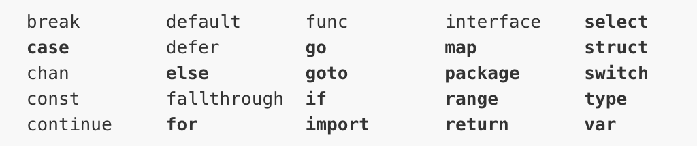

## GoLang基础

> 前景：Google开发的开源编程语言，诞生2006年1月2号15点4分5秒，于2009年11月开源，2012年发布go稳定版，Go语言在多核并发上拥有原生设计优势。
>
> go领域（目前Go语言已经⼴泛应用于人工智能、云计算开发、容器虚拟化、⼤数据开发、数据分析及科学计算、运维开发、爬虫开发、游戏开发等领域）
>
> - 服务端开发
> - 分布式系统，微服务
> - 网络编程
> - 区块链开发
> - 内存KV数据库
> - 云平台
>
> GO 语言特性
>
> - 内存回收
>
> - 内置数据类型
>
> - 函数多返回值
>
> - 错误处理
>
> - 匿名函数和闭包
>
> - 类型和接口
>
> - 并发编程
>
> - 反射
>
> - 与C交互
>
> - 环境变量
>
>   ~~~golang
>   go env -w GOBIN=/Users/youdi/go/bin
>   go env -w GOPROXY=https://goproxy.cn,direct // 使用七牛云的
>   // 开启Module auto情况下  go会根据当前文件go.mod决定是否启用Module，即开启Module后，依赖包存放位置变为 $GOPATH/pkg下，允许同一个版本多个包并存
>   go env -w GO111MODULE=on
>   // go mod  <command> <arguments> 常用命令
>   go mod init // 生成go.mod 文件
>   go mod download
>   go mod edit
>   go mod graph // 打印模块依赖图
>   go mod verify // 在当前目录初始化mod
>   go mod tidy  // 拉取缺少的模块，移除不用的模块
>   go mod verify // 验证依赖是否正确
>   go list -m -u all // 检查升级package
>   go get -u //同上，升级到最新的版本，或修订版本
>   go get -u=patch // 升级到最新的修订版本
>   ~~~
>
> - GO关键字
>
>   
>
> - 引用数据类型
>
>   - array/slice：
>
>     1. array：长度固定，支持 "=="、"!=" 操作符，值类型，赋值和传参会复制整个数组
>
>     2. slice：引用数组（内部指针和相关属性引用数组片段）
>
>        
>
>   - map
>
>   - chan
>
>   - type / struct 结构体
>
>   - 指针
>
>   - interface
>
> - 泛型
>
> - 函数/方法
>
> - 异常处理
>
>   - error : 一般用来表达可以处理的错误
>
>     > errorrs 包
>     >
>     > - New 创建新的error
>     > - Is 判断是不是特定的某个error
>     > - As 类型转为特定的error
>     > - Unwrap 解除包装，返回被包装的error
>
>   - panic 抛出异常（不可恢复，可以被捕获）
>
>     > 类似throw，终止其后执行的代码
>
>   - recover 捕获异常
>
>     > 类似try，捕获panic，不影响应用后续功能
>
>   - defer
>
>     > - 利用recover处理panic指令，defer 必须放在 panic 之前定义，另外 recover 只有在 defer 调用的函数中才有效。否则当panic时，recover无法捕获到panic，无法防止panic扩散。
>     > - recover 处理异常后，逻辑并不会恢复到 panic 那个点去，函数跑到 defer 之后的那个点。
>
> - 单元测试
>
>   go test命令会遍历所有的`*_test.go`文件中符合上述命名规则的函数，然后生成一个临时的main包用于调用相应的测试函数，然后构建并运行、报告测试结果，最后清理测试中生成的临时文件。
>
>   |   类型   |         格式          |              作用              |
>   | :------: | :-------------------: | :----------------------------: |
>   | 函数测试 |   函数名前缀为Test    | 测试程序的一些逻辑行为是否正确 |
>   | 基准函数 | 函数名前缀为Benchmark |         测试函数的性能         |
>   | 示例函数 |  函数名前缀为Example  |       为文档提供示例文档       |
>
>   1. 文件名以**_test.go 命名
>   2. 测试方法以Test`[^a-z]` 开头
>   3. 方法参数以 t *testing.T 为入参
>   4. 使用go test 运行
>
>   ~~~go
>   // 测试代码的驱动程序 ，源文件以_test.go格式命名
>   go test [-c] [-i] [build flags] [packages] [flags for test binary]
>   -c : 编译go test成为可执行的二进制文件，但是不运行测试。
>   
>   -i : 安装测试包依赖的package，但是不运行测试。
>   
>   -test.run pattern: 只跑哪些单元测试用例
>   
>   -test.bench patten: 只跑那些性能测试用例
>   
>   -test.benchmem : 是否在性能测试的时候输出内存情况
>   
>   -test.benchtime t : 性能测试运行的时间，默认是1s
>   
>   -test.cpuprofile cpu.out : 是否输出cpu性能分析文件
>   
>   -test.memprofile mem.out : 是否输出内存性能分析文件
>   
>   -test.blockprofile block.out : 是否输出内部goroutine阻塞的性能分析文件
>   
>   -test.memprofilerate n : 内存性能分析的时候有一个分配了多少的时候才打点记录的问题。这个参数就是设置打点的内存分配间隔，也就是profile中一个sample代表的内存大小。默认是设置为512 * 1024的。如果你将它设置为1，则每分配一个内存块就会在profile中有个打点，那么生成的profile的sample就会非常多。如果你设置为0，那就是不做打点了。
>   
>   你可以通过设置memprofilerate=1和GOGC=off来关闭内存回收，并且对每个内存块的分配进行观察。
>   
>   -test.blockprofilerate n: 基本同上，控制的是goroutine阻塞时候打点的纳秒数。默认不设置就相当于-test.blockprofilerate=1，每一纳秒都打点记录一下
>   
>   -test.parallel n : 性能测试的程序并行cpu数，默认等于GOMAXPROCS。
>   
>   -test.timeout t : 如果测试用例运行时间超过t，则抛出panic
>   
>   -test.cpu 1,2,4 : 程序运行在哪些CPU上面，使用二进制的1所在位代表，和nginx的nginx_worker_cpu_affinity是一个道理
>   
>   -test.short : 将那些运行时间较长的测试用例运行时间缩短
>   ~~~
>

<a href="https://gitee.com/miaomiaole/quickgolang.git">码云</a>

