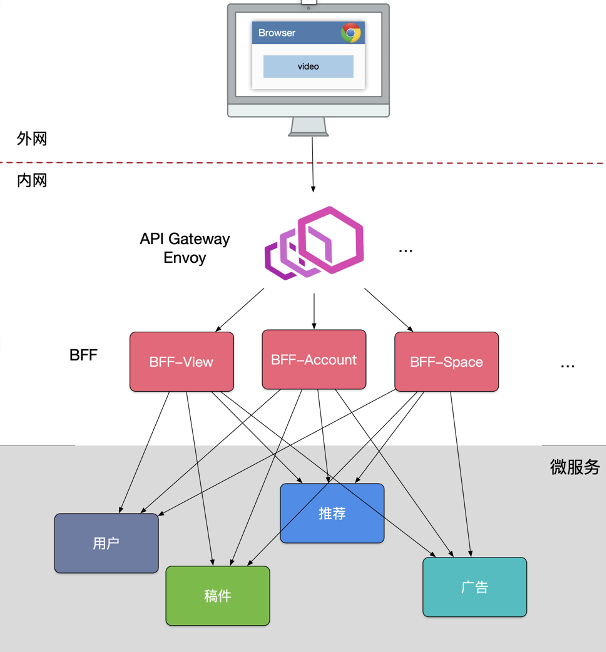

## 微服务

> - SOA 面向服务架构
>
> - 微服务
>
>   1. 原子服务
>
>   2. 独立进程
>
>   3. 隔离部署
>
>   4. 去中心化服务治理
>
>      > 数据去中心
>      >
>      > 治理去中心
>      >
>      > 技术去中心
>
>   5. 分布式系统，使用RPC进行远程进程之间调用
>   6. 分区数据库架构，存在事务
>   7. 运维难度大
>
> ---
>
> **基础设施自动化**
>
> - CI/CD：GitLab + GitLab Hooks + Kubernetes + Prometheus + ELK + *Control Panel*
>
> **可用性兼容性设计**
>
> - 隔离
>
> - 超时控制
>
> - 负载保护
>
> - 限流
>
> - 降级
>
> - 重试
>
> - 负载均衡
>
> - API GateWay 划分
>
>   >  
>   >
>   > - BFF (Backend For Frontend) 数据聚合，计算，组合，根据不同的客户端提供不同接口（面向用户接口），调用不同服务的BFF需要组合不同的服务器返回数据
>   >
>   > - Microservices 划分
>   >
>   >   - CQRS 分为命令端和查询端。
>   >
>   >   