## JavaSE

- #### 计算机基础

  > **计算机位数：** 32位计算机表示能同时处理$2^{32}-1$个电信号（子长32位的电路信号）
  >
  > **浮点数：**
  >
  > - 符号位 （0正数，1负数）
  > - 阶码位 （存储指数，$E=e+(2^{n-1}-1)$ E 表示阶码，e表示指数真值，8位阶码的指数范围为[-126，127]）
  > - 有效数（存储有效数） 
  
- #### **JDK**

  > 面向对象编程（Object-Oriented Programming) 
  >
  > *主要目标*
  >
  > - 可维护
  > - 可重用
  > - 可扩展
  >
  > ---
  >
  > *面对对象特性*
  >
  > - 封装 ，继承，多态，（抽象）
  >
  > ---
  >
  > - is - a ：LSP（里氏替换原则）父类引用直接使用子类引用代替，并可以编译正确执行，则使用继承关系 （extends）
  >
  > - can-do：(implement）
  > - contains - a：类是成员变量（组合）**组合成员与类生命周期一致**
  > - has - a ：类是成员变量（聚合） 聚合成员可以复用在其他类上
  > - use - a ：依赖（使用）  （通常作为入参使用）
  >
  > ---
  >
  > **序列化**
  >
  > *内存中数据对象进行二进制流转换进行数据持久化和网络传输*
  >
  > - Serializable  序列化
  > - Hessian 序列化
  > - JSON 数据交互格式
  >
  > ---
  >
  > **函数式编程**
  >
  > - 转换类型：Function<T,R>：元素转换函数
  >
  > - 消费类型函数：Consumer ：包装执行逻辑操作
  >
  > - 生产类型函数：Supplier：包装new对象操作
  >
  > - 判断类型函数：Predicate：包装条件判断逻辑操作
  >
  > - null类型包装函数：Optional：包装单元素操作对象（消除 if obj != null 代码)
  >
  > - 容器类型包装函数：Stream：操作，收集，统计，约归容器中元素
  >
  > - 异步操作对象：Future/CompletableFuture
  >   - CompletableFuture方法概述
  >   
  >     - runAsync：执行无返回的异步线程
  >     - supplyAsync：执行有返回值得异步线程
  >     - whenComplete/whenCompleteAsync：计算结果完成时回调
  >     - handle：同whenComplete，需要手动处理异常
  >     - thenApply/thenApplyAsync ：回调方法（获取返回值后对结果进行处理）
  >     - thenAccept/thenApplyAsync:
  >   
  >   - 线程池大小：$N_{threads}= N_{CPU}*U_{CPU}*(1+W/C)$ 
  >   
  >     > $U_{CPU}$是期望的CPU利用率， W/C是等待时间与计算时间的比率
  >   
  >   - **计算密集型的操作**，并且没有I/O，那么推荐使用Stream接口
  >   
  >   - **涉及等待I/O的操作（包括网络连接等待）**，那么使用 CompletableFuture
  >   
  >   - **Stream与CompletableFuture完成并发异步操作**
  >   
  >     >  

- #### **容器**

  >  
  >
  > 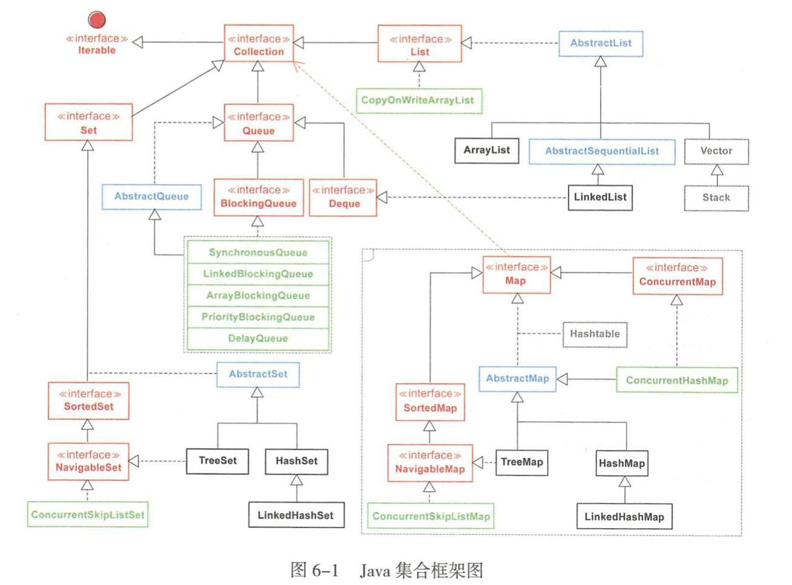 
  >
  > **数据结构**
  >
  > - 线性
  >
  >   > ArrayList
  >   >
  >   > > *以无参创建ArrayList时，实际上初始化一个空数组，当添加元素时才分配容（默认数组容量为10），每次扩容以源数组长度1.5倍进行扩容*
  >   > >
  >   > > ~~~java
  >   > >  private Object[] grow(int minCapacity) {
  >   > >         int oldCapacity = elementData.length;
  >   > >         if (oldCapacity > 0 || elementData != DEFAULTCAPACITY_EMPTY_ELEMENTDATA) {
  >   > >            // elementData 长度不足 扩充1.5倍
  >   > >             int newCapacity = ArraysSupport.newLength(oldCapacity,
  >   > >                     minCapacity - oldCapacity, /* minimum growth */
  >   > >                     oldCapacity >> 1           /* preferred growth */);
  >   > >             return elementData = Arrays.copyOf(elementData, newCapacity);
  >   > >         } else {
  >   > >             return elementData = new Object[Math.max(DEFAULT_CAPACITY, minCapacity)];
  >   > >         }
  >   > >     }
  >   > > // 需要目标数组，将原数组拷贝到你自己定义的数组里，而且可以选择拷贝的起点和长度以及放入新数组中的位置
  >   > > System.arraycopy()
  >   > >  //系统自动在内部新建一个数组，并返回该数组。底层调用System.arraycopy()
  >   > > Arrays.copyOf()
  >   > > ~~~
  >   >
  >   > LinkedList(实现List，Queue接口)
  >   >
  >   > > ~~~java
  >   > > // 双向链表结构
  >   > > private static class Node<E> {
  >   > >         E item;
  >   > >         Node<E> next;
  >   > >         Node<E> prev;
  >   > >         Node(Node<E> prev, E element, Node<E> next) {
  >   > >             this.item = element;
  >   > >             this.next = next;
  >   > >             this.prev = prev;
  >   > >         }
  >   > >     }
  >   > > 
  >   > > ~~~
  >   >
  >   > Queue
  >
  > - **树**
  >
  >   > **二叉排序树(二叉搜索树)**
  >   >
  >   > - 所有子树的根节点的左子节点小于根节点
  >   > - 所有子树的根节点的右子节点大于根节点
  >   > - 二叉排序树删除
  >   >   - 叶子节点直接删除
  >   >   - 删除节点只存在左子树或右子树直接使用子树代替删除节点
  >   >   - 删除节点同时存在左子树和右子树
  >   >     - 删除节点左子树最大节点代替删除节点
  >   >     - 删除节点右子树最小节点代替删除节点
  >   >
  >   > **平衡二叉树(AVL)**  
  >   >
  >   > - **二叉排序树**
  >   > - **任意节点的子树高度差都小于或等于1**
  >   > - 删除或新增操时
  >   >   - 左旋：当右边子树高度大于左边时，使用某个节点为中心，将它沉入当前左节点位置，而让当前右子节点作为新树的根节点
  >   >   - 右旋：当左边子树高度大于右边时，使用某个节点为中心，将它沉入当前右节点位置，而让当前左子节点作为新树的根节点
  >   >   - 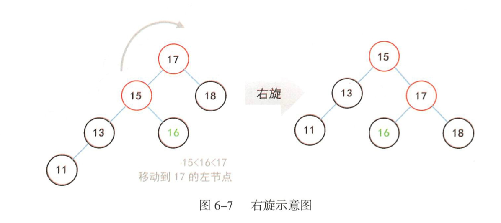 
  >   >   - 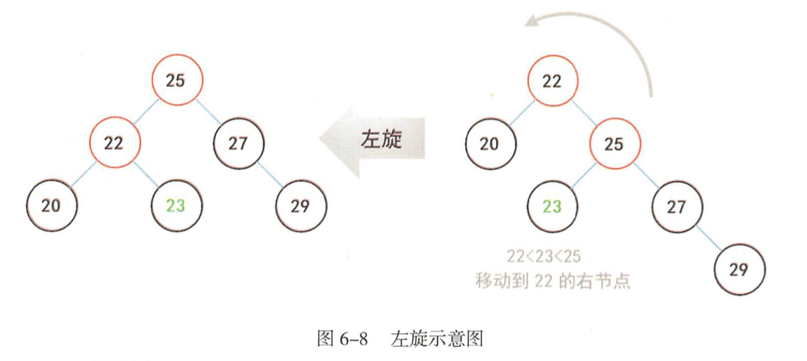 
  >   >
  >   > ---
  >   >
  >   > **多路查找树（B树）**
  >   >
  >   > - 2-3树  每个节点都具有2个字节点或3个子节点  **且左子树小于中子树小于右子树**
  >   >   - 任意节点到它的所有子节点深度相同，**绝对平衡树**
  >   >   - **中子树元素值位于父节点两个元素之间**
  >   >   -  
  >   >
  >   > ---
  >   >
  >   > **红黑树**（2-3-4树）   新增，查找，删除最差时间复杂度为$O(log_n)$
  >   >
  >   > - **二叉排序树**
  >   > - 节点具有红黑属性，黑色节点：对应2-3-4中子节点为2的节点 其他为红色节点
  >   > - **根节点和叶子节点都是黑色**
  >   > - 一条路径上不能存在相邻红色节点
  >   > - 根节点到叶子节点所有路径包含相同数目的黑色节点
  >   >
  >   > *红黑树的平衡性不如AVL树，维持一种大致上的平衡，可能平均查找次数不如AVL树（取决于树的高度），但在删除操作时，红黑树最多三次旋转后恢复平衡，而AVL可能需要$O(log_N)$次旋转才能恢复平衡，所以在对删除，插入操作频繁时，红黑树整体性能高于AVL树*
  >
  > - 哈希
  >
  >   > Map
  >   >
  >   > > HashMap 
  >   > >
  >   > > - 尺寸（size，实际存储Node个数）
  >   > >
  >   > >   - CAPACITY (桶)  数组实际长度   CAPACITY < size
  >   > >
  >   > > - 阈值（threshold，超过阈值扩容，计算方式 **capacity** * **loadFactor**）
  >   > >
  >   > > - 负载因子（loadFactor，默认0.75，**数组扩容系数**）
  >   > >
  >   > > - **数组初始容量**（DEFAULT_INITIAL_CAPACITY，默认16，必须是2的N次幂)
  >   > >
  >   > > - 数组最大容量（MAXIMUM_CAPACITY，默认$2^{30}$)
  >   > >
  >   > > - 链表转红黑树阈值（MIN_TREEIFY_CAPACITY，默认64）
  >   > >
  >   > > - 链表转红黑树阈值(TREEIFY_THRESHOLD，默认为8)
  >   > >
  >   > >   - **当链表长度超过8（存在Node节点再哈希超过8次）且size超过64才转换红黑树**
  >   > >
  >   > > - modCount 记入修改次数（防止多线程修改HashMap，抛出异常）
  >   > >
  >   > > - 扩容机制
  >   > >
  >   > >   - 空参构造函数在第一次put时初始化数组长度（16）
  >   > >   - 有参构造函数，resize()计算阈值，tableSizeFor()调整初始容量为2的n次幂
  >   > >   - 每次扩容，容量，阈值为原来的2倍
  >   > >
  >   > > - 结构（数组+链表+红黑树）
  >   > >
  >   > >   - 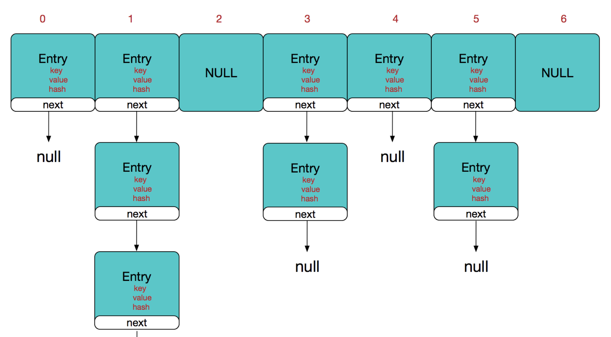  
  >   > >
  >   > >   - ~~~java
  >   > >     // 内部Node结构 
  >   > >     static class Node<K,V> implements Map.Entry<K,V> {
  >   > >             final int hash;
  >   > >             final K key;
  >   > >             V value;
  >   > >             Node<K,V> next;
  >   > >             Node(int hash, K key, V value, Node<K,V> next) {
  >   > >                 this.hash = hash;
  >   > >                 this.key = key;
  >   > >                 this.value = value;
  >   > >                 this.next = next;
  >   > >             }
  >   > >                                                 
  >   > >             public final K getKey()        { return key; }
  >   > >             public final V getValue()      { return value; }
  >   > >             public final String toString() { return key + "=" + value; }
  >   > >                                                 
  >   > >             public final int hashCode() {
  >   > >                 return Objects.hashCode(key) ^ Objects.hashCode(value);
  >   > >             }
  >   > >                                                 
  >   > >             public final V setValue(V newValue) {
  >   > >                 V oldValue = value;
  >   > >                 value = newValue;
  >   > >                 return oldValue;
  >   > >             }
  >   > >             public final boolean equals(Object o) {
  >   > >                 if (o == this)
  >   > >                     return true;
  >   > >                 return o instanceof Map.Entry<?, ?> e
  >   > >                         && Objects.equals(key, e.getKey())
  >   > >                         && Objects.equals(value, e.getValue());
  >   > >             }
  >   > >         }
  >   > >     // put 元素过程
  >   > >     //onlyIfAbsent – 如果为 true，则不更改现有值 
  >   > >     // evict – 如果为 false，则表处于创建模式。
  >   > >     final V putVal(int hash, K key, V value, boolean onlyIfAbsent,
  >   > >                    boolean evict) {
  >   > >         Node<K,V>[] tab; Node<K,V> p; int n, i;
  >   > >         // 1.先判断此时的数组是否为空，如果为空则进行resize操作下
  >   > >         if ((tab = table) == null || (n = tab.length) == 0)
  >   > >             n = (tab = resize()).length;
  >   > >         // 2.以hash索引数组的长度-1与key的hash值进行与运算，得出在数组中的索引，如果索引指定的位置
  >   > >         // 为空，则代表可以插入，直接插入一个新的node
  >   > >         if ((p = tab[i = (n - 1) & hash]) == null)
  >   > >             tab[i] = newNode(hash, key, value, null);
  >   > >         else {
  >   > >             Node<K,V> e; K k;
  >   > >             // 3.判断当前key是否存在，如果是则进行替换操作
  >   > >             if (p.hash == hash &&
  >   > >                 ((k = p.key) == key || (key != null && key.equals(k))))
  >   > >                 e = p;
  >   > >             // 4.如果key不存在，则判断当前节点是否为树类型，如果是树类型的话，
  >   > >             // 则按照树的操作去追加新节点内容
  >   > >             else if (p instanceof TreeNode)
  >   > >                 e = ((TreeNode<K,V>)p).putTreeVal(this, tab, hash, key, value);
  >   > >             // 5.如果出现hash冲突的节点不是树类型，则说明当前发生的碰撞在链表里面，
  >   > >             // 则这个时候就进入循环处理逻辑
  >   > >             else {
  >   > >                 for (int binCount = 0; ; ++binCount) {
  >   > >                     // 6.先判断被碰撞的节点的下一个节点是否为空
  >   > >                     if ((e = p.next) == null) {
  >   > >                         // 如果为空则将新节点放到被碰撞节点的下一个节点
  >   > >                         p.next = newNode(hash, key, value, null);
  >   > >                         // 7.作为后继节点之后判断当前链表长度是否超过最大允许链表长度8，
  >   > >                         // 如果大于的话，则转为红黑树执行插入
  >   > >                         if (binCount >= TREEIFY_THRESHOLD - 1) // -1 for 1st
  >   > >                         // 8.如果map的索引表为空或者当前索引表长度还小于64（最大转红黑树的索引数组表长度），
  >   > >                         // 那么进行resize操作就行了；否则，如果被碰撞节点不为空，
  >   > >                         // 那么就顺着被碰撞节点这条树往后新增该新节点
  >   > >                             treeifyBin(tab, hash);
  >   > >                         break;
  >   > >                     }
  >   > >                     if (e.hash == hash &&
  >   > >                         ((k = e.key) == key || (key != null && key.equals(k))))
  >   > >                         break;
  >   > >                     p = e;
  >   > >                 }
  >   > >             }
  >   > >             // 如果替换成功，返回老的value
  >   > >             if (e != null) { // existing mapping for key
  >   > >                 V oldValue = e.value;
  >   > >                 if (!onlyIfAbsent || oldValue == null)
  >   > >                     e.value = value;
  >   > >                 afterNodeAccess(e);
  >   > >                 return oldValue;
  >   > >             }
  >   > >         }
  >   > >         ++modCount;
  >   > >         if (++size > threshold)
  >   > >             resize();
  >   > >         afterNodeInsertion(evict);
  >   > >         return null;
  >   > >     }
  >   > >                                                 
  >   > >     ~~~
  >   >
  >   > **ConcurrentHashMap** （涉及分段锁，volatile，CAS，链表，红黑树）
  >   >
  >   > - **成员字段**
  >   >
  >   >   - ~~~java
  >   >     // node数组，存放数据
  >   >     transient volatile Node<K,V>[] table;
  >   >     // 扩容新生成的数组，其大小为table两倍
  >   >     private transient volatile Node<K,V>[]nextTable;
  >   >     // Node 内部结构，包含内key 、 value 、 hash 、 next 一个节点
  >   >     static  class Node<K,V> implements Map.Entry<K,V>
  >   >     //维护红黑树的读写锁，存储对红黑树节点引用
  >   >     static final class TreeBin<K,V>  extends Node<K,V>
  >   >     // 红黑树存储结构
  >   >     static final class TreeNode<K,V> extends Node<K,V>
  >   >      //扩容操作，外部对数组节点操作会转发到nextTable
  >   >     static final class ForwardingNode<K,V> extends Node<K,V>
  >   >     // 占位加锁，执行读写操作时，对其加锁
  >   >     static final class ReservationNode<K,V> extends Node<K,V>
  >   >      // table 初始化和扩容状态位
  >   >      // sizeCtl = - 1 表示正在初始化
  >   >      // sizeCtl = -n 表示(n-1)个线程正在进行扩容
  >   >      // sizeCtl > 0 初始化或扩容中需要使用容量
  >   >      // sizeCtl = 0 默认值，使用默认容量进行初始化
  >   >     private transient volatile int sizeCtl 
  >   >     ~~~
  >   >
  >   >   - 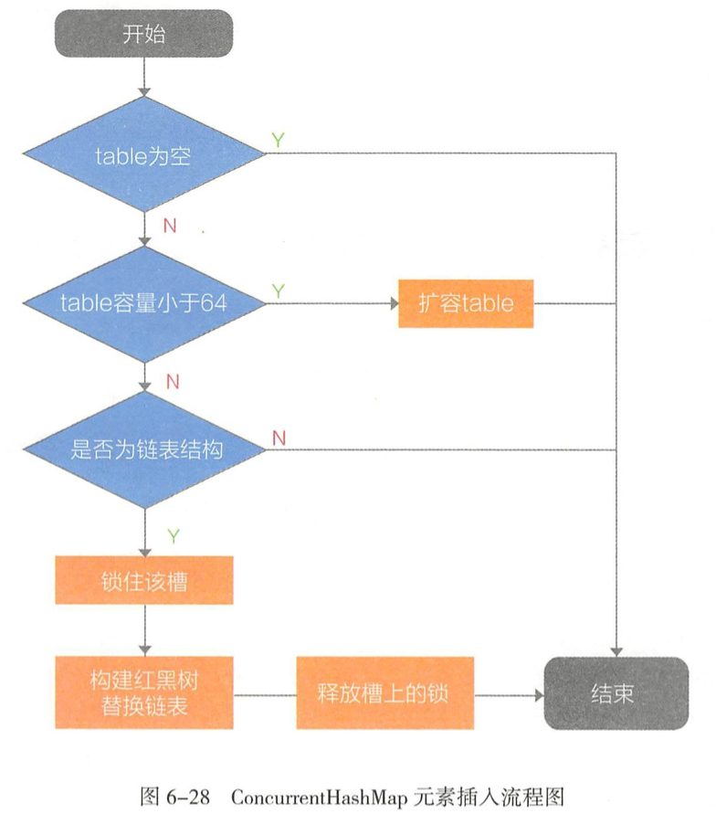 
  >   >
  >   >   - 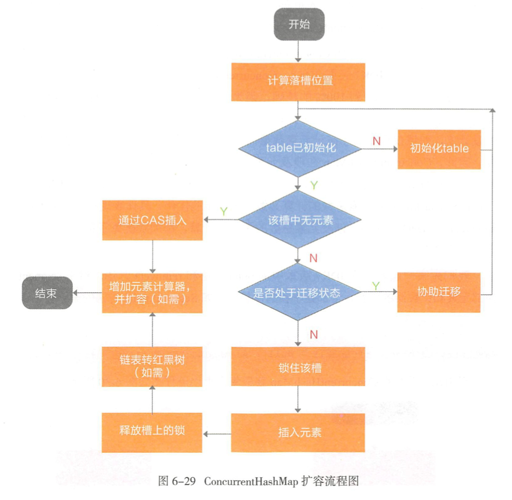 
  >   >
  >   >      - **并发控制逻辑**
  >   >
  >   >   - ~~~java
  >   >     private final Node<K,V>[] initTable() {
  >   >             Node<K,V>[] tab; int sc;
  >   >           // table tab都为空 且sizeCtl小于 0 存在线程正在初始化
  >   >             while ((tab = table) == null || tab.length == 0) {
  >   >               if ((sc = sizeCtl) < 0)
  >   >                    // 让出当前线程CPU资源
  >   >                     Thread.yield(); 
  >   >               // 大于0 使用CAS（原子操作）并设置为-1
  >   >                 else if (U.compareAndSetInt(this, SIZECTL, sc, -1)) {
  >   >                     try {
  >   >                         if ((tab = table) == null || tab.length == 0) {             // 默认容量
  >   >                             int n = (sc > 0) ? sc : DEFAULT_CAPACITY;
  >   >                           // 创建数组
  >   >                             @SuppressWarnings("unchecked")
  >   >                             Node<K,V>[] nt = (Node<K,V>[])new Node<?,?>[n];
  >   >                             table = tab = nt;
  >   >                             sc = n - (n >>> 2);
  >   >                         }
  >   >                     } finally {
  >   >                       // 扩容中需要使用容量
  >   >                         sizeCtl = sc;
  >   >                     }
  >   >                     break;
  >   >                 }
  >   >             }
  >   >             return tab;
  >   >         }
  >   >     //onlyIfAbsent  如果为 true，则不更改现有值 
  >   >     final V putVal(K key, V value, boolean onlyIfAbsent) {
  >   >             if (key == null || value == null) throw new NullPointerException();
  >   >           // 计算hash值
  >   >             int hash = spread(key.hashCode());
  >   >         // 统计hash冲突 超过8转红黑树
  >   >             int binCount = 0;
  >   >        // while 循环
  >   >             for (Node<K,V>[] tab = table;;) {
  >   >                 Node<K,V> f; int n, i, fh; K fk; V fv;
  >   >                 if (tab == null || (n = tab.length) == 0)
  >   >                   // tab为空  初始化数组
  >   >                     tab = initTable();
  >   >               // 数组槽上没元素，使用cas插入（非分段锁）
  >   >                 else if ((f = tabAt(tab, i = (n - 1) & hash)) == null) {          //  数组槽上没元素时使用cas插入（没加锁）
  >   >                     if (casTabAt(tab, i, null, new Node<K,V>(hash, key, value)))
  >   >                         break;                   
  >   >                 } //MOVED == -1 转发节点的哈希 （正在扩容）
  >   >                 else if ((fh = f.hash) == MOVED)
  >   >                    // 协作扩容
  >   >                     tab = helpTransfer(tab, f);
  >   >                 else if (onlyIfAbsent // 在不获取锁的情况下检查第一个节点，hash相同，值不同则替换
  >   >                          && fh == hash
  >   >                          && ((fk = f.key) == key || (fk != null && key.equals(fk)))
  >   >                          && (fv = f.val) != null)
  >   >                     return fv;
  >   >                 else { // 插入节点hash冲突，且数组没处于扩容状态
  >   >                     V oldVal = null;
  >   >                   // 加锁插入
  >   >                     synchronized (f) {
  >   >                         if (tabAt(tab, i) == f) {
  >   >                             if (fh >= 0) {
  >   >                                 binCount = 1;
  >   >                                 for (Node<K,V> e = f;; ++binCount) {
  >   >                                     K ek;
  >   >                                     if (e.hash == hash &&
  >   >                                         ((ek = e.key) == key ||
  >   >                                          (ek != null && key.equals(ek)))) {
  >   >                                         oldVal = e.val;
  >   >                                         if (!onlyIfAbsent)
  >   >                                             e.val = value;
  >   >                                         break;
  >   >                                     }
  >   >                                     Node<K,V> pred = e;
  >   >                                     if ((e = e.next) == null) {
  >   >                                         pred.next = new Node<K,V>(hash, key, value);
  >   >                                         break;
  >   >                                     }
  >   >                                 }
  >   >                             }
  >   >                             else if (f instanceof TreeBin) {
  >   >                                 Node<K,V> p;
  >   >                                 binCount = 2;
  >   >                                 if ((p = ((TreeBin<K,V>)f).putTreeVal(hash, key,
  >   >                                                                value)) != null) {
  >   >                                     oldVal = p.val;
  >   >                                     if (!onlyIfAbsent)
  >   >                                         p.val = value;
  >   >                                 }
  >   >                             }
  >   >                             else if (f instanceof ReservationNode)
  >   >                                 throw new IllegalStateException("Recursive update");
  >   >                         }
  >   >                     }
  >   >                     if (binCount != 0) {
  >   >                         if (binCount >= TREEIFY_THRESHOLD)
  >   >                             treeifyBin(tab, i);
  >   >                         if (oldVal != null)
  >   >                             return oldVal;
  >   >                         break;
  >   >                     }
  >   >                 }
  >   >             }
  >   >             addCount(1L, binCount);
  >   >             return null;
  >   >         }
  >   >      // 数组安全扩容
  >   >      private final void transfer(Node<K,V>[] tab, Node<K,V>[] nextTab) {
  >   >             int n = tab.length, stride;
  >   >             if ((stride = (NCPU > 1) ? (n >>> 3) / NCPU : n) < MIN_TRANSFER_STRIDE)
  >   >                 stride = MIN_TRANSFER_STRIDE; // subdivide range
  >   >             if (nextTab == null) {            // initiating
  >   >                 try {
  >   >                     @SuppressWarnings("unchecked")
  >   >                     Node<K,V>[] nt = (Node<K,V>[])new Node<?,?>[n << 1];
  >   >                     nextTab = nt;
  >   >                 } catch (Throwable ex) {      // try to cope with OOME
  >   >                     sizeCtl = Integer.MAX_VALUE;
  >   >                     return;
  >   >                 }
  >   >                 nextTable = nextTab;
  >   >                 transferIndex = n;
  >   >             }
  >   >             int nextn = nextTab.length;
  >   >             ForwardingNode<K,V> fwd = new ForwardingNode<K,V>(nextTab);
  >   >             boolean advance = true;
  >   >             boolean finishing = false; // to ensure sweep before committing nextTab
  >   >             for (int i = 0, bound = 0;;) {
  >   >                 Node<K,V> f; int fh;
  >   >                 while (advance) {
  >   >                     int nextIndex, nextBound;
  >   >                     if (--i >= bound || finishing)
  >   >                         advance = false;
  >   >                     else if ((nextIndex = transferIndex) <= 0) {
  >   >                         i = -1;
  >   >                         advance = false;
  >   >                     }
  >   >                     else if (U.compareAndSetInt
  >   >                              (this, TRANSFERINDEX, nextIndex,
  >   >                               nextBound = (nextIndex > stride ?
  >   >                                            nextIndex - stride : 0))) {
  >   >                         bound = nextBound;
  >   >                         i = nextIndex - 1;
  >   >                         advance = false;
  >   >                     }
  >   >                 }
  >   >                 if (i < 0 || i >= n || i + n >= nextn) {
  >   >                     int sc;
  >   >                     if (finishing) {
  >   >                         nextTable = null;
  >   >                         table = nextTab;
  >   >                         sizeCtl = (n << 1) - (n >>> 1);
  >   >                         return;
  >   >                     }
  >   >                     if (U.compareAndSetInt(this, SIZECTL, sc = sizeCtl, sc - 1)) {
  >   >                         if ((sc - 2) != resizeStamp(n) << RESIZE_STAMP_SHIFT)
  >   >                             return;
  >   >                         finishing = advance = true;
  >   >                         i = n; // recheck before commit
  >   >                     }
  >   >                 }
  >   >                 else if ((f = tabAt(tab, i)) == null)
  >   >                     advance = casTabAt(tab, i, null, fwd);
  >   >                 else if ((fh = f.hash) == MOVED)
  >   >                     advance = true; // already processed
  >   >                 else {
  >   >                     synchronized (f) {
  >   >                         if (tabAt(tab, i) == f) {
  >   >                             Node<K,V> ln, hn;
  >   >                             if (fh >= 0) {
  >   >                                 int runBit = fh & n;
  >   >                                 Node<K,V> lastRun = f;
  >   >                                 for (Node<K,V> p = f.next; p != null; p = p.next) {
  >   >                                     int b = p.hash & n;
  >   >                                     if (b != runBit) {
  >   >                                         runBit = b;
  >   >                                         lastRun = p;
  >   >                                     }
  >   >                                 }
  >   >                                 if (runBit == 0) {
  >   >                                     ln = lastRun;
  >   >                                     hn = null;
  >   >                                 }
  >   >                                 else {
  >   >                                     hn = lastRun;
  >   >                                     ln = null;
  >   >                                 }
  >   >                                 for (Node<K,V> p = f; p != lastRun; p = p.next) {
  >   >                                     int ph = p.hash; K pk = p.key; V pv = p.val;
  >   >                                     if ((ph & n) == 0)
  >   >                                         ln = new Node<K,V>(ph, pk, pv, ln);
  >   >                                     else
  >   >                                         hn = new Node<K,V>(ph, pk, pv, hn);
  >   >                                 }
  >   >                                 setTabAt(nextTab, i, ln);
  >   >                                 setTabAt(nextTab, i + n, hn);
  >   >                                 setTabAt(tab, i, fwd);
  >   >                                 advance = true;
  >   >                             }
  >   >                             else if (f instanceof TreeBin) {
  >   >                                 TreeBin<K,V> t = (TreeBin<K,V>)f;
  >   >                                 TreeNode<K,V> lo = null, loTail = null;
  >   >                                 TreeNode<K,V> hi = null, hiTail = null;
  >   >                                 int lc = 0, hc = 0;
  >   >                                 for (Node<K,V> e = t.first; e != null; e = e.next) {
  >   >                                     int h = e.hash;
  >   >                                     TreeNode<K,V> p = new TreeNode<K,V>
  >   >                                         (h, e.key, e.val, null, null);
  >   >                                     if ((h & n) == 0) {
  >   >                                         if ((p.prev = loTail) == null)
  >   >                                             lo = p;
  >   >                                         else
  >   >                                             loTail.next = p;
  >   >                                         loTail = p;
  >   >                                         ++lc;
  >   >                                     }
  >   >                                     else {
  >   >                                         if ((p.prev = hiTail) == null)
  >   >                                             hi = p;
  >   >                                         else
  >   >                                             hiTail.next = p;
  >   >                                         hiTail = p;
  >   >                                         ++hc;
  >   >                                     }
  >   >                                 }
  >   >                                 ln = (lc <= UNTREEIFY_THRESHOLD) ? untreeify(lo) :
  >   >                                     (hc != 0) ? new TreeBin<K,V>(lo) : t;
  >   >                                 hn = (hc <= UNTREEIFY_THRESHOLD) ? untreeify(hi) :
  >   >                                     (lc != 0) ? new TreeBin<K,V>(hi) : t;
  >   >                                 setTabAt(nextTab, i, ln);
  >   >                                 setTabAt(nextTab, i + n, hn);
  >   >                                 setTabAt(tab, i, fwd);
  >   >                                 advance = true;
  >   >                             }
  >   >                             else if (f instanceof ReservationNode)
  >   >                                 throw new IllegalStateException("Recursive update");
  >   >                         }
  >   >                     }
  >   >                 }
  >   >             }
  >   >         }
  >   >     ~~~
  >   > 
  >   >   - ConcurrentHashMap 源码解析
  >   >  
  >   >      *get操作过程中使用volatile变量修饰，不需要加锁，变量更改对所有线程可见，put过程中判断是否扩容和插槽加锁，插槽上没元素使用cas将元素插入数组，插槽上存在元素使用synchronized加锁插入。*
  >   >
  >   >   
  >   >
  >   > 
  >   >
  >   > ---
  >   >
  >   > Set
  >   >
  >   > > LinkeHashMap 以插入时顺序排列元素（最近最少使用次序），迭代访问时性能优于HashMap
  >   >
  >   > TreeMap（基于红黑树实现，线程不安全）
  >   >
  >   > >  
  >   > >
  >   > > *sortedMap ：实现key有序不重复，支持队列方式获取元素*
  >   > >
  >   > > *NavigableMap： 根据指定的搜索条件返回最匹配的Key-Value元素（key属性查询）*
  >   > >
  >   > > TreeMap依靠Comparable或Comparator 实现Key的去重复
  >   > >
  >   > >  ~~~java
  >   > >  // TreeMap  entry 
  >   > >  static final class Entry<K,V> implements Map.Entry<K,V> {
  >   > >          K key;
  >   > >          V value;
  >   > >          Entry<K,V> left;
  >   > >          Entry<K,V> right;
  >   > >          Entry<K,V> parent;
  >   > >         // 红黑属性
  >   > >          boolean color = BLACK;
  >   > >  
  >   > >          /**
  >   > >           * Make a new cell with given key, value, and parent, and with
  >   > >           * {@code null} child links, and BLACK color.
  >   > >           */
  >   > >          Entry(K key, V value, Entry<K,V> parent) {
  >   > >              this.key = key;
  >   > >              this.value = value;
  >   > >              this.parent = parent;
  >   > >          }
  >   > >  
  >   > >          /**
  >   > >           * Returns the key.
  >   > >           *
  >   > >           * @return the key
  >   > >           */
  >   > >          public K getKey() {
  >   > >              return key;
  >   > >          }
  >   > >  
  >   > >          /**
  >   > >           * Returns the value associated with the key.
  >   > >           *
  >   > >           * @return the value associated with the key
  >   > >           */
  >   > >          public V getValue() {
  >   > >              return value;
  >   > >          }
  >   > >  
  >   > >          /**
  >   > >           * Replaces the value currently associated with the key with the given
  >   > >           * value.
  >   > >           *
  >   > >           * @return the value associated with the key before this method was
  >   > >           *         called
  >   > >           */
  >   > >          public V setValue(V value) {
  >   > >              V oldValue = this.value;
  >   > >              this.value = value;
  >   > >              return oldValue;
  >   > >          }
  >   > >  
  >   > >          public boolean equals(Object o) {
  >   > >              return o instanceof Map.Entry<?, ?> e
  >   > >                      && valEquals(key,e.getKey())
  >   > >                      && valEquals(value,e.getValue());
  >   > >          }
  >   > >  
  >   > >          public int hashCode() {
  >   > >              int keyHash = (key==null ? 0 : key.hashCode());
  >   > >              int valueHash = (value==null ? 0 : value.hashCode());
  >   > >              return keyHash ^ valueHash;
  >   > >          }
  >   > >  
  >   > >          public String toString() {
  >   > >              return key + "=" + value;
  >   > >          }
  >   > >      }
  >   > > ~~~
  >   > >
  >   > >  
  >   > >
  >   > >  
  >   > >
  >   > > **TODO 红黑树**
  >
  > ---
  >
  > **集合与泛型**
  >
  > - List<?> ：可以接收任何类型集合的引用赋值，**不能添加任何元素**，可以remove和clean，一般用来作为参数接收外部集合或者返回一个不知道具体元素类型集合
  > - <? extends T>：可以赋值任何T及T子类集合，取出来的元素需要向上强转为T类型，**不能添加任何元素**
  > - <? super T>：可以**赋值任何T及T父类集合**，get()返回为Object类型需要向下转型
  >
  > ---
  >
  > **元素比较**
  >
  > - Comparable：与自己比较，
  > - Comparator：与其他元素比较，用于集合排序
  >
  > ---
  >
  > **fail-fast与fail-safe机制**
  >
  > *集合的提前检错机制，当多线程对同一个集合内容操作时抛出异常*
  >
  > fail-safe 机制：在安全副本上进行遍历，修改。
  >
  > ---
  >
  > **Copy-On-Write 机制**
  >
  > *Copy-On-Write机制实现并发容器读写分离实现，对比Collections.synchronizedCollection()，**Copy-On-Write写操作性能弱于synchronized***
  >
  > 
  >
  > **Collections.synchronized**  通过加锁控制并发
  >
  > 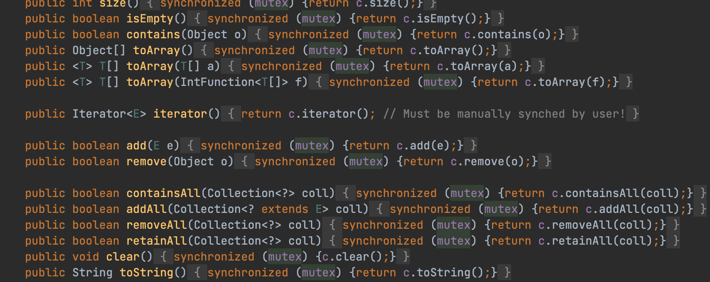 
  >
  > **Copy-On-Write ** 复制一个新集合 ， 在新集合内添加或删除元素。待一切修改完成之后 ， 再将原集合的可|用指向新的集合
  >
  > 

- #### 注解(元数据)

  >  
  >
  > 
  >
  > **apt工具**（注解处理器）
  >
  > *在**代码编译时期**对注解进行处理 @Data 并生成Java文件，减少手动输入代码过程*
  
- #### 并发

  > *并发与并行，并发是指在某个时间段内，多任务交替处理能力，并行是指同时处理多任务能力*
  >
  > ---
  >
  > 线程安全实现方案：
  >
  > 1. 数据单线程内可见（ThreadLocal，存储在线程局部变量表中）
  > 2. 只读对象（final关键字修饰的字段，String，Interger等）
  > 3. 线程安全类（StringBuffer等使用synchronized等关键字修饰,**序列化访问共享资源**）
  > 4. 同步与锁机制（**序列化访问共享资源**）
  >
  > ---
  >
  > - Thread.yield() 线程让步（将当前获取CPU执行权让给其他线程，该线程进入就绪态，**不会释放锁**）
  >
  > - Thread.sleep()  线程睡眠（将当前CPU执行权让给其他线程，该线程进入阻塞态，**不会释放锁**）
  >
  > - daemon 后台线程 （非后台线程执行完后，程序终止，后台线程终止）
  >
  > - **interrupt()** ：另一个线程调用**被阻塞线程的interrupt方法**被阻塞线程会抛出InterruptedException异常(**线程周期未结束**)
  >
  > - isInterruptd()：判断当前线程是否被中断（**线程捕获中断信号后会将interrupt变量复位**）
  >
  > - interrupted()：静态方法，对比isInterruptd()为成员方法，调用Thread.interrupted()方法后会立即对interrupt变量复位
  >
  > - Thread.join() ：等待Thread.join()执行完或被中断后，在执行本线程
  >
  > - ThreadGroup：线程组，用于批量操作线程
  >
  >   > int enumerate(ThreadGroup [] list) 复制
  >
  > - Hook线程（钩子线程）
  >
  >   > 防止程序重复启动
  >
  > ---
  >
  > **UncaughtException-Handler 线程异常处理器**
  >
  > 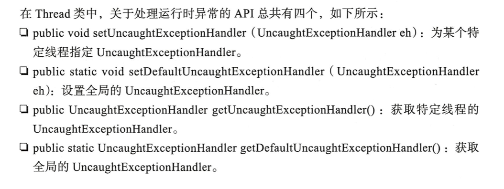 
  >
  > [异常处理案例](https://gitee.com/miaomiaole/java_project/blob/master/src/main/java/org/example/concurrency/ExceptionThread.java)
  >
  > ---
  >
  > **守护线程**
  >
  > JVM中**没有非守护线程执行**，JVM自动退出
  >
  > *守护线程具备自动结束生命周期特性，适用于执行后台任务，当JVM退出时，线程自动关闭，在线程池中使用ThreadFactory工厂创建线程*
  >
  > ---
  >
  > **共享资源竞争**（多个线程竞争资源）
  >
  > Java并发模式下使用**序列化访问共享资源**模式（给定时刻只允许一个任务访问共享资源）
  >
  > 
  >
  > 防止任务在共享资源上产生冲突的第二种方式是**消除变量的共享**----（本地线程变量）
  >
  > ---
  >
  > **线程之间协作**（多线程之间按顺序执行任务）
  >
  > - Object.wait()   释放锁等待（一般用在线程执行完任务后手动释放占用资源）
  >
  >   > wait() 在此期间暂停，直到使用notify方法和时间后进入就绪态
  >   >
  >   > notifyAll()与wait() 配合while 循环判断某个条件是否满足唤醒和挂起=> 实现线程之间协作
  >   >
  >   > Object.notifyAll() 
  >   >
  >   > 调用wait() 和notify()时，**当前线程必须拥有锁**
  >   >
  >   > ~~~java
  >   > synchronized(x){
  >   > // 手动释放x对象锁
  >   > x.notifyAll()
  >   > x.wait()
  >   > }
  >   > ~~~
  > - Condition （多线程协调通信工具类）
  >
  >   > - await() 当前线程进入等待状态除非被通知或中断
  >   > - singal() 唤醒在Condition上的线程（进入就绪态）
  > - 使用BlockingQueue队列协作处理
  >
  >   > [队列协作处理](https://gitee.com/miaomiaole/java_project/blob/master/src/main/java/org/example/concurrency/Toast.java)
  >   >
  >   > offer(E e，long timeout，TimeUnit unit) 满队等待timeout时间放弃或被中断
  >   >
  >   > put(E e) 满队阻塞当前入队线程，直到队列空闲或线程中断
  >   >
  >   > add(E e) 满队抛出异常
  >   >
  >   > take()
  >   >
  >   > poll(long timeout,TimeUnit unit)
  >   >
  >   > ArrayBlockingQueue：指定容量，在入队或出队并发高情况下使用
  >   >
  >   > LinkedBlockingQueue：入队出队并发高情况下使用（入队和出队不竞争Queue）
  >
  > -  **DelayQueue**  延迟队列
  >
  >    *对象只能在到期时间才能从队列中取走，队头对象延时时间最长*
  >
  >   - 设置元素有效期，有效期过后出队执行（线程睡眠等待元素到期）
  >   - 定时任务调度
  >   - Leader，Follower模式 
  > ---
  >
  > **java.util.concurrent 线程工具类** 
  >
  > - **Lock** 
  >
  >   > 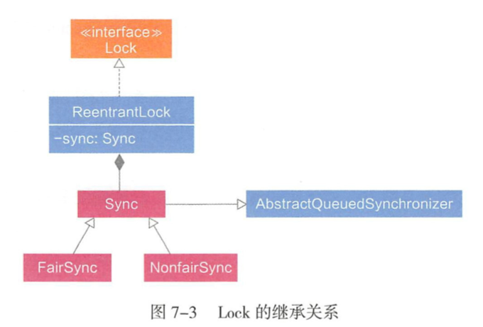 
  >   >
  >   > AQS：AbstractQueuedSynchronizer，**JUC包实现同步的基础工具**
  >   >
  >   > *AQS中，定义volatile int state变量作为共享资源，线程获取资源失败，进入同步队列中等待，线程获取资源执行临界区代码并执行完释放资源，通知同步队列中等待的线程，AQS**内置自旋锁**实现同步队列，封装入队和出队操作*
  >   >
  >   > 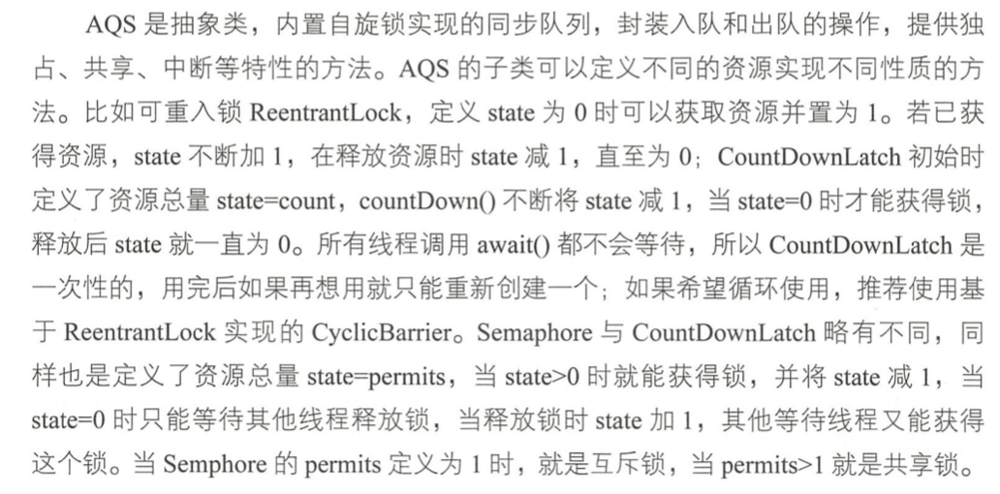 
  >   >
  >   > - getState()获取当前同步状态
  >   > - setState(int newState) 设置当前同步状态
  >   > - compareAndSetState(int expect,int update) : 使用CAS设置当前状态
  >   > - tryAcquite(int arg) 使用CAS设置同步状态（独占锁）
  >   > - tryRelease(int arg) 释放同步状态并唤醒等待同步线程
  >   > - tryAcquireShared(int arg) 获取同步状态（共享锁，大于0表示成功）
  >   > - tryReleaseShared(int arg) 释放共享锁
  >   > - isHeldExclusively() 判断资源是否被线程占用
  >   >
  >   > *独占锁：表示只能存在一个线程访问资源，共享锁可以多个线程同时访问资源*
  >   >
  >   > 
  >   >
  >   > **同步队列**
  >   >
  >   > *当线程获取同步状态失败时，同步器将线程及其等待状态信息构造节点加入队列，同时阻塞当前线程，同步状态释放时，将首节点的线程唤醒尝试获取同步状态*
  >   >
  >   > 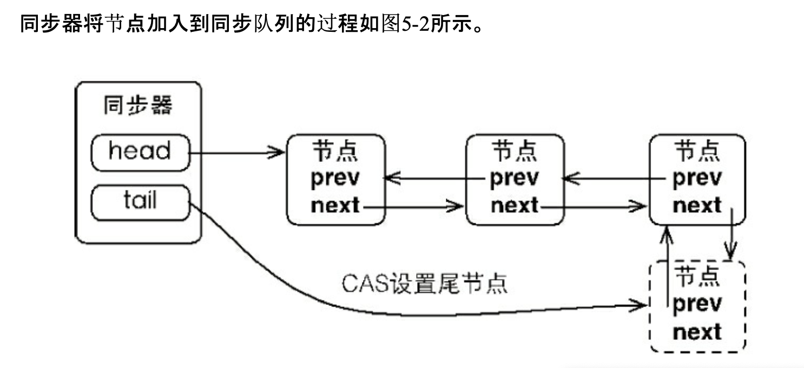 
  >   >
  >   > 首节点是获取同步状态成功的节点，首节点的线程在释放同步状态 时，将会唤醒后继节点，而后继节点将会在获取同步状态成功时将自己设置为首节点
  >   >
  >   > 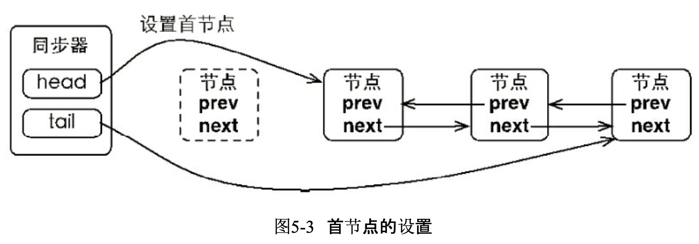 
  >   >
  >   > **独占式同步状态获取与释放**
  >   >
  >   > *获取同步状态失败，构造同步节点到队尾，并每个节点以自旋方式判断。被阻塞的线程节点依靠**前驱节点出队或阻塞**实现唤醒*
  >   >
  >   > 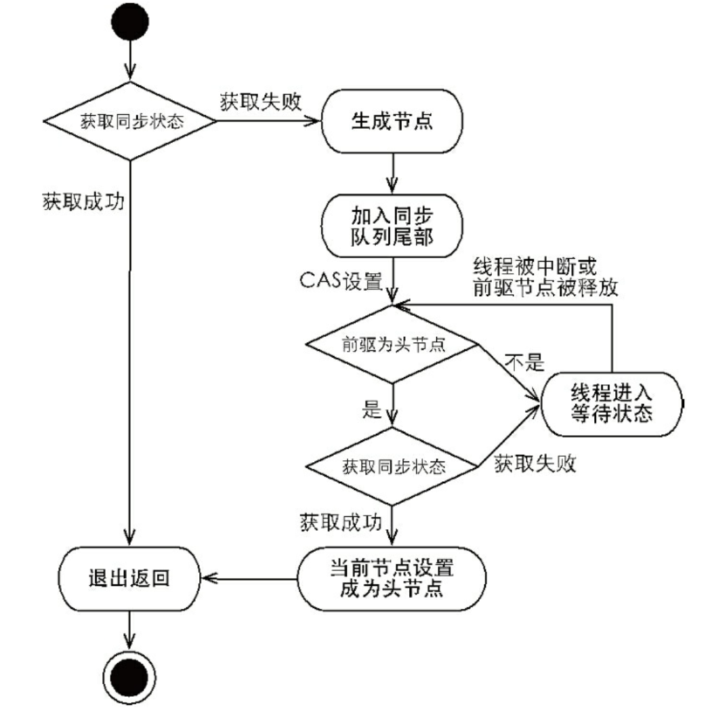 
  >   >
  >   > ---
  >   >
  >   > **Synchronized锁**
  >   >
  >   > - monitor  对象属性，使用synchronized时，通过monitor状态进行加解锁
  >   >- 偏向锁：当一个线程访问同步块并获取锁时，会在对象头和栈帧中的锁记录里存储锁偏向的线程ID，**该线程在进入和退出同步块时不需要进行CAS操作来加锁和解锁**。**存在竞争线程时则释放偏向锁**
  >   > - 轻量级锁：使用自旋方式获取锁（CAS），如果当前资源存在锁竞争，锁升级为重量级锁。（防止多个线程无效自旋）
  >   > - 重量级锁：多个线程竞争锁资源时被阻塞，等待持有锁线程释放锁唤醒阻塞线程 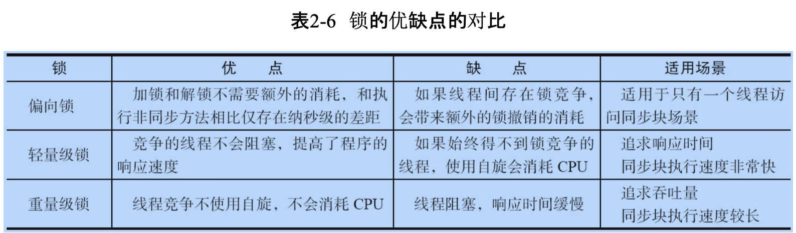 
  >   > 
  >   > **volatile机制**  
  >   >
  >   > *确保共享变量在多线程环境下一致更新，对变量的操作都在内存中进行，不会产生副。相对于锁的操作在加锁时读取变量，释放锁时写回内存*
  >   >
  >   > *volatile 适用于一写多读的方式，最典型的应用是 CopyOnWriteArrayList。它在修改数据时会把整个集合的数据全部复制出来 ， 对写操作加锁，修改完成后， 再用 setArray()把 array指向新的集合。使用 volatile可 以便读线程尽快地感知 array 的修改 ， 不进行指令重排，操作后即对其他线程可见。* 
  >
  > - ReentrantLock重入锁
  >
  >   > *支持一个线程对资源重复加锁，获取锁时公平和非公平选择*
  >
  > - ReadWriteLock
  >
  >   > - int getReadLockCount() 返回当前读锁获取次数
  >   > - int getReadHoldCount() 返回当前线程获取读锁次数（ThreadLocal实现）
  >   > - boolean isWriteLocked() 判断写锁是否被获取
  >   > - int getWriteHoldCount() 返回当前写锁获取次数
  >
  > - **CountDownLatch**  设置等待线程数，当计数为0时往下执行 
  >
  >   > countDown() 表示当前线程已完成  计数减一
  >   >
  >   > 当某个线程中断（发生异常）将导致await() 线程一直阻塞，不能重试
  >   >
  >   > await() 被阻塞的线程 当计数为0时进入就绪态
  >
  > - CyclicBarrier  所有的线程达到屏障点后执行下一个线程
  >
  >   > new CycliBarrier((int parties, Runnable barrierAction)
  >   >
  >   > parties ：屏障数
  >   >
  >   > barrierAction ：满足屏障数后执行下一个线程
  >   >
  >   > - await()表示当前线程达到屏障点被阻塞等待其他线程(执行完后await)
  >   > - rest() 重新执行
  >   > - isBloken() 判断线程是否被中断
  >
  >   CyclicBarrier：重点是多个线程，在任意一个线程没有完成，所有的线程都必须等待。
  >
  >   CountDownLatch：一个线程等待多个线程完成
  >
  > - **Semaphore** 信号量
  >
  >   > *计数信号量允许n个任务同时访问资源，许可证，限制线程执行的数量，当一个线程执行时先通过其方法进行获取许可操作，获取到许可的线程继续执行业务逻辑，当线程执行完成后进行释放许可操作，未获取达到许可的线程进行等待或者直接结束。*
  >   >
  >   > - acquire(int permits) 获取指定数量许可（阻塞等待其他线程释放许可）
  >   > - `boolean tryAcquire(int permits, long timeout, TimeUnit unit)` 尝试获取指定的许可数  可指定等待时间
  >   > - void release() 释放当前线程持有的许可（等待许可的线程可以马上执行）
  >
  > - **Atomic 原子操作类**
  >
  >   > - int addAndGet(int delta)  入参与原子变量相加返回结果
  >   > - boolean compareAndSet(int expect,int update)  原子变量等于expect则将原子变量赋值update
  >   > - int getAndIncrement()  原子变量当前值加1，**返回自增前的值。**
  >   > - void lazySet(int newValue)  原子变量终会设置成newValue（其他线程可能在一段时间还是能读取旧值）
  >   > - int getAndSet(int newValue) 以原子方式设置为newValue的值，**并返回旧值**。
  >   >
  >   > 原子更新引用类型
  >   >
  >   > - AtomicReference： 原子更新引用类
  >   > - AtomicReferenceFieldUpdater：原子更新引用类型中字段
  >
  > - **Exchanger** 用于线程通信
  >
  > - **Fork/Join框架**
  >
  >   > *将大任务分割成若干个小任务，并汇总每个小任务的结果得到大任务处理结果,多线程归并处理*
  >   >
  >   > Fork：切分
  >   >
  >   > Join：合并
  >   >
  >   > ForkJoinTask
  >   >
  >   > - RecursiveAction：用于没有返回结果任务
  >   > - RecursiveTask：用于有结果返回任务
  >   >
  >   > ForkJoinPool：ForkJoinTask通过线程池执行
  >
  > - **FutureTask 异步任务**
  >
  >   > FutureTask 未启动或已启动状态时使用get()获取结构会导致调用线程阻塞
  >
  > ---
  >
  > **线程池**
  >
  > *使线程更加合理使用计算机资源，减少线程在创建，合理执行，复用，销毁时带来系统资源开销*
  >
  > **ThreadPoolExecutor 核心参数**
  >
  > - corePoolSize ：核心常驻线程数
  > - maximumPoolSize：线程池能**同时执行**最大线程数
  > - keepAliveTime：非核心线程停留时间
  > - unit：keepAliveTime时间单位默认是秒
  > - workQueue：缓存队列当请求线程大于maximumPoolSize时进入**阻塞队列**
  > - **threadFactory**：生产一组任务相同的线程 (自定义实现线程)
  > - **RejectedExecutionHandler**： 拒绝处理策略（并发限流）
  >   - CallerRunsPolicy： 用调用者所在的线程处理任务
  >   - AbortPolicy：直接丢弃任务，并抛出异常（默认）
  >   - DiscardOldstPolicy：丢弃等待队列中最久的任务，并执行当前任务
  >   - DiscardPolicy：直接丢弃任务，不抛出异常
  >   - **自定义拒绝策略**  实现RejectedExecutionHandler接口
  >     - 将当前任务数据保存到数据库进行削峰
  >     - 跳转某个提示页面
  >     - 打印日志
  >
  > 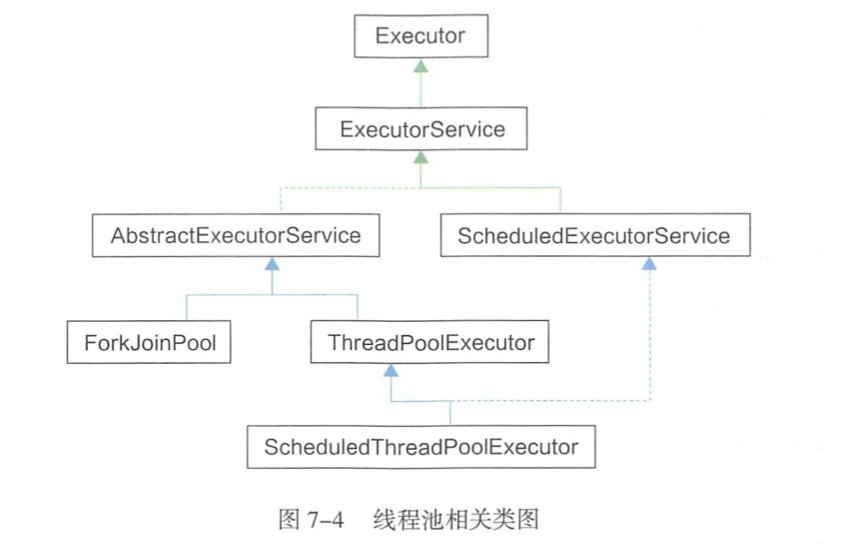 
  >
  > **ExecutorService**
  >
  > - newWorkStealingPool  创建支持有足够的线程支持给定的并行都，通过多个队列减少竞争，把CPU数量设置为默认并行度
  > - newScheduledThreadPool 支持定时及周期性任务
  > - newCachedThreadPool  根据需要创建新线程，规定时间内存在空闲线程则使用该线程执行任务，无空闲线程则新建。长时间无执行任务会自动释放线程
  > - FixedThreadPool   创建固定数量的线程执行任务。线程执行异常则新建线程代替。当所有线程处于执行态，则新加入任务在队列中等待。线程池中线程不会自动回收。
  > - SingleThreadExecutor  线程数量为1的FixedThreadPool
  >
  > ---
  >
  > 
  >
  > **线程池源码**
  >
  > ~~~java
  >  public void execute(Runnable command) {
  > 
  >         if (command == null)
  >             throw new NullPointerException();
  >        // 获取包含线程数及线程状态的Integer类型数值
  >        int c = ctl.get();
  >       // 工作线程小于核心线程数，创建新线程执行任务
  >      if (workerCountOf(c) < corePoolSize) {
  >          // 创建线程
  >          if (addWorker(command, true))
  >                 return;
  >          // 创建失败，，重新获取线程池中线程数量及状态   
  >          c = ctl.get();
  >         }
  >       //线程处于RUNNING状态 且将当线程放入队列
  >         if (isRunning(c) && workQueue.offer(command)) {
  >             int recheck = ctl.get();
  >             // 当前线程不处于运行状态，则移除刚加入的任务
  >             if (! isRunning(recheck) && remove(command))
  >                 reject(command);
  >             // 之前任务处理完，新创建一个线程
  >             else if (workerCountOf(recheck) == 0)
  >                 addWorker(null, false);
  >         }
  >        // 核心线程和队列已满 创建新线程
  >         else if (!addWorker(command, false))
  >             reject(command);
  >     }
  > 
  >      // 根据当前线程池状态，判断是否可以添加新的任务线程，创建成功返回true，否则返回false
  >     // 返回false的情况可能有
  >    // 1. 线程池没有处于RUNNING状态，被销毁了
  >   // 2.线程工厂创建线程失败
  >   // firstTask: 构建第一个父线程
  >   // core：新增工作线程判断指标 
  >    // true：表示新增时，当前RUNNING状态的线程是否少于corePool
  >     // false：与上相反
  >     private boolean addWorker(Runnable firstTask, boolean core) {
  >        // continue retry 快速退出循环
  >        retry:
  >         for (int c = ctl.get();;) {
  >             // 判断是否为RUNNING，STOP，queue是否为空
  >             // 判断线程池状态和队列任务是否为空
  >             if (runStateAtLeast(c, SHUTDOWN)
  >                 && (runStateAtLeast(c, STOP)
  >                     || firstTask != null
  >                     || workQueue.isEmpty()))
  >                 return false;
  > 
  >             for (;;) {
  >               // 超过最大允许线程数不能添加新线程
  >                 if (workerCountOf(c)
  >                     >= ((core ? corePoolSize : maximumPoolSize) & COUNT_MASK))
  >                     return false;
  >                // 当前活动线程+1
  >                 if (compareAndIncrementWorkerCount(c))
  >                     break retry;
  >                 c = ctl.get();  // Re-read ctl
  >                 if (runStateAtLeast(c, SHUTDOWN))
  >                     continue retry;
  >                 // else CAS failed due to workerCount change; retry inner loop
  >             }
  >         }
  >        // 开始创建线程工作
  >         boolean workerStarted = false;
  >         boolean workerAdded = false;
  >         Worker w = null;
  >         try {
  >           // 通过线程工厂创建线程，包装Worker对象
  >             w = new Worker(firstTask);
  >           // 获取Thread对象
  >             final Thread t = w.thread;
  >             if (t != null) {
  >                // 加锁执行
  >                 final ReentrantLock mainLock = this.mainLock;
  >                 mainLock.lock();
  >                 try {
  >                     int c = ctl.get();
  >                   // 当线程池状态位RUNNING或SHUTDOWN时
  >                   //且 firstTask为空时
  >                     if (isRunning(c) ||
  >                         (runStateLessThan(c, STOP) && firstTask == null)) {
  >                         if (t.getState() != Thread.State.NEW)
  >                             throw new IllegalThreadStateException();
  >                         workers.add(w);
  >                         workerAdded = true;
  >                         int s = workers.size();
  >                         if (s > largestPoolSize)
  >                             largestPoolSize = s;
  >                     }
  >                 } finally {
  >                     mainLock.unlock();
  >                 }
  >                 if (workerAdded) {
  >                     t.start();
  >                     workerStarted = true;
  >                 }
  >             }
  >         } finally {
  >             if (! workerStarted)
  >                 addWorkerFailed(w);
  >         }
  >         return workerStarted;
  >     }
  > ~~~
  >
  > **ThreadLocal 源码** 
  >
  > *给每个线程创建变量副本，保证一个线程对变量的修改不会影响到其他线程对它的使用*
  >
  > - 软引用（SoftReference）内存不足时GC软引用对象
  > - 弱引用（WeakReference）WeakHashMap ，ThreadLocal
  >   - 当WeakHashMap中key赋值为null，GC后其值也被清空
  >
  > 
  >
  > **ThreadLocal**
  >
  > ~~~java
  >   static class ThreadLocalMap {
  >      		// WeakReference 弱引用对象
  >         static class Entry extends WeakReference<ThreadLocal<?>> {
  >             Object value;
  >             Entry(ThreadLocal<?> k, Object v) {
  >                // Entry对象的key指向ThreadLocal
  >                 super(k);
  >                 value = v;
  >             }
  >         }
  > 
  >         ThreadLocalMap(ThreadLocal<?> firstKey, Object firstValue) {
  >             table = new Entry[INITIAL_CAPACITY];
  >             int i = firstKey.threadLocalHashCode & (INITIAL_CAPACITY - 1);
  >             table[i] = new Entry(firstKey, firstValue);
  >             size = 1;
  >             setThreshold(INITIAL_CAPACITY);
  >         }
  > 
  > 
  >         private ThreadLocalMap(ThreadLocalMap parentMap) {
  >             Entry[] parentTable = parentMap.table;
  >             int len = parentTable.length;
  >             setThreshold(len);
  >             table = new Entry[len];
  > 
  >             for (Entry e : parentTable) {
  >                 if (e != null) {
  >                     @SuppressWarnings("unchecked")
  >                     ThreadLocal<Object> key = (ThreadLocal<Object>) e.get();
  >                     if (key != null) {
  >                         Object value = key.childValue(e.value);
  >                         Entry c = new Entry(key, value);
  >                         int h = key.threadLocalHashCode & (len - 1);
  >                         while (table[h] != null)
  >                             h = nextIndex(h, len);
  >                         table[h] = c;
  >                         size++;
  >                     }
  >                 }
  >             }
  >         }
  > 
  >         private Entry getEntry(ThreadLocal<?> key) {
  >             int i = key.threadLocalHashCode & (table.length - 1);
  >             Entry e = table[i];
  >             if (e != null && e.refersTo(key))
  >                 return e;
  >             else
  >                 return getEntryAfterMiss(key, i, e);
  >         }
  > 
  >         private Entry getEntryAfterMiss(ThreadLocal<?> key, int i, Entry e) {
  >             Entry[] tab = table;
  >             int len = tab.length;
  > 
  >             while (e != null) {
  >                 if (e.refersTo(key))
  >                     return e;
  >                 if (e.refersTo(null))
  >                     expungeStaleEntry(i);
  >                 else
  >                     i = nextIndex(i, len);
  >                 e = tab[i];
  >             }
  >             return null;
  >         }
  > 
  >         private void set(ThreadLocal<?> key, Object value) {
  >             Entry[] tab = table;
  >             int len = tab.length;
  >             int i = key.threadLocalHashCode & (len-1);
  > 
  >             for (Entry e = tab[i];
  >                  e != null;
  >                  e = tab[i = nextIndex(i, len)]) {
  >                 if (e.refersTo(key)) {
  >                     e.value = value;
  >                     return;
  >                 }
  > 
  >                 if (e.refersTo(null)) {
  >                     replaceStaleEntry(key, value, i);
  >                     return;
  >                 }
  >             }
  > 
  >             tab[i] = new Entry(key, value);
  >             int sz = ++size;
  >             if (!cleanSomeSlots(i, sz) && sz >= threshold)
  >                 rehash();
  >         }
  > 
  >         private void remove(ThreadLocal<?> key) {
  >             Entry[] tab = table;
  >             int len = tab.length;
  >             int i = key.threadLocalHashCode & (len-1);
  >             for (Entry e = tab[i];
  >                  e != null;
  >                  e = tab[i = nextIndex(i, len)]) {
  >                 if (e.refersTo(key)) {
  >                     e.clear();
  >                     expungeStaleEntry(i);
  >                     return;
  >                 }
  >             }
  >         }
  > 
  > 
  >         private void replaceStaleEntry(ThreadLocal<?> key, Object value,
  >                                        int staleSlot) {
  >             Entry[] tab = table;
  >             int len = tab.length;
  >             Entry e;
  > 
  >             int slotToExpunge = staleSlot;
  >             for (int i = prevIndex(staleSlot, len);
  >                  (e = tab[i]) != null;
  >                  i = prevIndex(i, len))
  >                 if (e.refersTo(null))
  >                     slotToExpunge = i;
  > 
  >             for (int i = nextIndex(staleSlot, len);
  >                  (e = tab[i]) != null;
  >                  i = nextIndex(i, len)) {
  > 
  >                 if (e.refersTo(key)) {
  >                     e.value = value;
  > 
  >                     tab[i] = tab[staleSlot];
  >                     tab[staleSlot] = e;
  > 
  >                     // Start expunge at preceding stale entry if it exists
  >                     if (slotToExpunge == staleSlot)
  >                         slotToExpunge = i;
  >                     cleanSomeSlots(expungeStaleEntry(slotToExpunge), len);
  >                     return;
  >                 }
  > 
  >                 // If we didn't find stale entry on backward scan, the
  >                 // first stale entry seen while scanning for key is the
  >                 // first still present in the run.
  >                 if (e.refersTo(null) && slotToExpunge == staleSlot)
  >                     slotToExpunge = i;
  >             }
  > 
  >             // If key not found, put new entry in stale slot
  >             tab[staleSlot].value = null;
  >             tab[staleSlot] = new Entry(key, value);
  > 
  >             // If there are any other stale entries in run, expunge them
  >             if (slotToExpunge != staleSlot)
  >                 cleanSomeSlots(expungeStaleEntry(slotToExpunge), len);
  >         }
  > 
  >         private int expungeStaleEntry(int staleSlot) {
  >             Entry[] tab = table;
  >             int len = tab.length;
  > 
  >             // expunge entry at staleSlot
  >             tab[staleSlot].value = null;
  >             tab[staleSlot] = null;
  >             size--;
  > 
  >             // Rehash until we encounter null
  >             Entry e;
  >             int i;
  >             for (i = nextIndex(staleSlot, len);
  >                  (e = tab[i]) != null;
  >                  i = nextIndex(i, len)) {
  >                 ThreadLocal<?> k = e.get();
  >                 if (k == null) {
  >                     e.value = null;
  >                     tab[i] = null;
  >                     size--;
  >                 } else {
  >                     int h = k.threadLocalHashCode & (len - 1);
  >                     if (h != i) {
  >                         tab[i] = null;
  > 
  >                         // Unlike Knuth 6.4 Algorithm R, we must scan until
  >                         // null because multiple entries could have been stale.
  >                         while (tab[h] != null)
  >                             h = nextIndex(h, len);
  >                         tab[h] = e;
  >                     }
  >                 }
  >             }
  >             return i;
  >         }
  >         private boolean cleanSomeSlots(int i, int n) {
  >             boolean removed = false;
  >             Entry[] tab = table;
  >             int len = tab.length;
  >             do {
  >                 i = nextIndex(i, len);
  >                 Entry e = tab[i];
  >                 if (e != null && e.refersTo(null)) {
  >                     n = len;
  >                     removed = true;
  >                     i = expungeStaleEntry(i);
  >                 }
  >             } while ( (n >>>= 1) != 0);
  >             return removed;
  >         }
  > 
  > 
  >         private void rehash() {
  >             expungeStaleEntries();
  > 
  >             // Use lower threshold for doubling to avoid hysteresis
  >             if (size >= threshold - threshold / 4)
  >                 resize();
  >         }
  > 
  >         /**
  >          * Double the capacity of the table.
  >          */
  >         private void resize() {
  >             Entry[] oldTab = table;
  >             int oldLen = oldTab.length;
  >             int newLen = oldLen * 2;
  >             Entry[] newTab = new Entry[newLen];
  >             int count = 0;
  > 
  >             for (Entry e : oldTab) {
  >                 if (e != null) {
  >                     ThreadLocal<?> k = e.get();
  >                     if (k == null) {
  >                         e.value = null; // Help the GC
  >                     } else {
  >                         int h = k.threadLocalHashCode & (newLen - 1);
  >                         while (newTab[h] != null)
  >                             h = nextIndex(h, newLen);
  >                         newTab[h] = e;
  >                         count++;
  >                     }
  >                 }
  >             }
  > 
  >             setThreshold(newLen);
  >             size = count;
  >             table = newTab;
  >         }
  > 
  >         /**
  >          * Expunge all stale entries in the table.
  >          */
  >         private void expungeStaleEntries() {
  >             Entry[] tab = table;
  >             int len = tab.length;
  >             for (int j = 0; j < len; j++) {
  >                 Entry e = tab[j];
  >                 if (e != null && e.refersTo(null))
  >                     expungeStaleEntry(j);
  >             }
  >         }
  >     }
  > 
  > 
  > public T get() {
  >         Thread t = Thread.currentThread();
  >        // 每个线程都有ThreadMap 
  >         ThreadLocalMap map = getMap(t);
  >        // 不为空则表示线程中存在线程变量
  >         if (map != null) {
  >             ThreadLocalMap.Entry e = map.getEntry(this);
  >             if (e != null) {
  >                 @SuppressWarnings("unchecked")
  >                 T result = (T)e.value;
  >                 return result;
  >             }
  >         }
  >        // 为空初始化线程变量
  >         return setInitialValue();
  >     }
  > 
  >  private T setInitialValue() {
  >        // 执行ThreadMap的initialValue方法
  >         T value = initialValue();
  >         Thread t = Thread.currentThread();
  >         ThreadLocalMap map = getMap(t);
  >         if (map != null) {
  >            // key为当前线程  value 变量
  >             map.set(this, value);
  >         } else {
  >             createMap(t, value);
  >         }
  >         if (this instanceof TerminatingThreadLocal) {
  >             TerminatingThreadLocal.register((TerminatingThreadLocal<?>) this);
  >         }
  >         return value;
  >     }
  > ~~~
  >
  > 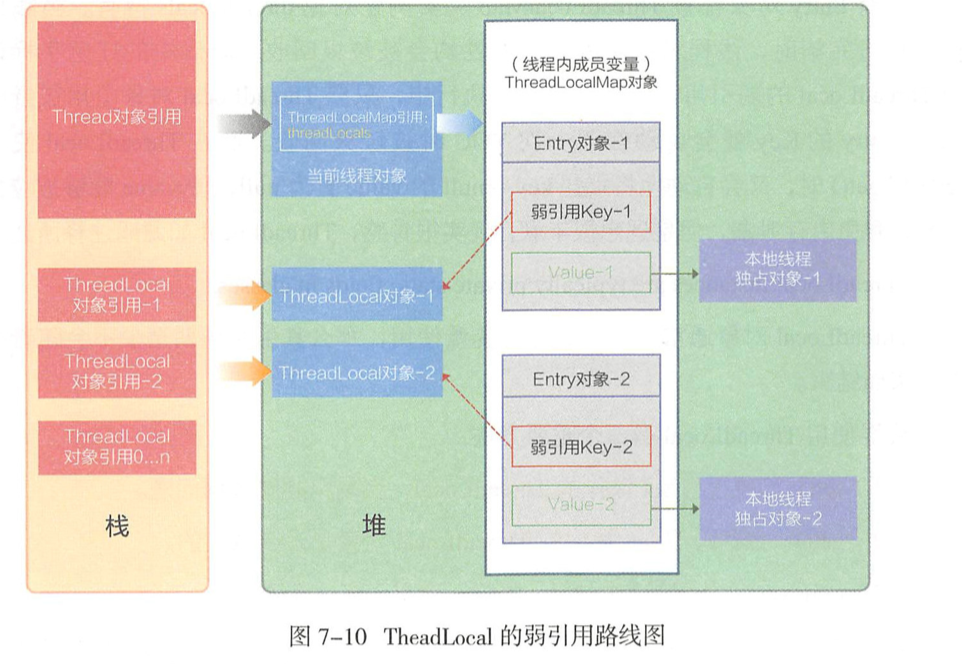  
  >
  > - Thead 实例中仅有1个ThreadLocalMap对象
  > - **Entry对象的key弱引用指向一个ThreadLocal对象**
  > - **ThradLocalMap**可以存储多个Entry对象
  > - **ThreadLocal**对象可以被多个线程共享
  >
  > *所有Entry对象被ThreadLocalMap持有，当线程执行完毕时自动释放，当ThreadLocal被赋值为空时，所有线程中使用该对象引用的key对应的Entry都会被下一处YGC时收回，*
  >
  > ---
  >
  > **在线程池中使用ThreadLocal**
  >
  > *父子线程变量共享时使用InheritableThreadLocal*
  >
  > - 脏数据
  >
  >   *线程中需要显式调用remove()清理上一个任务变量*
  >
  > - 内存泄漏
  >
  >   *使用static修饰的ThreadLocal不适用于弱引用机制收回线程变量。必须显式remove操作*
  
#### **单元测试**

> - **Junit 单元测试框架**
>
>   > @Test  标识这个方法是测试方法
>   >
>   > @TestFactory  注明一个方法是基于数据驱动 的动态测试数据源
>   >
>   > @ParameterizedTest  测试方法使用不同的入参运行多次
>   >
>   > @RepeatedTest  让测试方法自定义重复运行次数
>   >
>   > @BeforeEach  可以在每一个测试方法运行前 ， 都运行一个指 定的方法。 在 JUnit.5 中， 除了运行@Test注解的方法，还额外支持运行@ ParameterizedTest 和@RepeatedTest. 注解的方法
>   >
>   > @AfterEach
>   >
>   > @BeforeAll
>   >
>   > @AfterAll
>   >
>   > @Disabled
>   >
>   > @Nested
>   >
>   > @Tag

  

  

