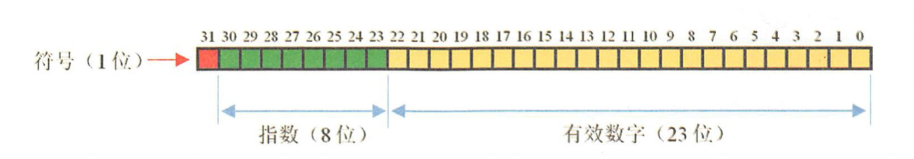
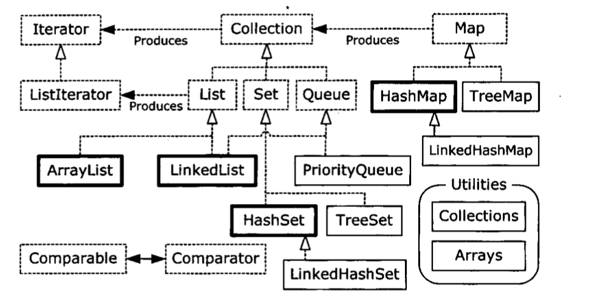
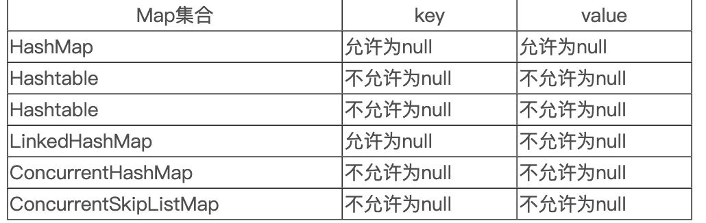
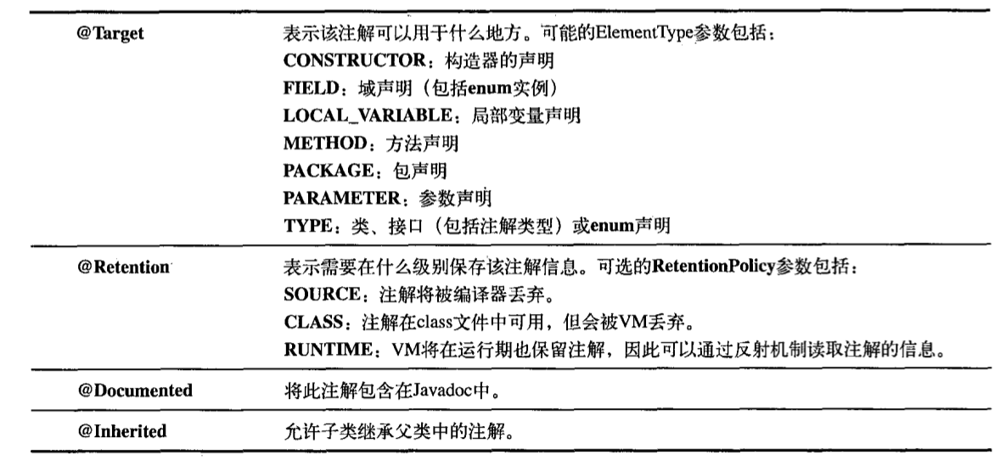

## JavaSE

- #### 计算机基础

  > **计算机位数：** 32位计算机表示能同时处理$2^{32}-1$个电信号（子长32位的电路信号）
  >
  > **浮点数：**
  >
  > - 符号位 （0正数，1负数）
  > - 阶码位 （存储指数，$E=e+(2^{n-1}-1)$ E 表示阶码，e表示指数真值，8位阶码的指数范围为[-126，127]）
  > - 有效数（存储有效数） 
  
- #### **面向对象**

  > 面向对象编程（Object-Oriented Programming) 
  >
  >  *主要目标*
  >
  > - 可维护
  > - 可重用
  > - 可扩展
  >
  > ---
  >
  > *面对对象特性*
  >
  > - 封装 ，继承，多态，（抽象）
  >
  > ---
  >
  > - is - a ：LSP（里氏替换原则）父类引用直接使用子类引用代替，并可以编译正确执行，则使用继承关系 （extends）
  >
  > - can-do：(implement）
  > - contains - a：类是成员变量（组合）**组合成员与类生命周期一致**
  > - has - a ：类是成员变量（聚合） 聚合成员可以复用在其他类上
  > - use - a ：依赖（使用）  （通常作为入参使用）
  >
  > ---
  >
  > **序列化**
  >
  > *内存中数据对象进行二进制流转换进行数据持久化和网络传输*
  >
  > - Serializable  序列化
  > - Hessian 序列化
  > - JSON 数据交互格式

- #### **容器**

  >  
  >
  > HashMap 基于散列表实现 通过构造器容量和负载因子调整容器性能
  >
  > > HashMap 的性能因子
  > >
  > > - 容量：表中桶位数
  > > - 初始容量：创建表的容量
  > > - 尺寸：实际存储的数据长度
  > > - 负载因子：尺寸/容量 （负载因子较小产生hash冲突概率低），实际负载因子大于规定负载因子将进行扩容（再哈希）
  >
  > LinkeHashMap 以插入时顺序排列元素（最近最少使用次序），迭代访问时性能优于HashMap
  >
  > TreeMap 元素实现Comparable接口自动排序存在supMap()返回子树
  >
  > ConcurrentHashMap 线程安全Map
  >
  > WeakHashMap 弱键映射，允许释放映射所指对象
  >
  > IdentityHashMap 使用 == 代替equals()进行散列映射
  >
  > 
  >
  > // 只读容器
  >
  > Collections.unmodifiableCollection() 

- #### 持有引用

  > **Java引用机制**
  >
  > *在内存不足情况下 实现不需要的资源自动释放回收内存，GC*
  >
  > **Java的引用java.lang.ref.Reference及其子类封装了一个对象Object referent，当referent的可达性发生变化的时候，java.lang.ref.Reference会被垃圾收集器GC做一些操作，例如通知、触发资源回收等。**
  >
  > **当GC发现java.lang.ref.Reference封装的referent的可达性发生变化时，垃圾收集器会clear the reference（实际上就是referent = null，唯一的例外是FinalReference，FinalReference不会clear）并把对应的java.lang.ref.Reference加入关联的队列。**
  >
  >  
  >
  > **当JVM中垃圾收集时，GC发现referent为弱可达，那么GC将referent引用对象挂载到GC回收链表上，并发生一次线程通信，通知ReferenceHandler线程取走这些引用对象做后续处理，ReferenceHandler 判断时Cleaner实例，调用clean清理释放资资源，对于PhantomReference类型，需要放入ReferenceQueue队列，等待系统资源释放后删除。对于FinalReference，也几乎没有直接使用该类的，而都是直接使用其子类java.lang.ref.Finalizer，在队列中会发生第二次线程间通信，ReferenceHandler线程在将Reference对象入队列时，会通知FinalizerThread做进一步的处理——即调用FinalReference封装的referent重写的java.lang.Object的finalize()方法；**
  >
  > 
  >
  > - 强引用  
  >
  >   > 1. 包含Java堆内存
  >   > 2. 包含系统资源 （文件句柄，端口，网络连接）
  >
  > - 软引用（SoftReference，作用于内存敏感操作，堆内存不足时回收）
  >
  >   > ~~~java
  >   > Reference<User> reference = new SoftReference<User>(user);
  >   > reference.get()
  >   > ~~~
  >
  > - 弱引用（WeakReference，作用于不阻止key被回收的规范化映射，GC后回收)
  >
  >   > ~~~java
  >   > Reference<User> reference = new WeakReference<User>(user);
  >   > reference.get()
  >   > ~~~
  >
  > - 虚引用(PhantomReference，处理事后清理操作)
  >
  >   > ~~~java
  >   > ReferenceQueue<User> queue = new ReferenceQueue<User>();
  >   > Reference<User> reference = new PhantomReference<User>(new User(),queue);
  >   > ~~~
  >
  > - 兜底引用（FinalReference）
  >
  >   > TODO
  
- #### 注解(元数据)

  >  
  >
  > 
  >
  > **apt工具**（注解处理器）
  >
  > *在**代码编译时期**对注解进行处理 @Data 并生成Java文件，减少手动输入代码过程*
  
- #### 并发

  > - Thread.yield() 线程让步（将当前获取CPU执行权让给其他线程，该线程进入就绪态，**不会释放锁**）
  >
  > - Thread.sleep()  线程睡眠（将当前CPU执行权让给其他线程，该线程进入阻塞态，**不会释放锁**）
  >
  > - daemon 后台线程 （非后台线程执行完后，程序终止，后台线程终止）
  >
  > - Thread.join()  等待一段时间直到**其他线程完成后执行**（**执行线程被暂停执行其他线程**，不会释放线程锁）
  >
  > - Thread.interrupt() 终止当前执行的线程，（当前线程被阻塞或对其操作则抛出异常)
  >
  >   > 当抛出该异常或者调用Thread.interrupted()方法，则中断被复位
  >
  > 
  >
  > ---
  >
  > **ExecutorService**
  >
  > - newCachedThreadPool  根据需要创建新线程，规定时间内存在空闲线程则使用该线程执行任务，无空闲线程则新建。长时间无执行任务会自动释放线程
  > - FixedThreadPool   创建固定数量的线程执行任务。线程执行异常则新建线程代替。当所有线程处于执行态，则新加入任务在队列中等待。线程池中线程不会自动回收。
  > - SingleThreadExecutor  线程数量为1的FixedThreadPool
  >
  > ---
  >
  > **UncaughtException-Handler 线程异常处理器**
  >
  > [异常处理案例](https://gitee.com/miaomiaole/java_project/blob/master/src/main/java/org/example/concurrency/ExceptionThread.java)
  >
  > ---
  >
  > **共享资源竞争**（多个线程竞争资源）
  >
  > Java并发模式下使用**序列化访问共享资源**模式（给定时刻只允许一个任务访问共享资源）
  >
  > 
  >
  > 防止任务在共享资源上产生冲突的第二种方式是**消除变量的共享**----（本地线程变量）
  >
  > ---
  >
  > **线程之间协作**（多线程之间按顺序执行任务）
  >
  > - Object.wait()   释放锁等待（一般用在线程执行完任务后手动释放占用资源）
  >
  >   > wait() 在此期间暂停，直到使用notify方法和时间后进入就绪态
  >   >
  >   > notifyAll()与wait() 配合while 循环判断某个条件是否满足唤醒和挂起=> 实现线程之间协作
  >
  > - Object.notifyAll() 
  >
  >   > 调用wait() 和notify()时，**当前线程必须拥有锁**
  >   >
  >   > ~~~java
  >   > synchronized(x){
  >   >   // 手动释放x对象锁
  >   >   x.notifyAll()
  >   >   x.wait()
  >   > }
  >   > ~~~
  >
  > - Condition （多线程协调通信工具类）
  >
  >   > - await() 当前线程进入等待状态除非被通知或中断
  >   >
  >   > - singal() 唤醒在Condition上的线程（进入就绪态）
  >
  > - 使用BlockingQueue队列协作处理
  >
  >   > [队列协作处理](https://gitee.com/miaomiaole/java_project/blob/master/src/main/java/org/example/concurrency/Toast.java)
  >   >
  >   > offer(E e，long timeout，TimeUnit unit) 满队等待timeout时间放弃或被中断
  >   >
  >   > put(E e) 满队阻塞当前入队线程，直到队列空闲或线程中断
  >   >
  >   > add(E e) 满队抛出异常
  >   >
  >   > take()
  >   >
  >   > poll(long timeout,TimeUnit unit)
  >   >
  >   > ArrayBlockingQueue：指定容量，在入队或出队并发高情况下使用
  >   >
  >   > LinkedBlockingQueue：入队出队并发高情况下使用（入队和出队不竞争Queue）
  >
  > ---
  >
  > **java.util.concurrent 线程工具类**
  >
  > - CountDownLatch  设置等待线程数，当计数为0时往下执行 
  >
  >   >  - countDown() 表示当前线程已完成  计数减一
  >   >
  >   >    > 当某个线程中断（发生异常）将导致await() 线程一直阻塞，不能重试
  >   >
  >   >  - await() 被阻塞的线程 当计数为0时进入就绪态
  >
  > - CyclicBarrier  所有的线程达到屏障点后执行下一个线程
  >
  >   > new CycliBarrier((int parties, Runnable barrierAction)
  >   >
  >   > parties ：屏障数
  >   >
  >   > barrierAction ：满足屏障数后执行下一个线程
  >   >
  >   > ---
  >   >
  >   > - await()表示当前线程达到屏障点被阻塞等待其他线程(执行完后await)
  >   > - rest() 重新执行
  >   > - isBloken() 判断线程是否被中断
  >
  > CyclicBarrier：重点是多个线程，在任意一个线程没有完成，所有的线程都必须等待。
  >
  > CountDownLatch：多个线程等待
  >
  >  
  >
  > **DelayQueue**  延迟队列
  >
  >  *对象只能在到期时间才能从队列中取走，队头对象延时时间最长*
  >
  > - 设置元素有效期，有效期过后出队执行（线程睡眠等待元素到期）
  > - 定时任务调度
  > - Leader，Follower模式 
  >
  >  
  >
  > **Semaphore** 信号量
  >
  > *计数信号量允许n个任务同时访问资源，许可证，限制线程执行的数量，*
  >
  > 当一个线程执行时先通过其方法进行获取许可操作，获取到许可的线程继续执行业务逻辑，当线程执行完成后进行释放许可操作，未获取达到许可的线程进行等待或者直接结束。
  >
  > -  acquire(int permits) 获取指定数量许可（阻塞等待其他线程释放许可）
  >
  > - `boolean tryAcquire(int permits, long timeout, TimeUnit unit)` 尝试获取指定的许可数 可指定等待时间
  >
  > - void release()
  >
  >   
  >
  > **Exchanger** 用于线程通信
  
  

  

