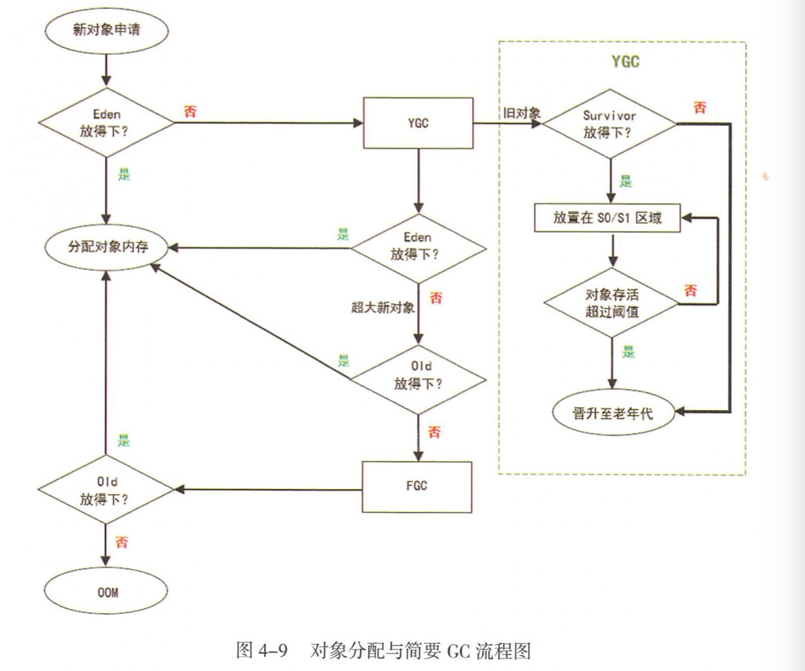
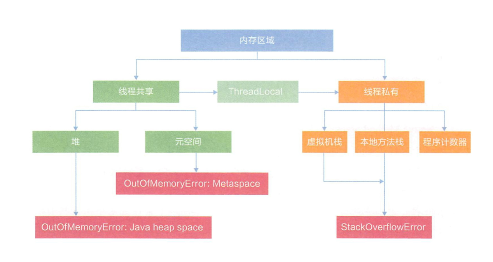

## JDK内存模型

> JDK  java开发环境包
>
> JRE  运行环境（装载类）
>
> JVM Java虚拟机（执行class文件）
>
>  
>
> **JVM 运行时数据区**
>
> 1. 程序计数器（下一条需要执行的字节码指令，分支、循环、跳转、异常处理、线程恢复等信息存储）
>
> 2. Java虚拟机栈（Stack） **存放编译期基本数据类型和对象引用指针**
>
>    > StackOverflowError：线程栈大小超出JVM内存限制，（多次递归）
>    >
>    > OutOfMemoryError：内存溢出
>
> 3. 本地方法栈 (JVM 调用操作系统API)
>
> 4. Java Heap (对象数据存放区，线程共享)
>
>    >  -XMs（堆初始容量）  -Xmx （堆最大容量）
>    >
>    > 新生代 （1/3） -Xmn 
>    >
>    > - Eden  （4/5）  GC后存活的对象移入From区
>    > - From  （1/10）与ToSurvivor 复制交换，每次GC都被清空
>    > - To Survivor （1/10）
>    >
>    > 老年代 （2/3） 
>
> 5. 方法区 （存储已被虚拟机加载的类信息、常量、静态变量、即时编译器编译后的代码等数据）
>
>  
>
> ---
>
>  **类加载器**
>
> > Load-> Link -> Init  加载，链接，初始化（执行类构造器) 
> >
>> 1. 类全限定名获取二进制字节流Class文件
> > 2. 将Class文件转为运行时数据结构（常量，方法区，属性）
>> 3. 在内存中创建该类Class对象（对该类的对象创建数据访问入口）
> >
>>  
> >
> > **Linking：**
>>
> > 1. 验证 （保证二进制字节流中的信息符合虚拟机规范,并没有安全问题，使用-Xverify:none关闭，加快类加载时间）
>> 2. 准备（方法区中静态成员变量内存分配，0，fasle，null等）
> > 3. 解析 （对字段，类，接口，类方法解析，判断是否继承，复写）
>>
> > **JVM加载源**
> >
> > - Jar，War，Ear 等压缩文件
> > - JSP文件中Class类
> > - 数据库读取
> > - Applet网络加载
> > - 动态代理
> 
> #### **类加载器**
> 
> - Bootstrap （加载JDK中API，或通过-Xbootclasspath参数指定路径中的）
> 
> - Extension （加载指定系统类库）
> 
> - Application （加载用户自定义类库）
> 
> - UserClassLoad
> 
> - 双亲委派模型
> 
>   > - 当一个类加载器收到类加载任务，**会先交给其父类加载器去完成**，**因此最终加载任务都会传递到顶 层的启动类加载器**，
>  > - 只有当父类加载器无法完成加载任务时，才会尝试执行加载任务
>   >
>  > ---
>   >
>  > 1. 避免重复加载
>   > 2. 类加载器与类名判断是否同一个Class
>
>  

#### 持有引用

> **Java引用机制**
>
> *在内存不足情况下 实现不需要的资源自动释放回收内存，GC*
>
> **Java的引用java.lang.ref.Reference及其子类封装了一个对象Object referent，当referent的可达性发生变化的时候，java.lang.ref.Reference会被垃圾收集器GC做一些操作，例如通知、触发资源回收等。**
>
> **当GC发现java.lang.ref.Reference封装的referent的可达性发生变化时，垃圾收集器会clear the reference（实际上就是referent = null，唯一的例外是FinalReference，FinalReference不会clear）并把对应的java.lang.ref.Reference加入关联的队列。**
>
> 
>
> **当JVM中垃圾收集时，GC发现referent为弱可达，那么GC将referent引用对象挂载到GC回收链表上，并发生一次线程通信，通知ReferenceHandler线程取走这些引用对象做后续处理，ReferenceHandler 判断时Cleaner实例，调用clean清理释放资资源，对于PhantomReference类型，需要放入ReferenceQueue队列，等待系统资源释放后删除。对于FinalReference，也几乎没有直接使用该类的，而都是直接使用其子类java.lang.ref.Finalizer，在队列中会发生第二次线程间通信，ReferenceHandler线程在将Reference对象入队列时，会通知FinalizerThread做进一步的处理——即调用FinalReference封装的referent重写的java.lang.Object的finalize()方法；**
>
> 
>
> - 强引用  
>
>   > 1. 包含Java堆内存
>   > 2. 包含系统资源 （文件句柄，端口，网络连接）
>
> - 软引用（SoftReference，作用于内存敏感操作，堆内存不足时回收）
>
>   > ~~~java
>   > Reference<User> reference = new SoftReference<User>(user);
>   > reference.get()
>   > ~~~
>
> - 弱引用（WeakReference，作用于不阻止key被回收的规范化映射，GC后回收)
>
>   > ~~~java
>   > Reference<User> reference = new WeakReference<User>(user);
>   > reference.get()
>   > ~~~
>
> - 虚引用(PhantomReference，处理事后清理操作)
>
>   > ~~~java
>   > ReferenceQueue<User> queue = new ReferenceQueue<User>();
>   > Reference<User> reference = new PhantomReference<User>(new User(),queue);
>   > ~~~
>
> - 兜底引用（FinalReference）
>
>   > TODO

- #### **JDK9**

  > - 接口方法可以使用private来修饰
  >
  > - 设置G1为JVM默认垃圾收集器
  >
  >   > 1. CMS 垃圾回收器
  >   >
  >   > 2. G1垃圾回收器（**延迟可控的情况下获得尽可能高的吞吐量**）
  >   >
  >   >    > -XX:G1HeapRegionSize 设置Region大小
  >   >    >
  >   >    >  
  >   >    >
  >   >    > 
  >   >    >
  >   >    > eden和old 不在物理隔离，通过Region动态分配实现逻辑连续
  >
  > - 支持http2.0和websocket的API

- #### **JDK17**

  > [JDK 17 API](https://docs.oracle.com/en/java/javase/17/)
