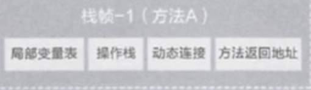
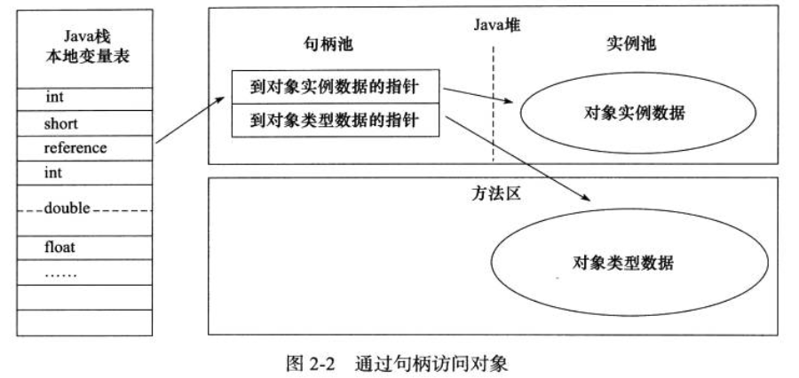
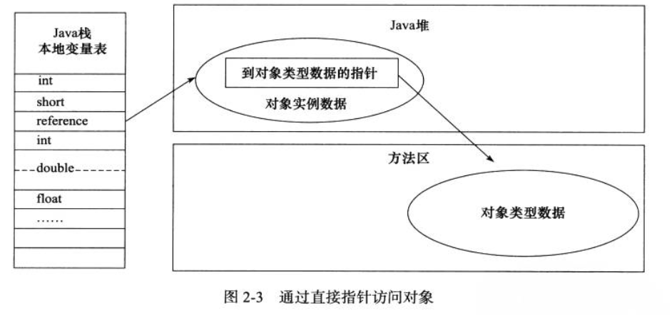
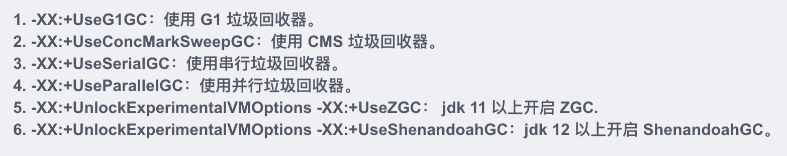

## JVM内存模型

> 
>
> - **运行时数据区**
>
>   > *java程序执行过程中把内存分为若干个不同的数据区域*
>   >
>   > - 程序计数器：记录所有线程状态（类似于进程控制块PCB）
>   >
>   > - 虚拟机栈：Java方法执行内存模型，方法执行时创建栈帧（**方法内局部变量表**，动态链接，方法出口信息）入栈，方法执行完返回出栈。*局部变量表包含基本数据类型，和引用数据类型*
>   >
>   >   >  
>   >
>   > - 本地方法栈：与虚拟机栈类似，保存的是本地方法栈帧
>   >
>   > - 堆：存放所有对象实例，垃圾回收器作用区域
>   >
>   >   > -XMs（堆初始容量）  -Xmx （堆最大容量）
>   >   >
>   >   > 新生代 （1/3） -Xmn 
>   >   >
>   >   > - Eden  （4/5）  GC后存活的对象移入From区
>   >   > - From  （1/10）  From与To Survivor 使用复制交换方式清理内存
>   >   > - To Survivor （1/10）
>   >   >
>   >   > 老年代 （2/3） 
>   >
>   > - 方法区（Method Area）元空间区：存储已被虚拟机加载的类信息，常量，静态变量
>   >
>   >   > JDK8 使用元工具代替方法区，相对方法区，元空间存放在系统内存中
>   >   >
>   >   > 运行时常量池：存放编译时期生成的字面量和符号应用
>
> - **对象的创建**
>
>   > **堆内存分配**
>   >
>   > - 指针碰撞分配：**连续使用堆内存**下使用指针标记未使用内存开始地址，开辟空间时移动指针
>   >
>   > - 空闲列表分配：**非连续使用堆内存**使用空闲表记录为使用内存的地址
>   >
>   > **对象的内存布局**
>   >
>   > - 对象头（hashcode，GC分代年龄，锁状态标志，线程持有锁，偏向线程ID）
>   > - 实例数据
>   > - 对齐填充
>   >
>   > **对象访问定义**
>   >
>   > *通过栈上的reference数据来操作堆上的具体对象*
>   >
>   > - 句柄访问：通过reference对象记录实际对象的具体地址信息
>   >
>   >    
>   >
>   > - 直接指针：
>   >
>   >    
>
> - **堆溢出**
>
>   > - 内存泄漏（Memory Leak）：程序中堆内存无法释放，超出系统资源浪费或系统缓慢
>   >
>   >   > - 静态集合类
>   >   > - 数据库，网络未动态释放
>   >   > - 变量不合理的作用域
>   >   > - 内部类持有外部类
>   >   > - 改变哈希值
>   >   > - 监听器和回调
>   >
>   > - 内存溢出（Memory Overflow）
>   >
>   >   > - StackOverflowError：线程请求栈深度大于虚拟机允许深度
>   >   > - OutOfMemoryError：虚拟机无法申请到足够内存空间
>   >
>   > - 方法区和运行时常量池溢出
>   
> - JVM启动内存参数
>
>   - -xms：设置JVM内存初始大小
>   - -xmx：设置JVM最大堆内存（不包含栈） 1/64 物理内存
>   - -xss：设置线程堆栈大小
>   -  
>   - -XX:±HeapDumpOnOutOfMemoryError：当 OutOfMemoryError 产生，即内存溢出（堆内存或持久代/元空间) 时，自动 Dump 堆内存。
>   - -Xdebug -Xrunjdwp:transport=dt_socket,server=y,suspend=n,address=1506 ：远程调试
>   - -XX:OnError：抛出异常时执行脚本（致命异常，通常做告警使用）

#### **垃圾收集器与内存分配策略**

> - **引用计数算法**
>
>   > *对象在引用时加一，引用失效时减一，计数为0则收回对象。在对象相互循环引用时失效*
>
> - **可达性分析算法**
>
>   > **Java引用机制：**Java的引用java.lang.ref.Reference及其子类封装了一个对象Object referent，当referent的可达性发生变化的时候，java.lang.ref.Reference会被垃圾收集器GC做一些操作，例如通知、触发资源回收等。当GC发现java.lang.ref.Reference封装的referent的可达性发生变化时，垃圾收集器会clear the reference（实际上就是referent = null，唯一的例外是FinalReference，FinalReference不会clear）并把对应的java.lang.ref.Reference加入关联的队列。
>   >
>   > - 强引用（StrongReference）
>   >
>   >   > 类似于`Object obj =new Object() ` obj变量不赋值为null，垃圾收集器永远不收回对象
>   >
>   > - 软引用（SoftReference）
>   >
>   >   > *作用于内存敏感操作，堆内存不足时回收*
>   >   >
>   >   > ~~~java
>   >   > Reference<User> reference = new SoftReference<User>(user);
>   >   > reference.get()
>   >   > ~~~
>   >
>   > - 弱引用（WeakReference）
>   >
>   >   > 
>   >
>   > - 虚引用（PhantomReference)
>   >
>   >   > 
>   >
>   > **当JVM中垃圾收集时，GC发现referent为弱可达，那么GC将referent引用对象挂载到GC回收链表上，并发生一次线程通信，通知ReferenceHandler线程取走这些引用对象做后续处理，ReferenceHandler 判断时Cleaner实例，调用clean清理释放资资源，对于PhantomReference类型，需要放入ReferenceQueue队列，等待系统资源释放后删除。对于FinalReference，也几乎没有直接使用该类的，而都是直接使用其子类java.lang.ref.Finalizer，在队列中会发生第二次线程间通信，ReferenceHandler线程在将Reference对象入队列时，会通知FinalizerThread做进一步的处理——即调用FinalReference封装的referent重写的java.lang.Object的finalize()方法；**

