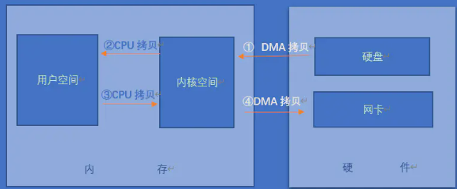

## Netty

> JDK中NIO网络编程
>
> - 缓冲区Buffer
>
> - 通道Channel（全双工，用户网络数据读写）
>
>   > SelectableChannel 
>   >
>   > FileChannel
>
> - 多路复用器Selector
>
>   > Selector不断轮询其注册上的Channel，Channel发送读写事件，Channel处于就绪态，会被Selector轮询出来，通过SelectionKey获取就绪Channel进行网络读写
>   
> - TCP沾包与拆包
>
>   > 1. 应用程序写入的字节大于socket发送的缓冲区大小
>   > 2. 进行2MSS大小的TCP分段
>   > 3. 以太网帧大于MTU进行IP分片
>   >
>   > ---
>   >
>   > - 应用层消息定长
>   >
>   > - 包尾加入特殊字符进行分割
>   >
>   > - 将消息分为消息头与消息体，消息头中包含数据包总长度
>   >
>   >   

*基于Reactor模型的网络通信应用框架（非阻塞异步事件驱动）*

>  Netty 处理流程
>
>  

- #### Channel Java NIO的基本构造

  > 它代表一个到实体（如一个硬件设备、一个文件、一个网络套接字或者一个能够执 行一个或者多个不同的I/O操作的程序组件）的开放连接，如读操作和写操作（Channel 看作是传入（入站）或者传出（出站）数据的载体。因此，它可以 被打开或者被关闭，连接或者断开连接。）
  >
  > | 方法名                 | 描述                                                         |
  > | ---------------------- | ------------------------------------------------------------ |
  > | eventLoop              | 返回分配给 Channel 的 EventLoop                              |
  > | pipeline               | 返回分配给 Channel 的 ChannelPipeline                        |
  > | isActive、localAddress | 如果 Channel 是活动的，则返回 true。活动的意义可能依赖于底层的传输。例如， 一个 Socket 传输一旦连接到了远程节点便是活动的，而一个 Datagram 传输一旦 被打开便是活动的 返回本地的 SokcetAddress |
  > | remoteAddress          | 返回远程的 SocketAddress                                     |
  > | write                  | 将数据写到远程节点。这个数据将被传递给 ChannelPipeline，并且排队直到它被 冲刷 |
  > | flush                  | 将之前已写的数据冲刷到底层传输，如一个 Socket                |
  > | writeAndFlush          | 上述                                                         |

- #### EventLoopGroup

  > - EventLoop在生命周期中只和一个Thread绑定（等价线程）
  > - Channel 在生命周期中只注册一个EventLoop
  > - 一个 EventLoop 可能会被分配给一个或多个 Channel
  >
  >  

- #### ChannelHandler、ChannelPipeline

  > ChannelHandler它充当了所有处理入站和出站数据的应用程序逻辑
  >
  > ChannelPipeline提供了 ChannelHandler 链的容器，并定义了用于在该链上传播入站 和出站事件流的 AP
  >
  > 
  >
  > **入站事件：**
  >
  > 1. 连接已被激活或连接失效
  > 2. 数据读取
  > 3. 用户事件（handler）
  > 4. 错误事件
  >
  > **出站事件：**
  >
  > 1. 打开或者关闭到远程节点连接
  > 2. 将数据写入到Socket
  >
  > 
  >
  > ChannelHandler 是对 Channel 中数据的处理器(拦截器)
  >
  >  
  >
  >  
  >
  > **适配器类：**
  >
  > ChannelHandlerAdapter
  >
  > ChannelInboundHandlerAdapter：处理入站数据以及各种状态变化
  >
  > ChannelOutboundHandlerAdapter：处理出站数据并且允许拦截所有的操作
  >
  > ChannelDuplexHandler
  >
  >  
  >
  > **ChannelInboundHandler入站生命周期函数：**
  >
  > - channelRegistered：当 Channel 已经注册到它的 EventLoop 并且能够处理 I/O 时被调用
  >
  > - channelUnregistered： Channel 从它的 EventLoop 注销并且无法处理任何 I/O 时被调用
  >
  > - channelActive : 当 Channel 处于活动状态时被调用；Channel 已经连接/绑定并且已经就绪
  >
  > - channelInactive：当 Channel 离开活动状态并且不再连接它的远程节点时被调
  >
  > - **channelRead：当从服务器接收到一条消息时被调用(需要处理粘包)，需要手动释放ByteBuf实例相关内存（使用ReferenceCountUtil.release(msg) 进行释放 或使用用 SimpleChannelInboundHandler进行继承从写）**
  >
  > - channelReadComplete：当Channel上的一个读操作完成时被调用 （当所有可读的字节都已经从 Channel 中读取之后，将会调用该回调方法）
  >
  > - exceptionCaught：通道发生异常事件
  >
  > - userEventTriggered：用户事件（读或写）
  >
  > 
  >
  > **ChannelOutboundHandler出站生命周期函数：**
  >
  > - bind：当请求将 Channel 绑定到本地地址时被调用
  >
  > - connect：当请求将 Channel 连接到远程节点时被调用
  >
  > - disconnect：当请求将 Channel 从远程节点断开时被调用
  >
  > - close：当请求关闭 Channel 时被调用
  >
  > - deregister：当请求将 Channel 从它的 EventLoop 注销 时被调用
  >
  > - read：当请求从Channel 读取更多的数据时被调用
  >
  > - flush：当请求通过 Channel 将入队数据冲刷到远程节点时被调用
  >
  > - write：当请求通过 Channel 将数据写到远程节点时 被调用
  >
  >   > ChannelPromise与ChannelFuture 定义了回调事件
  >
  >   

- #### ChannelHandlerContext

  > 保存 Channel 所有上下文信息
  >
  > close：关闭通道
  >
  > flush：刷新
  >
  > writeAndFlush：将数据写到 ChannelPipeline 中当前 ChannelHandler 的下一个 ChannelHandler 开始处理
  
- #### ChannelFuture（在操作完成时通知应用程序的方式）

  > ChannelFutureListener：在操作完成时获得通知（实现operationComplete方法）
  >
  > channel：返回当前正在进行IO操作的通道
  >
  > sync：等待异步操作执行完毕，将异步改为同步
  
- #### Unpooled

  > **零拷贝**
  >
  > > *计算机中传统数据传输需要经过两个阶段，由操作系统把数据从硬盘或网卡拷贝到操作系统内核中，在由用户程序将数据由内核空间拷贝到用户空间，用户程序一次IO需要经过4次目态与管态中断切换，2次CPU拷贝，2次DMA拷贝*
  > >
  > >  
  > >
  > > **零拷贝：**数据从一个存储区域到另一个存储区域不通过复制方法实现，利用mmap内存映射机制，将硬件IO数据映射到内存某个区域，由用户程序直接通过内存读取。
  > >
  > > **Netty零拷贝实现：**
  > >
  > > 1. 堆外内存对Socket内存直接读写
  > > 2. 用户程序操作buffer对象
  > > 3. 文件传输采用TransferTo方法
  >
  > **ByteBuf：**
  >
  > - 数组双索引，一个用于写，一个用于读操作
  >
  >  
  >
  > bytebuf构建模式
  >
  > - 堆缓冲区（适合对象快速创建与释放）
  > - 直接缓冲区
  > - 复合缓冲区
  >
  
- #### **Netty编码器与解码器**
  
  > **JDK序列化**  java.io.Serializable 
  >
  > - 效率低，无法兼容其他语言
  >
  > **JBoss Marshalling**
  >
  > - 对JDK默认的序列化框架进行优化，与JDK中Serializable 兼容
  >
  > **ProtoBuf**
  >
  > **Thrift**
  >
  > 
  
  

