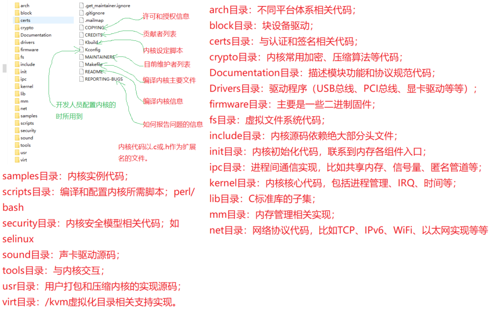

## Linux驱动

- 实时操作系统（RTOS）

  > VxWork，FreeRTOS

- **BootLoader：引导加载程序**（通过HAL函数与硬件驱动，负责硬件初始化，安全检测，加载内核，启动配置）

  > BIOS/UEFI：固件程序（负责硬件初始化，提供硬件HAL函数）
  >
  > GRUB/U-Boot：多操作系统引导加载器，负责整个系统的启动
  >
  > [u-boot](https://source.denx.de/u-boot/u-boot.git)
  >
  > **GRUB/U-Boot移植步骤**
  >
  > 1. 确定平台硬件架构，存储设备，外围设备类型
  >
  > 2. GRUB源码设置环境交叉编译（C语言编译）
  >
  > 3. 生成启动镜像烧录到启动介质
  >
  > 4. 调试GRUB（串口调试器，JTAG，gdb）
  >
  >    > gdb：C程序调试
  >    >
  >    > JTAG：用于访问和测试硬件接口工具（配合OpenOCD、GDB 软件工具）
  >    >
  >    > 串口调试：通过UART接口输出硬件日志，状态信息

- Linux内核

  > 
  >
  > [kernel_source](https://www.kernel.org/)
  >
  > [kernel文档]( https://github.com/0voice/linux_kernel_wiki)

- **Linux文件系统**

  > BusyBox，GNU fileutils，shellutils：文件系统工具
  >
  >  
  >
  > - bin/sbin：存放基本命令（包含基本的系统命令和工具）
  >
  > - boot：存放引导加载程序、内核映像、初始 RAM 磁盘映像，设备树，系统管理员提供管理和调试工具
  >
  > - dev：存放设备文件（使用文件或链接设备驱动程序代替设备进行IO通信）
  >
  > - etc：系统配置文件
  >
  > - lib/lib64：共享依赖库（so扩展名为动态依赖，a扩展名为静态依赖）
  >
  > - media：挂载可移动设备
  >
  > - mmt：挂载文件系统（mount将设备挂载到自定目录，文件系统类型ext4，ntfs，vfat）
  >
  > - opt：安装程序
  >
  > - proc：程序的运行信息（进程信息、内存信息、CPU 信息）及涉及top相关统计信息
  >
  > - run：操作系统运行信息
  >
  > - srv：存放服务数据
  >
  > - sys：存放硬件配置及驱动程序（允许用户以文件系统的形式访问和修改系统硬件和内核的各种参数和状态信息）
  >
  >   - /sys/class：系统中所有的设备类
  >   - /sys/devices：系统硬件设备的层次结构
  >   - /sys/bus：总线类型和相关设备
  >   - /sys/kernel：内核参数和状态信息
  >   - /sys/block：字符块类型设备
  >
  > - tmp：临时文件（程序运行过程中产生的文件）系统重启删除
  >
  > - usr：Unix System Resources，用于存储用户级应用程序、库文件和共享数据
  >
  >   - /usr/local：用于存放本地安装的软件和文件（通常是由系统管理员手动编译和安装的）
  >
  >   - /usr/include：存放系统和应用程序开发所需的头文件
  >
  >   - /usr/src：源代码文件
  >
  > - var：存放可变数据，例如日志文件、数据库文件

- **Linux编程**（C编程）

  > C 的标准实现库
  >
  > 1. glibc： Linux 系统
  >
  > 2. musl：嵌入式系统和轻量级 Linux 发行版
  >
  > 3. uClibc：嵌入式系统（资源有限环境中）
  >
  > 4. MSVCRT： Windows 操作系统C标准库
  >
  > 5. Clang’s libc++
  >
  > 
  >
  >  POSIX系统函数调用（区别于C标准函数）：操作系统底层功能的直接访问，直接与操作系统内核交互
  >
  > 
  >
  > **gcc 编译工具**
  >
  > - 预处理（.i）：处理宏定义，消除注释
  >
  > - 编译（.s）：翻译成汇编代码
  >
  > - 汇编（.o)：翻译成机器代码
  >
  > - 链接：生成可执行文件
  >
  >   - 静态库：一组目标文件 (.o 文件) 的集合，通过ar命令打包成.a库文件，链接时包含在可执行文件中
  >   - 动态库：在程序运行时才会被加载到内存中
  >
  > - gcc [options] [files]  -o output_file
  >
  >   - **-c: 只编译源文件，不进行链接。生成 .o 目标文件**
  >
  >   - **-g：生成调试信息（gdb使用）**
  >
  >   - -E：执行预处理阶段（.i）
  >
  >   - -S：编译源代码生成汇编代码（.s）
  >
  >   - **-O1：使用编译优化**
  >
  >   - **-I：指定头文件路径**
  >
  >   - **-L/-l：库文件路径或指定库文件**
  >
  >   - -fPIC ：源文件编译为位置无关代码（动态库使用）
  >
  >   - -static：生成静态库（强制将动态库编译在二进制文件中）
  >
  >   - -shared：生成动态库（打包动态库） 与-fPIC使用
  >
  >   - -std：使用标准
  >
  >   - -v：输出编译过程
  >
  >   - **-o <file>**: 指定输出文件的名称。配合其它参数使用
  >
  >     
  >
  > **gdb：调试工具** （配合gcc -g使用）
  >
  > - break linenum：设置断点 
  > - breaktrace：显示调用栈信息
  > - list：显示当前源码
  > - set ：修改变量的值
  > - run：开始调试
  > - next：执行下一步（非进入函数）
  > - step：执行当前行（进入函数）
  > - finish：执行当前函数返回
  > - print：打印变量值
  > - info locals：打印当前函数所有局部变量
  > - continue：从断点继续执行
  >
  >  
  >
  > makefile：
  >
  > - target file ：dependency file
  >
  >   ​	command
  >
  >   ~~~makefile
  >   # 定义变量
  >   CC = gcc                 # 编译器
  >   CFLAGS = -Wall -g        # 编译选项（警告信息、调试信息）
  >   LDFLAGS =                # 链接选项（如有需要）
  >   OBJ = main.o utils.o     # 目标文件
  >   EXEC = my_program        # 生成的可执行文件名
  >     
  >   # 默认目标
  >   all: $(EXEC)
  >     
  >   # 生成可执行文件
  >   $(EXEC): $(OBJ)
  >   	$(CC) $(LDFLAGS) -o $@ $(OBJ)
  >   # 文件推导
  >   VPATH=<dir>:<dir>
  >     
  >   # 生成目标文件
  >   main.o: main.c utils.h
  >   	$(CC) $(CFLAGS) -c main.c
  >     
  >   utils.o: utils.c utils.h
  >   	$(CC) $(CFLAGS) -c utils.c
  >     
  >   # 清理生成文件
  >   clean:
  >   	rm -f $(OBJ) $(EXEC)
  >     
  >   # 伪目标
  >   .PHONY: all clean
  >   ~~~
  >
  >   
  >
  > **Linux文件，串口，进程，进程通信，线程，网络（TCP，UDP）编程**（TODO）

- Linux 嵌入式应用

  > sqlite3 , boa, Mongoose

- **Linux硬件接口**

  > GPIO
  >
  > PWM
  >
  > UART
  >
  > RS-485
  >
  > I2C
  >
  > SPI
  >
  > ADC/DAC
  >
  > eMMC
  >
  > SD/MMC
  >
  > PCI/PCie
  >
  > USB
  >
  > SATA
  >
  > NVMe
  >
  > HDMI
  >
  > VGA
  >
  > DisplayPort
  >
  > Audio

- **Linux驱动**

  > 设备文件：用户空间程序提供与设备交互的接口
  >
  > 设备号：由主设备号和次设备号组成，主设备号用于标识设备类型，次设备号用于区分同一类型设备的不同实例
  >
  > 设备号分配：静态分配：设备类型都有一个预先定义的设备号范围，内核会根据设备类型自动分配设备号，适用于常规硬件设备，例如硬盘、网卡、串口。动态分配：由设备驱动程序会向内核申请一个空闲的设备号。
  >
  > 设备树：描述硬件配置的树状结构数据，用于 Linux 内核识别和配置系统中的硬件设备，文件扩展为dts

  

