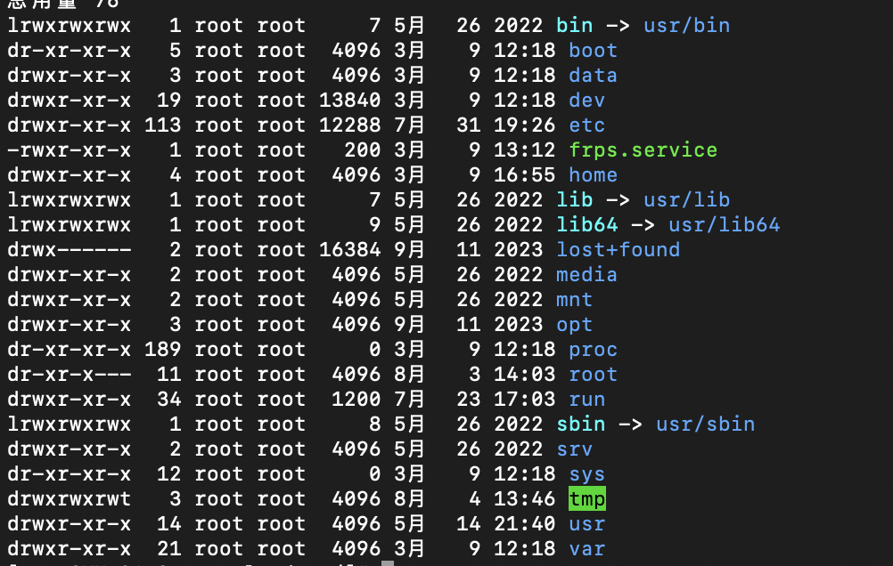

## Linux驱动

- #### Linux常用目录

  >  
  >
  > - bin/sbin：存放基本命令（包含基本的系统命令和工具）
  >
  > - boot：存放引导加载程序、内核映像、初始 RAM 磁盘映像，设备树，系统管理员提供管理和调试工具
  >
  > - dev：存放设备文件（使用文件或链接设备驱动程序代替设备进行IO通信）
  >
  > - etc：系统配置文件
  >
  > - lib/lib64：共享依赖库（so扩展名为动态依赖，a扩展名为静态依赖）
  >
  > - media：挂载可移动设备
  >
  > - mmt：挂载文件系统（mount将设备挂载到自定目录，文件系统类型ext4，ntfs，vfat）
  >
  > - opt：安装程序
  >
  > - proc：程序的运行信息（进程信息、内存信息、CPU 信息）及涉及top相关统计信息
  >
  > - run：操作系统运行信息
  >
  > - srv：存放服务数据
  >
  > - sys：存放硬件配置及驱动程序（允许用户以文件系统的形式访问和修改系统硬件和内核的各种参数和状态信息）
  >
  >   - /sys/class：系统中所有的设备类
  >   - /sys/devices：系统硬件设备的层次结构
  >   - /sys/bus：总线类型和相关设备
  >   - /sys/kernel：内核参数和状态信息
  >   - /sys/block：字符块类型设备
  >
  > - tmp：临时文件（程序运行过程中产生的文件）系统重启删除
  >
  > - usr：Unix System Resources，用于存储用户级应用程序、库文件和共享数据
  >
  >   - /usr/local：用于存放本地安装的软件和文件（通常是由系统管理员手动编译和安装的）
  >
  >   - /usr/include：存放系统和应用程序开发所需的头文件
  >
  >   - /usr/src：源代码文件
  >
  > - var：存放可变数据，例如日志文件、数据库文件
  >
  
- #### Linux驱动

> 设备文件：用户空间程序提供与设备交互的接口
>
> 设备号：由主设备号和次设备号组成，主设备号用于标识设备类型，次设备号用于区分同一类型设备的不同实例
>
> 设备号分配：静态分配：设备类型都有一个预先定义的设备号范围，内核会根据设备类型自动分配设备号，适用于常规硬件设备，例如硬盘、网卡、串口。动态分配：由设备驱动程序会向内核申请一个空闲的设备号。
>
> 设备树：描述硬件配置的树状结构数据，用于 Linux 内核识别和配置系统中的硬件设备，文件扩展为dts