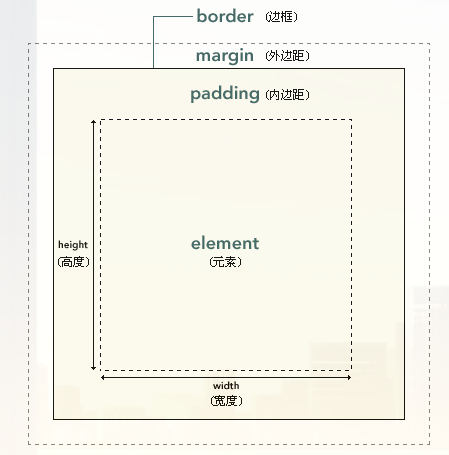
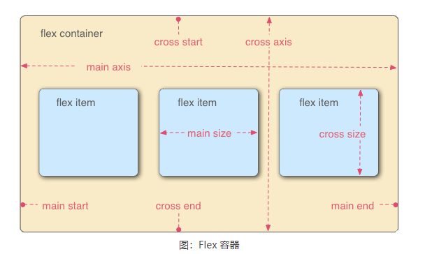
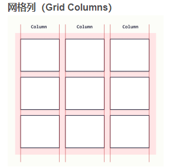
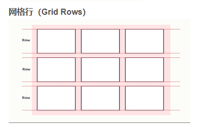

## Html与Css

- #### **Html**标签

  **内容标签**

  - head：用于描述页面基础信息，链接其他文件
  - header：描述引导类信息（标题，logo，搜索框）
  - body：页面内容元素
  - main：页面组要内容，包含在body元素中
  - nav：导航栏信息
  - section：主题相关内容
  - aside：与主体body无关的内容（测栏，弹出框）
  - footer：页脚
  - div：容器，继承上级元素宽度，高度自适应

  **功能标签**

  - a：链接标签，href，target属性

    - target：跳转方式
      1. _self：当前页打开
      2. _blank：弹出新页
      3. _parent：在父级元素打开（与iframe标签使用）
      4. _top：在顶级页面打开（与iframe标签使用）

  - h：标题标签

  - img：图片标签，存在src，alt，w/h，border属性，**非闭合标签**

  - p：自然段落

  - input：输入标签，存在type，value，placeholder，autofocus属性，**非闭合标签**

    - type：输入类型
      1. text：文本类型输入（默认）
      2. password
      3. color：颜色选择器
      4. date/datetime-local/month/week
      5. email
      6. number
      7. button
      8. checkbox/radio
      9. file：文件选择
      10. image：图片提交按钮。配合src使用
      11. range：限制输入范围数字
      12. submit/reset：提交，重置按钮，与form标签使用
      13. search：同text，关联enter，esc按键事件
    
  - textarea：多行输入框，cols，rows属性
  
  - select：下拉菜单
  
  - button：按钮
  
  - form：表单
  
  - span：与div容器对比，自适应宽度，宽度
  
  - strong：字体加粗
  
  - ol/ul：有序和无序列表，type，start属性
  
    - type：类型
      1. 1：数字
      2. a：小写字母
      3. i：小写罗马数字
      4. I：大写罗马数字
  
  - table：表格标签
  
  - iframe：嵌套网页，src，allowfullscreen，height，width
  
- #### **Css标签**

  - style：样式标签，type属性

  - link：引入其它文件，rel，type，href属性

  - import：嵌套其他css文件

  - Css选择器

    1. 标签选择器：div {}

    2. 类选择器：.class {}

    3. id选择器：#id {}

    4. 属性选择器：[prop=value] {}

       - `[href]`：选择所有存在href属性的元素
       - `[href*='wiki']`：匹配包含wiki值的元素

    5. 全局选择器：* {}

    6. **选择器的组合使用**

       - a,p {}：共用标签样式，选中a，p标签
       - .classA.classB：复合类选择器，选中属性中存在classA，classB的元素
       - footer span{}：父子选择器，选择footer元素下所有的span元素（包含嵌套）
       - `#grandpa > div` {}：父子选择器，选择Id为grandpa元素下的div元素（不包含子集嵌套）
       - `#me + span {}`：兄弟选择器，选择同级的下一个元素
       -  `#me ~ span {}`：选择同级的下所有元素

    7. 伪类：与外界互动的样式 `选择器:状态`

       状态

       - :hover{}：鼠标悬停在选择器上的样式
       - :active{}：鼠标点击时样式
       - :focus{}：聚焦显示
       - :disable{} / :enabled{} / :empty{}
       - :first-child{} / :last-child{}  / :nth-child(n)：选择同级元素中任意一个元素

    8. 伪元素：使用样式代替元素内容 `选择器::插入位置`

       - ::before/after {content:"¥"}：在元素内容前添加¥
       - ::placeholder{}：input元素中placeholder属性样式
       - ::selection：编辑选中后的样式

  - **样式权重**

    1. 选择器权重：行类样式 > ID选择器 > 类/属性/伪类选择器 > 元素选择器/伪类选择器
    2. 样式覆盖：div {text-decoration:underline !important;}
    3. 继承样式：继承上级的元素样式权重最低，允许子元素进行覆盖

  - **文字样式**

    - 块元素/行元素：块元素默认占一行高度，块元素相邻会换行，宽度受上级元素约束（默认占整行）；行元素自适应宽度（width属性无效，line-height设置高度）只能容纳文本或其他行元素
    - text-indent：文本首行缩进
    - text-align：文本对齐属性（块级元素）

      1. justify：调整空格，使其文字两端对齐
    - line-height：文字高度，调整文字行间距
    - vertical-align：行内上下对齐（行级元素）

      1. baseline：上下对齐
    2. bottom/top：向上向下对齐
    - letter-spacing/word-spacing：子体距离
    - white-space：空白字符
      1. normal：默认内容取消空格
      2. pre：显示空格
  
  - **字体样式**
  
    - font-family：使用系统库文字字体
  
    - @font-face：引用其他库字体 
  
    - font-weight：字体粗细（字体粗细分为9级）
  
    - font-size：字体大小（默认分内7级，对应small，medium，large）
  
  - **div盒子模型**
  
    -  
  
    - element：内容区
  
    - padding：内容与边框距离（非继承属性），扩充内容区大小
  
    - border：边框，border-width，border-style，border-color，border-radious
  
    - margin：与其他盒子的间距
  
  - 其他样式
  
    - outline：选中轮廓
  
    - color
  
    - backgroud：背景颜色（覆盖元素，内边距）
  
      1. color：背景颜色
  
      2. image：指定图片作为背景
  
      3. repeage：背景重复
  
      4. position：背景定位
  
      5. clip：背景剪切（指定背景覆盖范围）
  
    - **box-sizing：指定元素宽，高计算位置（默认width，height不包含padding长度）**
  
      1. content-box
      2. padding-box
      3. border-box
  
    - **overflow：内容溢出处理**（容器高度自动不需要添加overflow属性）
  
      1. visible：溢出显示
      2. hidden：隐藏溢出部分
      3. scroll：添加滚动条
      4. auto：
  
    - **display：**元素显示方式
  
      1. none：隐藏对应元素（不占据空间）
      2. block：块级元素（占据一行）
      3. inline：行内元素（宽度由内容决定）
      4. inline-block：通常使用width，height限制大小
  
    - **position：定位元素（非static属性都会覆盖其他元素内容）**
  
      1. static：以左上角位置进行静态定位（浏览器默认排版）
  
      2. relative：相对定位（相对于原位置，使用top，left进行内容偏移）
  
      3. absolute：绝对定位（父级元素以左上角为位置，使用top,left进行偏移）
  
         - 通常使用relative作为父级元素，absolute作为子级元素在父级元素内部任意位置进行定位
         
      4. fixed：浮动元素（覆盖），不会随页面进行移动
  
      5. sticky：同上，元素超出范围时浮动
  
      6. 元素层叠顺序
  
         - 非静态定位层级高于静态定位
         
         - 非静态定位会覆盖先出现的层级
         
         - z-index：手动调整层级 
  
    - **float：**浮动，让元素脱离父级元素控制（在内部单独构件一个block，其他元素会占位）
  
      1. left/right：浮动向左，向右排列
      2. 多个浮动元素不会覆盖（会覆盖原其他非浮动的元素)
  
    - **属性特殊值**
  
      1. initial：默认值（不继承上级元素值）
  
      2. unset：默认先使用继承值，无继承使用默认值
  
      3. url：引用其他资源
  
      4. 百分比：对比父级元素的百分比
  
      5. 单位
  
         - px：像素
  
         - pt/pc/in/cm/mm：点（用于印刷）
  
         - em/ex：相对当前字体缩放
  
         - rem：相对与根元素缩放
  
         - vw/vh：窗口宽高度的1%（动态变换）
  
         - calc()：动态计算
  
      6. 颜色属性值
  
         - transparent：透明度
  
         - rgb()：三元色占比
  
         - `#0x`：16进制颜色
  
         - hsl()
  
    - 响应式布局：指定相应条件
  
      1. @media (max-width:450px) {} // 视窗小于450采用的样式
  
    - **弹性布局**：将display属性设置flex，inline-fex等（弹性容器中float，clear,vertical-align属性失效）
  
      1.  
  
      2. Main Axis：主轴，默认从左到右排列
  
      3. Cross Axis：交叉轴，默认从上到下排列
  
      4. **flex属性**
  
         - flex-direction：控制主轴方向（row,row-reverse，column，column-reverse)
  
         - flex-wrap：子元素超出父容器时是否换行
  
           1. nowrap：默认不换行，压缩所有子元素
           2. wrap：换行
  
         - justify-content：Main Axis上子元素对齐方式
  
         - align-items：Crpss Axos上子元素对齐方式
  
         - align-content：行对齐方式
  
         - align-self：列对齐方式
  
         - flex-grow：填充剩余的空间（拉升子元素铺满剩余空间）
  
         - flex-shrink：压缩子元素铺满容器
  
         - flex-basic：同min-width，分配智能子元素大小
      
    - **网格布局：**  将display属性设置grid，inline-grid等（网格容器子作用子元素）
    
      1.   
    
      2. **grid元素属性**
    
         - grid-template-rows/grid-template-columns：定义子元素长宽
    
           1. repate(auto-fill,30px)：定义每个元素30px填充
           2. 50px 1fr：行列占用大小
           3. max-contenx：以内容最多的元素为准
           4. minmax()：设置元素范围
    
         - grid-row/column-gap：设置行列间距
    
         - grid-row/column-start：设置元素位置
    
         - grid-row-end：设置元素结束位置（合并单元格）
    
           
  
  
  
  ​         
  
  ​         
  
  ​    
  
  ​    
