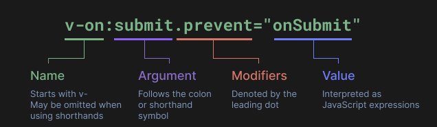
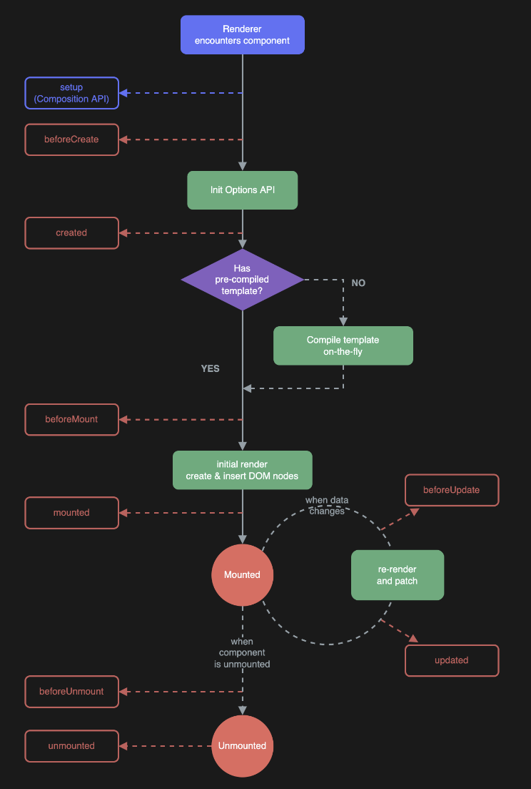

## Vue3.JS

> - **模板语法**
> 1. 文本插值
>   2. html插值（v-html），存在XSS风险（永远不要使用用户提供的html内容）
> 3. 属性插值（:attribute)，如果值是是 `null` 或者 `undefined`， attribute 将会从渲染的元素上移除
>   
>    - 动态参数`:[attributeName]='url'`
>   4. 绑定事件（@=“{...}”）
>
>      -  
>    - submit：keyup，click
>   - modifiers：stop，prevent，capture，self，once，passive，left，middle，right，{keyAlias}
> 5. v-model：双向绑定
>   
>      - lazy：输入框数据发生变化时进行同步
>
>      - trim/number
> 6. v-memo：同v-model，性能优化
>
> - **响应式基础**
> 1. ref：定义实时渲染的基础类型变量
>   
>    - 变量的改变与渲染不是实时的，需要使用 await nexTick()进行同步
>   
> 2. reactive：同ref，监听对象所有属性的访问和修改触发渲染
>   
> 3. toRef/toRefs：对响应式参数的引用（保持响应式特征）
>   
> 4. shallowReactive/triggerRef：非递归响应
>   
> 5. readonly/shallowReadonly/isReadonly：声明只读的响应式参数
>   
> 6. isRef/isReactive/isProxy：isProxy判断变量是否为方法
>   
> 7. toRaw/makeRaw：将响应式参数转为普通参数
> - **Vue特殊函数**
>   1. computed：计算衍生值，定义函数返回计算后的变量（当原变量变动时进行计算）
>   2. watch：响应式变量状态发生变化时触发回调函数
>   3. watchEffect：同watch，响应式变量定义时回触发一次
>   4. **钩子函数**
>      -  
>      - create：props，methods，watch，inject，provide等方法初始化后执行（通常定义初始化变量，API请求调用数据）
>      - mounted：用户页面DOM已渲染完成，this.$nextTick确保所有节点都渲染完成
>      - updated：DOM修改触发执行（data数据更改触发）
>      - activated/deactivated：与keep-alive使用，缓存当前页面状态
> - 
>

