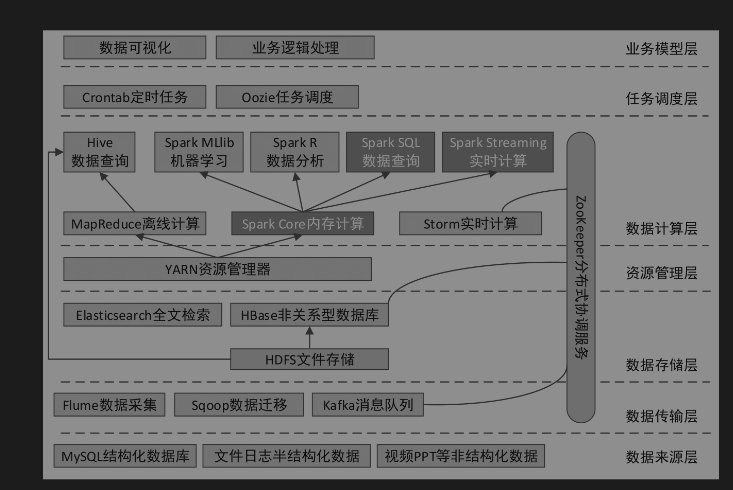

## Spark

> 大数据技术栈
>
>  
>
> Hadoop分布式架构
>
> - HDFS（Hadoop Distributed  File System）：分布式文件系统
> - MapReduce：分布式运算（计算）编程框架
> - Yarn：分布式资源调度系统
>
> Spark：计算引擎
>
> - SparkCore：定义RDD，任务调度、内存管理、错误恢复、与存储系统交互
>
>   > RDD：弹性分布式数据集（数据操作基本单位），创建后只读，不允许修改。
>   >
>   > 算子：基于RDD的操作
>   >
>   > RDD依赖：
>
> - SparkSQL：SQL查询接口
>
> - SparkStreaming：实时数据进行流式计算
>
> - MLlib：机器学习
>
> - GraphX：图形并行计算

 

