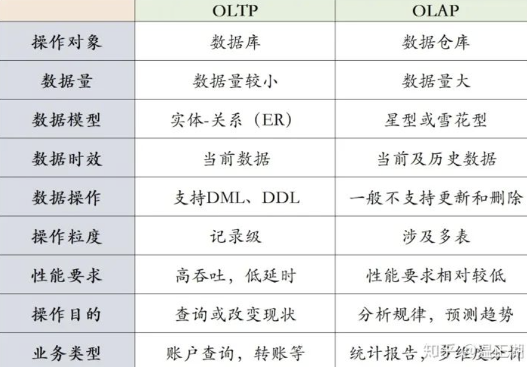

## 大数据

> 大数据特点
>
> - Volume：TB级别上的数据量
> - Velocity：实时或接近实时的数据流源源不断地产出，在短时间内完成数据收集、处理及反馈
> - Variety：数据种类多
> - Value：价值密度低，有价值的信息可能相对较少
>
> 关键技术
>
> 1. ETL：将数据源抽取清洗转换加载叨数据仓库
> 2. 数据存储和管理
> 3. 数据处理与分析（机器学习与数据挖掘）
> 4. 数据可视化展示
> 5. 数据安全与隐私
>
> 大数据相关框架
>
> - MapReduce：大数据数据处理模型与算法，将大规模的计算任务分成许多小规模的子任务，将子任务分发到多台计算机上进行并行处理。（索引构建，数据批量处理）
>   - Map操作：将输入数据元素切分并转换为一个或多个键值对，其中Map中的Key通过元素计算得到，键值对被分发到不同的计算节点
>   - Reduce操作：计算节点将相同键的所有值进行合并，Reduce函数将合并后的键值对进行处理，并生成最终的输出结果
> - HDFS：分布式文件系统，高效存储和处理大规模数据集
> - Hadoop：由MapReduce和HDFS构成，开源的分布式计算框架，用于处理大规模数据集。
> - HBase：分布式数据库，建立在Hadoop文件系统上，提供实时读写访问能力，并具有高可靠性和可扩展
> - Hive：基于Hadoop的数据仓库工具
> - Spark：高效处理大规模数据集（在分布式环境中执行数据处理、机器学习、图计算）
> - Flink：流处理引擎和批处理引擎，可靠的数据处理，支持实时流处理和批处理任务

#### Spark

> Spark生态组件
>
> 1. SparkCore：内存计算，任务调度，故障恢复，存储管理
> 2. SparkSQL：数据处理（处理关系表和RDD）
> 3. SparkStream：输入流，实时数据处理
> 4. StructuredStreaming：可扩展的流处理引擎
> 5. MLlib：机器学习（聚类，分类，回归，协同过滤）
> 6. GraphX：图计算
>
> Spark基本概念
>
> 1. RDD：分布式数据集（分布式内存,数据存储和处理结构）
> 2. DAG：存储RDD之间依赖关系
> 3. Task：工作单元
> 4. 执行器：任务处理器，执行工作单元
> 5. Job
> 6. Stage：Job调度的资源
>
> **RDD（Redilient Distributed Dataset）：**
>
> - Action：处理RDD并生成新的RDD
> - Transformation：处理RDD并计算器结果
>
> **SparkSQL**：基于Spark的分布式SQL查询引擎，在Spark上执行SQL查询和操作结构化数据
>
> 1. DataFrame：以RDD为基础的关系型数据库的表格化数据结构
> 2. DataSet：DataSet是DataFrame的扩展，提供了类型安全的数据集操作
>
> 
>
> **SparkStreaming：**流计算及处理
>
> - OLAP：多维数据分析处理
> - OLTP：在线事物处理
> -  
> - 数据流：时间分布，数量上无限的动态数据集合
>   1. 数据持续产生，数据量大
>   2. 来源广泛，格式不统一
>   3. 数据价值低，处理后保存（一般不存储流数据）
> - 实时处理
> - 批量处理：指在一定时间间隔内收集和处理大量数据（耗时，用于生成报告，及报表）
>
> **SparkMLIib：**Spark机器学习库（数据处理算法）
>
> 1. 数据分析算法：分类，回归，聚类，和协同过滤
>
> 2. 特征化分析：特征提取，转换，降维，选择
>
> 3. 流水线：构建，评估，参数调整
>
> 4. 持久化
>
>    
>
> 