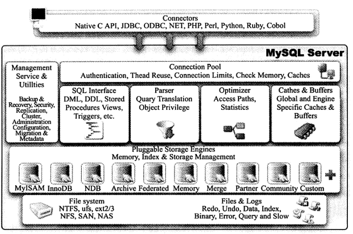
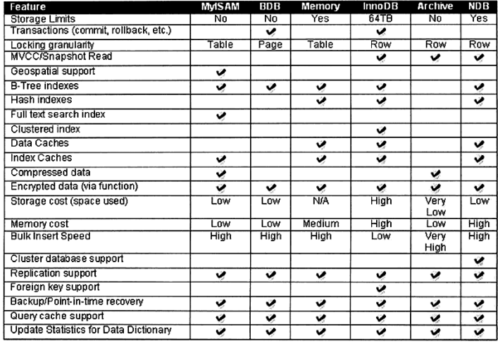
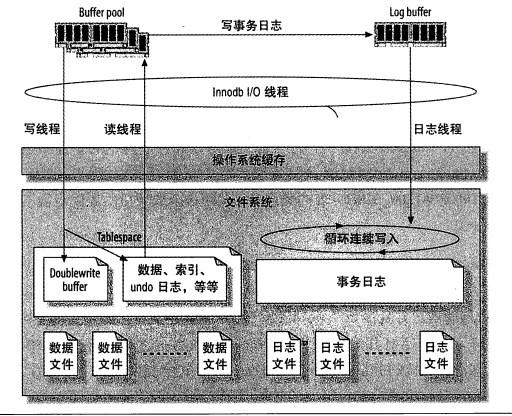
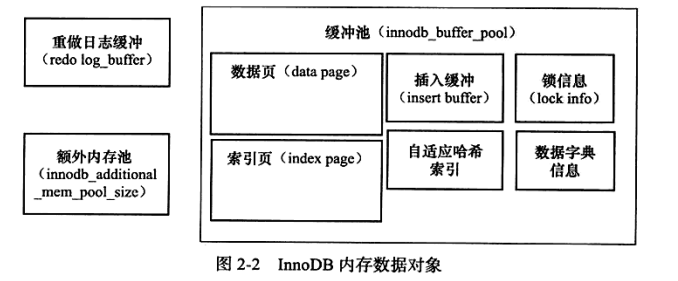

## mysql架构

>   
>
> - 连接池组件
>
>   > 不同客户端连接都会在服务器创建一个线程来执行SQL操作（*服务器会对连接线程进行缓存*）。
>   >
>   > TCP/IP 套接字连接
>   >
>   > SOCKET 套接字连接
>
> - 插件式存储引擎
>
>   > - InnoDB存储引擎（支持行锁，外键），MVCC多版本并发控制，支持插入缓存，二次写，自适应哈希索引，预读等高性能和高可用功能。
>   >
>   > - MyISAM 引擎（不支持事务，表锁设计，全文索引） 
>   >
>   > - NDB存储引擎 （集群存储引擎）类似ORACLE的RAC集群
>   > - Memory引擎（基于内存的存储）
>   > - Archive （只支持Insert和Select操作）
>   > - Maria （取代MyISAM设计）
>   >
>   >  
>
> - 物理文件
>
>   > - frm存放表结构，myd存放数据，myi存放索引，分区表文件使用#进行扩充
>   >
>   > - .ibd 和ibdata文件，存放Innodb索引和数据文件
>   >
>   > - error log  MYSQL异常日志
>   >
>   > - binarg log 用于数据恢复，主从复制
>   >
>   > - redo undo 事务提交/事务回滚日志
>   >
>   > - slow query log 慢查询日志
>   >
>   > - query log 慢查询日志
>
> - 系统库
>
>   > 1. mysql ：存储用户账号及权限信息
>   >
>   > 2. performance_schema：MySQL服务器运行过程状态信息（性能监控及配置状态）
>   >
>   >    > | 表名                              | 注释                                                         |
>   >    > | --------------------------------- | ------------------------------------------------------------ |
>   >    > | setup_table                       | 设置表，配置监控选项                                         |
>   >    > | current_events_table              | 记录当前那些thread                                           |
>   >    > | history_table                     | 发生的各种事件的历史记录表                                   |
>   >    > | summary_table                     | 对各种事件的统计表                                           |
>   >    > | setup_consumers\setup_instruments | 描述各种事件, 设置哪些事件能够被收集                         |
>   >    > | setup_instruments                 | 描述这个数据库下的表名以及是否开启监控                       |
>   >    > | setup_timers                      | 描述监控选项已经采样频率的时间间隔                           |
>   >    > | threads                           | 监控服务器所有连接                                           |
>   >    > | performance_timers                | 设置一些监控信息, 指定mysql服务可用的监控周期，CYCLE表示按每秒检测2603393034次, 目前 performance-schema 只支持’wait’时间的监控，代码树上 wait/ 下的函数都可以监控到 |
>   >
>   > 3. information_schema：数据库的元数据（表名，列数据类型，访问权限，触发器）
>   >
>   >    > |                  表                   |                  说明                   |
>   >    > | :-----------------------------------: | :-------------------------------------: |
>   >    > |               SCHEMATA                |       数据库信息（show database）       |
>   >    > |                TABLES                 |          表信息（show tables）          |
>   >    > |                COLUMNS                | 字段信息（show columns from tablename） |
>   >    > |              STATISTICS               |                索引信息                 |
>   >    > |            USER_PRIVILEGES            |        用户权限信息（来源mysql)         |
>   >    > |                 VIEWS                 |                  视图                   |
>   >    > |               TRIGGERS                |                 触发器                  |
>   >    > |               ROUTINES                |                存储过程                 |
>   >    > | TABLE_CONSTRAINTS KEY_COLUMN_USAGE |             约束字段及外键              |
>   >    > |                                       |                                         |
>   >
>   > 4. sys：查询库（服务器状态，数据库，表，存储过程，触发器信息通过视图关联查询）

#### **InnoDB引擎**

>  
>
> - Buffer Pool：内存池（缓存表中的数据和索引，提高查询速度）
>
>   >  
>
> - redo log：重做日志（事务提交时把修改缓存页提交到磁盘）
>
>   > 1. redo log buffer：记录数据更改后的值（脏页）
>   >
>   >    > redo log buffer更新策略（LRU）
>   >
>   > 2. 事务提交时，将redo log buffer内容追加到redo log file中（异步）
>   >
>   >    > innodb_flush_log_at_trx_commit：控制刷盘策略
>   >    >
>   >    > - 0：系统默认间隔1s对redo log file进行同步
>   >    > - 1：事务提交时进行同步（默认，CheckPoint策略）
>   >    > - 2：事务提交时将redo log buffer提交到操作系统，由操作系统写入redo log file
>   >    >
>   >    > 效率2最高，安全性1最高
>   >
>   > CheckPoint：事务提交时保存脏页数据到redo log 中（原子性）
>
> - bin log：归档日志（记录操作的SQL语句）
>
>   > 1. 用于主从复制：Master端开启binlog，将binlog发送到各个Slave端，实现主从一致
>   > 2. 数据恢复：使用`mysqlbinlog`工具恢复数据
>   >
>   > 日志格式
>   >
>   > - STATEMENT：基于SQL语句的复制
>   > - ROW：基于行的复制
>   > - MIXED
>   
> - undo log：回滚日志（数据版本控制）
>
>   > undo log：记录事务开启前数据，事务提交后，判断存其他事务是否存在使用该版本数据决定回收还是保留，用于数据回滚，实现事务隔离机制。
>   >
>   > MVCC（多版本并发控制）：
>   >
>   >  undo log内容
>   >
>   > 1. trx_id：最近一次更新事务Id
>   > 2. roll_pointer：指向上一个已提交的事务的数据指针
>   > 3. m_ids：记录那些事务ID没提交
>   > 4. min_trx_id：已提交的最小事务
>   > 5. max_trx_id：下一个生成的事务Id（事务Id自增生成）
>   > 6. creator_trx_id：生成undo log的事务Id
>   >
>   > ReadView：
>   >
>   > - creator_trx_id小于min_trx_id：当前事务只能读取到已提交的数据
>
> - 线程
>
>   > - Master Thread：循环将buffer pool中脏页刷入到磁盘中，配合change buffer清理undo页
>   >
>   > - IO Thread
>   >
>   > - Purge Thread： 清除行记录，对数据页行记录的真正删除操作和删除undo log
>   > - page cleaner：脏页清除
>

