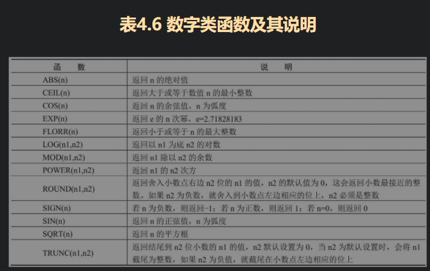
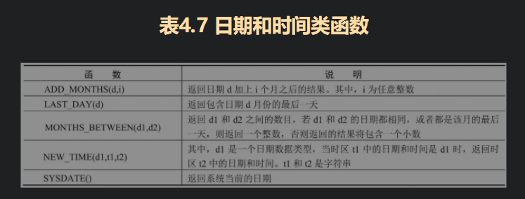
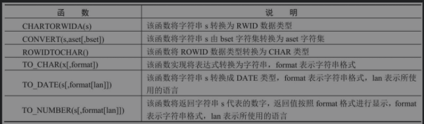

## SQL语言 

- #### **DCL** 数据控制语句

  > GRANT
  >
  > REVOKW

- #### **DDL** 数据定义语句

  > CREATE
  >
  > ALTER
  >
  > DROP
  >
  > RENAME
  >
  > TRUNCATE

- #### **DML** 数据操作语句

  > INSERT
  >
  > > ~~~sql
  > > -- 批量新增
  > > insert all 
  > >   into table_name (column_1,column_2) values ('value','value')
  > >   into table_name (column_1,column_2) values ('value','value')
  > >   into table_name (column_1,column_2) values ('value','value')
  > >  select 1 from dual;
  > >  
  > >  insert into table_name (column_1,column_2) select id,code from (
  > >    select 1 as id, '1' as code  from dual 
  > >        union all   
  > >        select 1 as id, '1' as code  from dual     
  > >        union all   
  > >        select 1 as id, '1' as code  from dual        
  > >        union all   
  > >        select 1 as id, '1' as code  from dual         
  > >  )
  > >  
  > >  begin
  > >   insert into oracle_table ( id, code ) values( 1 , '1' );  
  > >   insert into oracle_table ( id, code ) values( 2 , '2' );  
  > >   insert into oracle_table ( id, code ) values( 3 , '3' );   
  > >   insert into oracle_table ( id, code ) values( 4 , '4' );
  > > end;
  > > 
  > > ~~~
  >
  > UPDATE
  >
  > > ~~~sql
  > > -- 将 a表中 column1 的值改为b.column2
  > > update (select * from a,b where a.column1 = b.column2) as M set a.column1 = b.column2
  > > 
  > > -- 在SQL语句中同时执行inserts 和updates   table_name 目标表（修改/新增） table_name1 原表
  > > merge into table_name using table_name1 on condition 
  > > when matched then update set ...  -- 满足condition条件进行修改
  > > when not matched then insert ... values ... -- 不满足condition条件进行新增
  > > 
  > > -- 游标更新
  > > begin
  > > for cr in (SQL) loop 
  > > update table_name set ...
  > > end loop;
  > > end;
  > > ~~~
  >
  > DELETE
  >
  >  

- #### **DQL** 数据查询语句

> - 根据查询结构创建表(当前副本)
>
>   ~~~sql
>   create table stu as select * from blade_region;
>   -- 递归查询 condition1为开始条件（一般为根节点id或叶节点id）
>   -- condition3父子节点关联条件，PRIOR为当前循环数据，
>   select * from table_name where condition start with condition1 connect by condition3
>
> - where 条件查询
>
>   > any :  等价于子语句单列结果集与条件 or 连接： A {condition} any (B)   
>   >
>   > all ：等价于子语句单列结果集与条件 and 连接   A {condition} all (B)   
>   >
>   > in： 等价于子语句单列结果集**等于条件** and 连接   A in (B)   
>   >
>   > exists： 等价于子语句单列结果集**等于条件** or 连接   A exists (B)   
>
> - 分组
>
>   > **ROLLUP** （汇总）
>   >
>   > > group by rollup(A,B,C)
>   > >
>   > > - group by A,B,C
>   > >
>   > > - group by A,B
>   > >
>   > > - group by A
>   > >
>   > > - group by NULL
>   > >
>   > > group by A,rollup(A,B) 
>   > >
>   > > - group by A,B
>   > > - group by A
>   > > - group by A,NULL 
>   >
>   > **CUBE** (交)
>   >
>   > > group by cube (A,B,C) 
>   > >
>   > > - group by A,B,C
>   > > - group by A,B
>   > > - group by A,C
>   > > - group by B,C
>   > > - group by A
>   > > - group by B
>   > > - group by C
>   > > - group by NULL
>   > > 
>   > >group by cube((A,B),C)
>   > > 
>   > >- group by A,B,C
>   > > - group by A,B
>   > > - group by C
>   > > - group by NULL
>   >
>   > grouping sets：生成多个分组统计结果
>   >
>   > > ~~~sql
>   > > select deptno,job,avg(sal) from emp group by grouping sets(deptno,job);
>   > > ~~~
>   >
>   > 
>
> - 多表查询
>
>   > 行结构相同
>   >
>   > intersect：返回两个结果集相同行（查询两张表交集）
>   >
>   > union all：合并两个结果集行（查询两张表并集）
>   >
>   > union：合并两个结果集行并去重
>   >
>   > minus：第一个结果集减去第二个结果集中数据返回剩余行（差集）
>   >
>   > ​    
>   >
>   > 外连接：
>   >
>   > ~~~sql
>   > -- 左连接 （+）为附属表
>   > select * from table1,table2 where table1.col = table2.col(+)
>   > -- 右连接
>   > select * from table1,table2 where table1.col(+) = table2.col
>   > -- 全外连接(左+右连接)
>   > select * from table1 full join table2 on table1.col = table2.col
>   > ~~~
>

- #### **函数**

  > - rowid：伪列，输出查询时构造出来，一般是数据对象号(6位)+相对文件号(3位)+数据块号(6位)+在数据块中的行号(3位)
  >
  > - rownum 函数（用作字段排序，分页）
  >
  >   1. 未排序时按insert顺序生成行号
  >
  >   2. 只有子查询才能设置别名，并使用 <  > 条件进行行数限制
  >
  >   3. **rownum对非索引字段生成的序号在排序前**
  >
  >      ~~~sql
  >      -- 查询一条（第一次插入数据）
  >      select * from dual where rownum = 1;
  >      -- 查询0条  rownum起始值为1
  >      select * from dual where rownum > 1;
  >      -- 查询全部
  >      select * from dual where rownum >=1;
  >      -- 查询前5条
  >      select * from dual where rownum <= 5;
  >      -- 使用子查询分页 (嵌套2层查询，查询前20条数据，在过滤前10条数据)
  >      select * from (select rownum no ,t.* from dual t where rownum <=20) where no >10;
  >             
  >      -- 分页排序查询（嵌套3层查询）
  >      -- 跳过10前10行
  >      select * from (
  >      -- 给排序后的20条数据重新编号
  >      select rownum RN, T.* from (
  >          -- 查询排序后前20条数据
  >          select * from dual order by COL DESC where rownum <=20
  >      ) T) T2 where T2.RN > 10
  >      ~~~
  >
  > - row_number :  同rownum，通过over提前对字段排序编号
  >
  >   1. row_number() over(order by COL) ：  根据COL字段排序生成行号
  >
  >   2. row_number() over(partition by COL1 order by COL2)：以COL1分组后在组内通过COL2排序生成行号
  >
  > - rank ： 排名函数（跳过名次排序）
  >
  > - dense_rank：连续名次排名
  >
  > - decode：类似于case then  decode(col,match_value,...)
  >
  >   ~~~sql
  >   -- 用于进行特定排序
  >   select * from dual order by decode(Col,
  >                                      'VALUE',1,
  >                                      'VALUE',2,
  >                                      'VALUE',3
  >                                       9999
  >                                      )
  >   ~~~
  >
  > - nvl：将为空的字段替换
  >
  > -  
  >
  > -  
  >
  > -  
  

>- 索引
> 
>   > **逻辑上**
>   >
>   > - 单行索引/多行索引
>   >
>   >   ~~~sql
>   >   create index index_name on table_name(column_1,column_2);
>   >   ~~~
>   >
>   > - 唯一索引
>   >
>   >   ~~~sql
>   >   create unique index index_name on table_name(column_1,column_2)
>   >   create bitmap index <index_name> on <table_name>(<column_name>)
>   >   create index <index_name> on <table_name>(<column_name1><column_name2>)
>   >   create index <index_name> on <table_name>(column_name) reverse;
>   >   create index <index_name> on <table_name>(upper(column_name))
>   >   ~~~
>   >
>   > - 主键（不为null且不重复）
>   >
>   >   ~~~sql
>   >   -- 创建表时期建立 (复合主键)
>   >   create table_name ( 
>   >   column_1  datatype not null,
>   >   column_2  datatype not null,
>   >   column_3  datatype not null,
>   >   constraint primary_name primary key (column_1,column_2)
>   >   )
>   >   -- alter 创建
>   >   ALTER TABLE table_name ADD CONSTRAINT constraint_name PRIMARY KEY (col1, col2,...coln);
>   >   ~~~
>   >
>   > **物理结构上**
>   >
>   > - B-tree：适合增删该，不适合OR连接条件查询
>   >
>   > - Bitmap：适用于字段基数较小的字段建立索引，适合OR连接查询条件，不适合update
>   >
>   > - Reverse：适用于对称数据，节约存储空间
>   >
>   > - Hash
>   >
>   > - Function-based：基于函数索引，适用于函数处理的字段列
>   >
>   >   ~~~sql
>   >   -- 建立table_name的column_1字段上建立函数索引
>   >   create index index_name on table_name(upper(column_1))
>   >   ~~~
>   >
>   > - Partitioned：分区索引，优化索引存储空间
>   >
>   > - Domain：域索引（用户开放式索引)
> - 特殊字符
> 
>   > 1.  %  用来表示任意数量的字符，或者可能根本没有字符。
>   > 1.  _    任意单字符
>   > 3.  []  与特定范围或集合的任意单字符匹配
>   > 4.  ‘  描述字符串或日期
>   > 5.  “ 描述包含特殊字符或空格或日期
>   > 6.  escape 转义标识符  
> - 分区表（表数据量过大超过2G，通过某个字段进行分区，优化查询方案）
> 
>   > ~~~sql
>   > -- oracle 创建表时候未建分区，后续必须转为分区表才能添加分区
>   > create table table_name(
>   >   column_1 datatype,
>   >   column_2 datatype,
>   >   column_3 datatype,
>   >   column_4 datatype,
>   > ) 
>   > -- 创建range类型分区
>   > partition by range(column_1)(
>   > partition region_name values less then('value'),
>   > partition region_name values less then('value'),
>   > partition region_name values less then('value'),
>   > )
>   > -- partition 哈希模
>   > partition by hash(column_1)(
>   > partition 2
>   > partition 4
>   > partition 8
>   > )
>   > -- list 分区
>   > partition by list(column_1)(
>   > partition Li_ke value ('value','value','value') tablespace xxx,
>   > partition Li_ke_1 value ('value','value','value') tablespace xxx
>   > )
>   > -- 组合分区
>   > partition by range(score)
>   > 	subpartition by hash(id)
>   > 	subpartitions 2 store in (ccrpt,sjfx)
>   > 	(
>   > 		partition part1 values less than(60),
>   > 		partition part2 values less than(80),
>   > 		partition part3 values less than(maxvalue)
>   >  );
>   > -- 添加分区
>   > alter table table_name add partition region_name values less then('value');
> 
> - **索引优化**
> 
>   > RBO：基于规则的优化
>   >
>   > CBO：基于成本的优化
>   >
>   > ~~~sql
>   > -- 生成执行计划，并存入 Plan_Table中
>   > explain plan for + SQL;
>   > select * from table(dbms_xplan.display);
>   > ~~~
>   >
>   > 执行计划
>   >
>   > - 扫描
>   >   1. Full table scan：where条件查询中过滤
>   >      - **Access Predicate：在访问数据时判断，不会生成Row**
>   >      - Filter Predicate：对以产生的Row做判断
>   >   2. 索引扫描（Operation 操作类型包含索引扫描 ）
>   >      - index unique scan
>   >      - index range scan
>   >      - index range scan descending：索引降序范围扫描
>   >      - index skip scan：调表
>   >      - index full scan：索引全扫描
>   >      - index fast full scan：索引快速全扫描
>   >      - bitmap index：位图索引
>   > - 表连接
>   >   - nested loops join
>   >   - sort merge join
>   >   - hash join
>   >   - semi join
>   >   - outer join
>   >   - index join
>   >   - cartestian join
>   > - 其他运算方式

- #### **PLSQL**

  > 复合类型数据
  >
  > - 记录类型（相当某行数据）
  >
  >   ~~~sql
  >   declare 
  >   -- v_row_data 单行数据变量名，table1来源表，%ROWTYPE结构
  >   v_row_data table1%ROWTYPE;
  >   -- 引用table表中某列类型
  >   declare v_name table1.col%TYPE;
  >   ~~~
  >
  > - 表类型（数组类型）
  >
  >   ~~~sql
  >   declare 
  >    -- 声明数据类型集合
  >    type str_arr is varray(3) of varchar2(30);
  >    -- 声明记录类型集合
  >    type object is recode(
  >     v_code table1.col%type,
  >     v_name table1.col%type,
  >    );
  >     v_str_arr  str_arr;
  >   -- 立即执行SQL  将结果集赋值某个变量
  >   EXECUTE IMMEDIATE SQL into params
  >   -- 执行带参数SQL   :1  :2填充参数
  >   EXECUTE IMMEDIATE SQL using 'params' 'params'
  >   ~~~
  >
  > - 数组属性和相关函数
  >
  >   | 属性         | 描述                                                         |
  >   | ------------ | ------------------------------------------------------------ |
  >   | count        | 返回集合中元素的个数                                         |
  >   | delete       | 删除集合中 **所有** 的元素及 **extend**                      |
  >   | delete(x)    | 删除元素下标为 `x` 的元素（`对 varry 非法`）                 |
  >   | delete(x,y)  | 删除元素下标从 `x 到 y` 的元素（`对 varry 非法`）            |
  >   | trim         | 从集合`末端`开始删除`一个`元素（`对 index by 非法)           |
  >   | trim(x)      | 从集合`末端`开始删除 `x` 个元素 （`对 index by 非法`）       |
  >   | exists(x)    | 如果集合元素 x 已经 初始化(extend) ，则返回 true，否则返回 false |
  >   | extend       | 在集合 末尾 添加一个元素（对 index by 非法）                 |
  >   | extend(x)    | 在集合 末尾 添加 x个元素 （对 index by 非法）                |
  >   | extend(x, n) | 在集合 末尾 添加元素 x 个下标为n 的 副本（对 index by 非法） |
  >   | first        | 返回集合中第一个元素的下标号，对 varry 集合 始终 返回 1（除非 未初始化 则为 空） |
  >   | last         | 返回集合中最后一个元素的下标号，对 varry 集合 值始终 等于 count （除非 未初始化 则为 空） |
  >   | limit        | 返回 varry 集合的最大的元素个数，对 index by 无效            |
  >   | next(x)      | 返回在第 x 个元素之后紧挨着它的元素下标(x+1)，若 x 是最后一个元素，则返回 null |
  >   | prior(x)     | 返回在第x个元素之前紧挨着它的 元素下标(x-1)，如果 x 是第一个元素，则返回 null |
  >
  > 
  >
  > 流程控制语句
  >
  > - IF-THEN-END IF
  >
  > - IF-THEN-ELSE-END IF
  >
  > - IF-ELSIF-THEN-END IF
  >
  > - CASE - WHEN - THEN - ELSE - END CASE
  >
  > - CASE WHEN - THEN - ELSE - END CASE
  >
  > - LOOP --EXIT--END LOOP
  >
  >   >  
  >
  > - LOOP --EXIT WHEN -- END LOOP
  >
  > - WHILE -- LOOP -- END  LOOP
  >
  > - WHILE -- LOOP -- EXIT -- END LOOP
  >
  > - FOR - IN -- LOOP END LOOP
  >
  > - FOR - IN REVERSE -- LOOP END LOOP
  >
  > 
  >
  > 游标
  >
  > - 隐式游标(Oracle执行SQL语句自动声明的，不能控制游标信息)
  >
  >   > 游标属性
  >   >
  >   > ~~~sql
  >   > -- 返回一个布尔类型的值，如果游标指向的数据不为空，那么返回true，否则返回false
  >   > %found
  >   > %notfound
  >   > -- 它可以表示游标指向的缓冲区（结果集）的数据条数
  >   > %rowcount
  >   > -- 返回一个布尔类型的值，判断当前游标是否打开，如果是打开的返回true，否则返回false
  >   > %isopen
  >   > ~~~
  >
  > - 显示游标
  >
  >   > 游标生命周期
  >   >
  >   > 1. declare
  >   >
  >   >    ~~~sql
  >   >    -- 定义游标  SQL任意Select语句都可以定义游标
  >   >    CURSOR c_cursor_name is SQL;
  >   >    -- 声明游标
  >   >    v_cursor_name  c_cursor_name;
  >   >    ~~~
  >   >
  >   > 2. open
  >   >
  >   > 3. fetch
  >   >
  >   >    ~~~sql
  >   >    -- 循环读取
  >   >    fetch v_cursor_name INTO  v_name;
  >   >    ~~~
  >   >
  >   > 4. close
  >   >
  >   > ~~~sql
  >   > -- 游标循环，赋值
  >   > declare 
  >   >   cursor c_region is select * from blade_region_copy where parent_code = '1101';
  >   >   v_region c_region%ROWTYPE;
  >   > begin
  >   >   open c_region;
  >   > 	loop 
  >   > 		fetch c_region into v_region;
  >   > 		exit when c_region%NOTFOUND;
  >   > 		dbms_output.put_line('city name is ' || v_region.name);
  >   > 		end loop;
  >   > 		close c_region;
  >   > end;
  >   > 
  >   > 
  >   > -- 参数游标
  >   > declare 
  >   >   cursor c_region (param in blade_region_copy.parent_code%Type) is 
  >   > 	select * from blade_region_copy where parent_code = param ;
  >   > begin
  >   >   -- Test statements here
  >   >   for item in c_region('1201')
  >   > 		loop dbms_output.put_line(item.name);
  >   > 		end LOOP;
  >   > end;
  >   > -- FOR UPDATE  行锁（当前事务提交或回滚前其他事务不允许更改被锁的数据）
  >   > -- FOR UPDATE OF COL 字段锁（锁定当前行的列不允许其他事务更改）
  >   > -- WHERE CURRENT OF 
  >   > ~~~
  >   >
  >   > 
  >
  > 异常处理
  >
  > - Exception WHEN -- THEN 捕获异常
  >
  > - 用户定义的异常
  >
  >   > ~~~sql
  >   > -- 定义异常
  >   > DECLARE exception_name EXCEPTION;
  >   > -- 抛出异常
  >   > RAISE exception_name;
  >   > -- 捕获异常 （内层块发生错误时，异常会立即传播到外层）
  >   > EXCEPTION WHEN exception_name THEN 
  > - 内置异常
  >
  >   |        异常        |                             描述                             |
  >    | :----------------: | :----------------------------------------------------------: |
  >   |  ACCESS_INTO_NULL  |           当一个空对象被自动分配一个值时会引发它。           |
  >   |   CASE_NOT_FOUND   | 当没有选择`CASE`语句的`WHEN`子句中的任何选项时，会引发这个错误，并且没有`ELSE`子句。 |
  >   | COLLECTION_IS_NULL | 当程序尝试将`EXISTS`以外的集合方法应用于未初始化的嵌套表或`varray`时，或程序尝试将值分配给未初始化的嵌套表或`varray`的元素时，会引发此问题。 |
  >   |  DUP_VAL_ON_INDEX  |     当尝试将重复值存储在具有唯一索引的列中时引发此错误。     |
  >   |   INVALID_CURSOR   | 当尝试进行不允许的游标操作(例如关闭未打开的游标)时会引发此错误。 |
  >   |   INVALID_NUMBER   |    当字符串转换为数字时失败，因为字符串不代表有效的数字。    |
  >   |    LOGIN_DENIED    |     当程序尝试使用无效的用户名或密码登录到数据库时引发。     |
  >   |   NO_DATA_FOUND    |         当`SELECT INTO`语句不返回任何行时会引发它。          |
  >   |   NOT_LOGGED_ON    |             当数据库调用没有连接到数据库时引发。             |
  >   |   PROGRAM_ERROR    |                当PL/SQL遇到内部问题时会引发。                |
  >   |  ROWTYPE_MISMATCH  |        当游标在具有不兼容数据类型的变量中获取值时引发        |
  >   |    SELF_IS_NULL    |       当调用成员方法时引发，但对象类型的实例未初始化。       |
  >   |   STORAGE_ERROR    |             当PL/SQL用尽内存或内存已损坏时引发。             |
  >   |   TOO_MANY_ROWS    |             当`SELECT INTO`语句返回多行时引发。              |
  >   |    VALUE_ERROR     |    当发生算术，转换，截断或者`sizeconstraint`错误时引发。    |
  >   |    ZERO_DIVIDE     |                  当尝试将数字除以零时引发。                  |
  >
  
- **触发器**

  >> 当数据满足某种条件时,执行某种操作(DML,DDL系统事件,用户事件)
  >>
  >> - trigger_name  触发器名称
  >> - fires     before  | after | instead of
  >> - event   inset | update | delete 
  >> - table or view 创建表
  >> - statement level 
  >>
  >> ~~~plsql
  >> -- 创建触发器
  >> create or replace trigger region_trigger
  >>   before insert
  >>   on energy_region 
  >> declare
  >>   -- local variables here
  >> begin
  >>   ;
  >> end region_trigger;
  >> -- 禁用触发器
  >> alter trigger trigger_name DISABLE;
  >> alter trigger trigger_name ENABLE;
  >> -- 执行触发器顺序
  >> follows/precedes 
  >> -- 行触发器 (触发器执行次数与行改变有关)
  >> for each row 
  >> -- 语句触发器 只执行一遍
  >> ~~~
  >>
  >> **触发器应用于**
  >>
  >> - 执行不能利用完整性约束来定义复杂的业务规则
  >> - 自动生成派生列的值
  >> - 收集关于表的统计
  >> - 防止无效事务
  >> - **触发器内所有的操作在一个事务,不能使用事务控制**
  >>
  >> **INSTEAD OF 触发器(基于视图触发器)**
  >>
  >> > 用trigger的内容替换时间本身的动作
  >> >
  >> > ~~~plsql
  >> > create or replace trigger instead_trigger
  >> > instead of update on my_view for each row
  >> > ~~~
  >>
  >> #### **变异表与复合触发器**
  >>
  >> 变异表: 针对正在DML操作的表,为变异表,**触发器不能读取或修改变异表(适用于行级触发器)**
  >>
  >> 解决方案
  >>
  >> - 采用自主事务控制
  >> - 采用两个触发器(一个行级触发器,一个表级触发器)和一个包解决
  >>
  >> **复合触发器**
  >>
  >> - 在触发器执行**之前**的触发器
  >> - 触发器语句影响每一行**之前**的触发器
  >> - 在触发语句影响每一行**之后**触发的行触发器
  >> - 在触发语句**之后**触发的语句触发器
  >

~~~SQL
CREATE OR REPLACE TYPE "TYPE_ARRAY" IS TABLE OF VARCHAR2 (4000);

CREATE OR REPLACE FUNCTION f_split (p_str IN VARCHAR2, p_delimiter IN VARCHAR2)
  RETURN type_array
IS
  j INT := 0;
  i INT := 1;
  len INT := 0;
  len1 INT := 0;
  str VARCHAR2 (4000);
  str_split type_array := type_array ();
/***********************************************************
           date：2011.04.06
           purpose：实现字符串的split功能
           param：p_str 需要进行分割的字符串
                        p_delimiter 分隔符
          return : 返回一个type_array的数组
***********************************************************/
BEGIN
  len := LENGTH (p_str);
  len1 := LENGTH (p_delimiter);
  WHILE j < len
  LOOP
    j := INSTR (p_str, p_delimiter, i);
    IF j = 0
    THEN
        j := len;
        str := SUBSTR (p_str, i);
        str_split.EXTEND;
        str_split (str_split.COUNT) := str;
        IF i >= len
        THEN
          EXIT;
        END IF;
    ELSE
        str := SUBSTR (p_str, i, j - i);
        i := j + len1;
        str_split.EXTEND;
        str_split (str_split.COUNT) := str;
    END IF;
  END LOOP;
  RETURN str_split;
END f_split;
~~~

