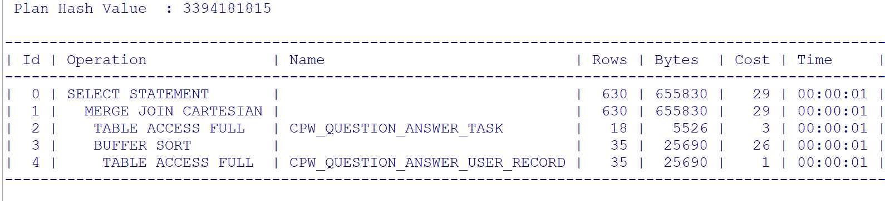

## **性能诊断与优化**

> **优化工具**
>
> 1. 告警日志：记录数据库的错误信息和告警信息（数据库启动关闭，死锁，更改数据库结构）
>
>    ~~~sql
>    -- 查询告警日志位置 
>    -- trace 以log格式文件
>    select * from v$diag_info;
>    ~~~
>
> 2. 统计信息（反应数据分布情况，根据数据分布生成最佳的SQL执行计划）
>
>    ~~~SQL
>    -- 执行收集单表数据分布情况
>    analyze table table_name compute statistics;
>    -- 查看用户表数据分布情况
>    select * from dba_tables where owner = 'user';
>    -- 使用dbms_stats 对数据空间收集统计
>    
>    -- 查询数据库事件相关信息
>    select * from v$event_name;
>    ~~~
>
> 3. 执行计划（记录查询SQL执行过程中访问路径，命中索引）
>
>    ~~~SQL
>    explain plan [set statment_id = string] for sql;
>    desc v$sql_plan;
>    ~~~
>
>    
>
>    **Id：**执行Id（带有`*`表示该步骤存在补充信息）
>
>    
>
>    
>
>    **Operation：** 操作项
>
>    - Table Access：表访问路径（访问表数据实际就两种情况，一种是全表扫描，另一种是直接或间接获取RowId，通过RowId读取对应的数据）
>
>      1. FULL：全表扫描
>      2. CLUSTER：通过索引簇访问数据（通常将不同的表字段相同的数据通过计算哈希后存在同一个数据块，减少连表查询时带来的IO次数，减少磁盘空间）
>      3. Hash：哈希命中（可能包含多条记录）
>      4. By Index RowId：通过ROWID访问单条记录（单行速度最快，回表操作）
>      5. By User RowId：通过主键访问单条记录
>      6. By Global Index RowId
>      7. By Local Index RowId
>      8. Sample：随机采样子集
>
>    - **Index：索引操作（where，order操作时使用索引）**
>
>      1. UNIQUE ：唯一索引
>      2. RANGE：左缀匹配（查找某个范围索引，通常出现在where 范围查询上）
>      3. FULL：扫描整个索引（通常在出现在排序SQL上）
>      4. SKIP ：跳表索引（通常用在多列复合索引上，一般将值少的字段放在索引左侧进行匹配）
>      5. FULL SACN(MAX/MIN)：从最高位或最低位开始扫描索引
>      6. FAST FULL：快速扫描索引（**不用做排序**，命中相邻的数据块，其物理存储顺序与索引存储顺序一致，IO一次可以读到多个相邻的数据块，可以使用 analyze table emp compute statistics for table for all columns for all indexes; 对索引重新排序设置）
>
>    - Join：连表操作
>
>      1. CONNECT BY：递归查询 （start with condition_1 connect by condition_2)
>
>      2. MERGE JOIN：非等值连表（使用 >, <, >=, <=, <>进行连表，以排序的临时表Merge Join后性能优于等值连表）
>
>      3. HASH JOIN：等值连表/散列连接
>
>         > TODO：散列连接步骤
>
>      4. NESTED LOOPS：子查询（作用在select，where上的子语句，通常使用在子语句返回的结果集数量较少，且关联字段使用索引）
>
>    - 执行计划顺序：最右最上原则（子语句先于父语句执行，同级靠上先执行）
>
>      
>
>      
>
>    
>
> 4. 跟踪文件（调试和诊断消息）
>
> 5. autotrace（自动跟踪，提供SQL执行计划）
>
> 6. 动态性能视图（提供Oracle在运行过程中状态）
>
> **性能报告**
>
> - AWR：自动工作负载信息库，提供数据库性能指标。
> - ADDM：优化建议报告（SQL优化，索引创建，统计量的收集）
> - ASH：记录会话事件
>

#### **数据库性能报告**

> 

